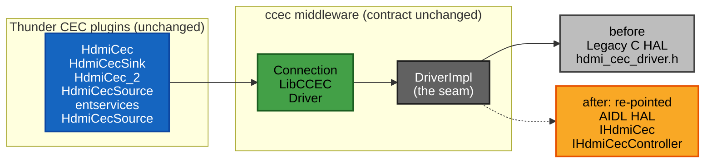
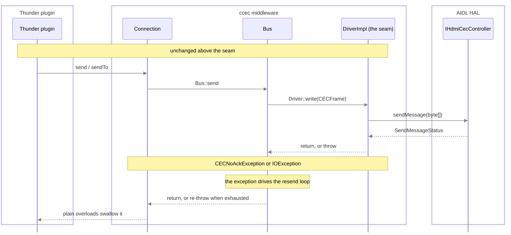
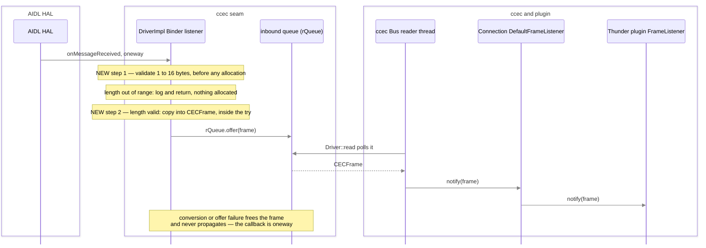

# HDMI CEC — Legacy C HAL to AIDL HAL Migration Mapping

## Overview

This page is the construct-by-construct migration mapping from the **legacy procedural C** HDMI-CEC HAL to the new **`@VintfStability` AIDL** HDMI-CEC HAL, together with the evidence that existing **Thunder (WPEFramework) plugin API behaviour is preserved** across that change.

The legacy contract is the ten-function C header at [`rdk-halif-hdmi_cec/include/hdmi_cec_driver.h`], whose public surface spans [`hdmi_cec_driver.h:L75-L423`]. The target contract is the AIDL package `com.rdk.hal.hdmicec`, declared at [`IHdmiCec.aidl:L41`] and described in the companion design document, [HDMI CEC](hdmi_cec.md).

Neither contract is consumed directly by a Thunder plugin. Every CEC plugin talks to the `ccec` middleware library — none of the ten plugin source files surveyed for this page (the `.cpp` and `.h` of each of the five mandated plugins) contains a single reference to `hdmi_cec_driver.h`, and each reaches CEC only through `LibCCEC` and `Connection` (the per-plugin evidence is in Facts 2 and 3 of *Behaviour-Preservation Validation*). `ccec` in turn reaches the HAL through exactly **one** adapter — [`hdmicec/ccec/src/DriverImpl.cpp`] — whose single `#include` of the legacy header at [`DriverImpl.cpp:L54`] is the only production reference to the legacy C API anywhere in this workspace. That adapter is referred to throughout this page as **the seam**.

!!! info "The behaviour-preservation principle"
    The migration re-points **only the internals of `DriverImpl`**. The plugin-facing `ccec` contract — the abstract `Driver` [`Driver.hpp:L45-L77`], the `LibCCEC` lifecycle singleton [`LibCCEC.hpp:L42-L51`] and the client-facing `Connection` [`Connection.hpp:L57-L85`] — keeps its exact signatures, return values and exception semantics. Because the plugins are written against that contract and never against the HAL, their JSON-RPC / COM-RPC surface is unaffected. Every row of the mapping below is therefore judged on one question: *does the seam still honour the `ccec` contract after the swap?*

### Scope

Three construct classes are mapped, one per sub-table:

|Construct class|Coverage|
|-|-|
|**Methods**|All ten legacy functions [`hdmi_cec_driver.h:L146-L423`] — eight as dedicated rows, plus `HdmiCecSetRxCallback()` [`hdmi_cec_driver.h:L330`] and `HdmiCecSetTxCallback()` [`hdmi_cec_driver.h:L358`] folded into the callback rows, which is what they are: registration mechanisms|
|**Callbacks**|Both legacy typedefs — `HdmiCecRxCallback_t` [`hdmi_cec_driver.h:L106`] and `HdmiCecTxCallback_t` [`hdmi_cec_driver.h:L117`]|
|**Data structures**|The 15-value `HDMI_CEC_STATUS` enum [`hdmi_cec_driver.h:L75-L93`], the opaque `int` handle [`hdmi_cec_driver.h:L146`], the raw message buffer [`hdmi_cec_driver.h:L287-L302`], the single-versus-array logical-address representation [`hdmi_cec_driver.h:L196,L228,L255`], and the additive `Property` [`Property.aidl:L23`] and `State` [`State.aidl:L30`] enums|

Out of scope: any source-code change. This page *describes* the edit each row requires at the seam; it does not perform it. Where the AIDL HAL has no successor for a legacy construct the cell reads `None` and the recommended alternative is named — the gap is documented, not resolved.

### Citation convention and short-name resolution

Every technical statement about a repository construct on this page carries a `path:line` citation. Citations use short file names for legibility; resolve them with this table.

Three kinds of statement cannot take that form, and each is marked where it occurs rather than left uncited. An **absence claim** has no locator by definition — its evidence is an exhaustive search, described at *How to read a `None` cell* in *Behaviour-Preservation Validation*. A statement about **Binder platform behaviour** — thread dispatch, call ordering, `oneway` delivery — is a property of the IPC framework rather than of any file in this workspace: no `.aidl` file in this package mentions threads at all, so such statements are attributed to the published Android guidance listed under *External references* and are never presented as if a locator supported them. A statement about **external standard structure** — the EDID block layout and its checksums, and the CTA-861 data-block collection that carries the CEC physical address — is likewise owned by VESA and CTA rather than by this repository: a workspace-wide search finds no checksum, extension-block or block-length rule anywhere in `rdk-halif-aidl`, so those statements are attributed to the standards and to the reference implementation cited under *External references*. Where the AIDL contracts do say something about EDID they are cited normally, and item 1 of *Gaps and Risks* keeps the boundary between the two explicit.

|Short name used in citations|Canonical repository-root-relative path|
|-|-|
|`hdmi_cec_driver.h`|`rdk-halif-hdmi_cec/include/hdmi_cec_driver.h`|
|`hdmi-cec_halSpec.md`|`rdk-halif-hdmi_cec/docs/pages/hdmi-cec_halSpec.md`|
|`IHdmiCec.aidl`, `IHdmiCecController.aidl`, `IHdmiCecEventListener.aidl`, `Property.aidl`, `SendMessageStatus.aidl`, `State.aidl`|`rdk-halif-aidl/hdmicec/current/com/rdk/hal/hdmicec/`|
|`IHdmiCecController.h`, `IHdmiCecEventListener.h` — the **generated C++ Binder backend**, not the AIDL source|`rdk-halif-aidl/hdmicec/0.1.0.0/include/com/rdk/hal/hdmicec/`|
|`IHDMIInput.aidl`, `IHDMIInputController.aidl`|`rdk-halif-aidl/hdmiinput/current/com/rdk/hal/hdmiinput/`|
|`IHDMIOutputControllerListener.aidl`|`rdk-halif-aidl/hdmioutput/current/com/rdk/hal/hdmioutput/`|
|`hdmi_cec.md`|`rdk-halif-aidl/hdmicec/current/docs/hdmi_cec.md` (this directory)|
|`DriverImpl.cpp`, `DriverImpl.hpp`, `Bus.cpp`, `Bus.hpp`, `Connection.cpp`, `LibCCEC.cpp`, `CECFrame.cpp`|`hdmicec/ccec/src/`|
|`Driver.hpp`, `LibCCEC.hpp`, `Connection.hpp`, `CECFrame.hpp`, `OpCode.hpp`|`hdmicec/ccec/include/ccec/`|
|`EventQueue.hpp`, `Mutex.hpp`|`hdmicec/osal/include/osal/`|
|`test_Driver.cpp`|`hdmicec/tests/L1Tests/ccec/test_Driver.cpp`|
|`HdmiCecSourceImplementation.cpp`, `HdmiCecSourceImplementation.h`|`entservices-hdmicecsource/plugin/`|
|`HdmiCec.cpp`/`.h`, `HdmiCecSink.cpp`/`.h`, `HdmiCec_2.cpp`/`.h`, `HdmiCecSource.cpp`/`.h`|`<PluginName>/` in the RDK-V `rdkservices` repository, which is **not** checked out in this workspace — see the plugin-inventory note in *Behaviour-Preservation Validation* for the exact external repository, branch and revision these locators were verified against|
|`README.md`|the migration workspace root `README.md` (repository inventory)|

!!! warning "Name-collision hazard: two different `hdmicec` directories"
    The workspace-root `hdmicec/` directory is the **`ccec` middleware repository** — it holds the seam `hdmicec/ccec/src/DriverImpl.cpp`, the preserved public contract `hdmicec/ccec/include/ccec/*.hpp` and the legacy test mock `hdmicec/mocks/hdmicec/hdmi_cec_driver_mock.h`. It is a **completely different** directory from `rdk-halif-aidl/hdmicec/`, which is this AIDL component. The two are unrelated despite the identical leaf name. Always expand a short name to its full repository-root-relative path using the table above before acting on a citation.

---

## Architecture Context

Four layers sit between a JSON-RPC caller and the CEC bus, and only the third one changes:

1. **Thunder CEC plugins** — the JSON-RPC / COM-RPC surface. Their CEC includes are confined to the `ccec/` public headers. Each plugin *header* declares the same six: `ccec/FrameListener.hpp` and `ccec/Connection.hpp` followed by `ccec/Assert.hpp`, `ccec/Messages.hpp`, `ccec/MessageDecoder.hpp` and `ccec/MessageProcessor.hpp` — [`HdmiCec.h:L23-L31`], [`HdmiCecSink.h:L23-L30`], [`HdmiCec_2.h:L23-L31`], [`HdmiCecSource.h:L23-L31`], [`HdmiCecSourceImplementation.h:L26-L32`]. Each cited span also contains one unrelated non-CEC include, `libIARM.h` — for example [`HdmiCec.h:L26`] and [`HdmiCecSourceImplementation.h:L28`] — so the span is quoted as the enclosing block, not as an unbroken run of `ccec/` lines. Each plugin *implementation* adds a second small `ccec/` set — `ccec/Connection.hpp` and `ccec/CECFrame.hpp`, plus `ccec/MessageEncoder.hpp` in the four plugins that build their own messages, plus `ccec/host/RDK.hpp` and `ccec/drivers/iarmbus/CecIARMBusMgr.h` in the four `rdkservices` plugins: [`HdmiCec.cpp:L23-L28`], [`HdmiCecSink.cpp:L22-L29`], [`HdmiCec_2.cpp:L23-L30`], [`HdmiCecSource.cpp:L23-L30`], [`HdmiCecSourceImplementation.cpp:L23-L25`]. Every one of those ten include sets is `ccec/`-only: none of the five plugins includes anything from the HAL.
2. **`ccec` public contract** — `LibCCEC` for lifecycle [`LibCCEC.hpp:L42-L51`], `Connection` for messaging [`Connection.hpp:L57-L85`], and the abstract `Driver` the adapter implements [`Driver.hpp:L45-L77`]. Between `Connection` and `Driver` sits the internal `Bus`, whose reader [`Bus.hpp:L67`] and writer [`Bus.hpp:L76`] threads own all queueing and all upper-layer resend behaviour [`Bus.cpp:L146-L173`], [`Bus.cpp:L243-L262`], [`Bus.cpp:L354-L376`]. `Bus` is not part of the plugin-facing contract, but it is where "asynchronous" and "retry" actually live, so the mapping rows below refer to it repeatedly.
3. **`DriverImpl` — the seam** — the concrete `Driver`. Ten legacy call expressions bind it to the C HAL today: [`DriverImpl.cpp:L119,L124,L125,L146,L212,L251,L296,L308,L325,L337`]. **Those ten expressions are the behavioural boundary of the migration, but they are not the whole edit.** Re-pointing the adapter also requires:
    - replacing the `int nativeHandle` member [`DriverImpl.hpp:L85`] with **two** Binder references — the `IHdmiCec` service [`IHdmiCec.aidl:L41`] and the `IHdmiCecController` returned by `open()` [`IHdmiCec.aidl:L114`] — because the service and controller planes are split (see the handle row below);
    - replacing the two static C callbacks [`DriverImpl.hpp:L55,L56`] with a Binder listener class implementing **all three** `IHdmiCecEventListener` methods — `onMessageReceived` [`IHdmiCecEventListener.aidl:L57`], `onStateChanged` [`IHdmiCecEventListener.aidl:L67`] and `onMessageSent` [`IHdmiCecEventListener.aidl:L102`] — since the interface has no optional members and is declared `oneway` as a whole [`IHdmiCecEventListener.aidl:L31`];
    - swapping the single legacy `#include` [`DriverImpl.cpp:L54`] for the generated Binder headers [`IHdmiCecController.h:L22-L24`], [`IHdmiCecEventListener.h:L23`], and extending the adapter's locking to cover listener callbacks that Binder may deliver concurrently (see the thread-safety row in *Behaviour-Preservation Validation*);
    - re-targeting build linkage from the legacy shared library `libRCECHal.so` [`hdmi-cec_halSpec.md:L140`] to the generated AIDL C++ backend.
4. **The HAL** — today the legacy C library [`hdmi-cec_halSpec.md:L140`]; after migration the AIDL service `IHdmiCec` [`IHdmiCec.aidl:L41`] and the controller it hands out, `IHdmiCecController` [`IHdmiCecController.aidl:L37`].

The blast radius is therefore narrow in the dimension that matters — **the behavioural boundary stays inside the `ccec` adapter, so layers 1 and 2 are untouched** — but it is not a ten-expression edit. `DriverImpl` gains new members, a new listener type implementing three callbacks, new includes and new build linkage, while its published `Driver` overrides [`DriverImpl.hpp:L67-L79`] keep their exact signatures.

<div class="cec-diagram" data-search-exclude markdown="1" style="--cec-diagram-ar:4.22">



</div>

The solid edge is the binding in force today and the dotted edge is the re-pointed binding, so the two HAL nodes carry the *before* and *after: re-pointed* labels directly. Node colour is semantic and follows the convention of the CEC design document's own diagrams [`hdmi_cec.md:L96-L127`]: blue for the Thunder plugins, green for the `ccec` middleware, grey for the seam and for the legacy C HAL, and orange for the AIDL HAL. Each node fill is paired with an explicit label colour so it reads identically in the light and dark site palettes, and everything the site theme owns — edges, cluster panels and cluster titles — is left to the theme so that it follows the reader's palette rather than fighting it. The one exception is the arrow markers, which the theme's own stylesheet no longer reaches because Mermaid 11 scopes marker ids per diagram; they are pinned to a single mid-grey that clears the 3:1 non-text contrast minimum against both the light and the dark page surface. The transmit and receive sequence diagrams below group their lifelines by the same three layers, using named groups rather than fixed fills for the same reason.

The single most consequential structural difference is *where the HAL boundary sits*. The legacy HAL was a linked shared library, `libRCECHal.so` [`hdmi-cec_halSpec.md:L140`], called in-process through function pointers and an opaque `int` handle [`hdmi_cec_driver.h:L146`]; its process model was stated as "This interface is required to support a single instantiation with a single process" [`hdmi-cec_halSpec.md:L83`]. The AIDL HAL is reached through object references across a **process boundary**, which the contract itself makes explicit in two places: a second `open()` fails "by this or another process" [`IHdmiCec.aidl:L93`], and "If the client that opened the `IHdmiCecController` crashes, then close() is implicitly called to perform clean up" [`IHdmiCec.aidl:L100-L101`] — both statements only have meaning across separate processes. Android's HAL guidance is the wider basis for that model (see *External references*). Registration, lifetime and error reporting all change shape as a result, and those three shape changes account for most of the risk recorded below.

---

## Migration Mapping Table

The table is presented in three parts — methods, callbacks and data structures — each using the identical five-column schema. Read the columns as: what the plugins depend on today, the legacy construct behind it, the AIDL construct that replaces it, the change required at the seam, and the residual risk to plugin behaviour.

### Method Mapping

!!! info "Narrow screens — this table scrolls sideways"
    On a phone-width viewport the five mandated columns cannot all fit, so **`Risk`** sits beyond the right edge, **`Migration action`** is clipped by it, and this table scrolls horizontally inside its own region rather than being truncated. Swipe or drag the table sideways to reach them, or press <kbd>Tab</kbd> to step through the two cross-reference links the **`Migration action`** and **`Risk`** cells carry: focusing either link scrolls the region far enough to bring that link fully into view — the **`Risk`** link from wholly outside the region, the **`Migration action`** link from partly visible. The cell around the link does not come fully into view with it: a focused **`Migration action`** cell still runs past the right edge, and the longer cells run off the top and bottom of the screen, so reading a whole cell can still mean scrolling in either direction. Every column is present at every width, and print output restores all five side by side.

| Existing plugin dependency | Old HAL concept | New AIDL HAL equivalent | Migration action | Risk |
|---|---|---|---|---|
| `LibCCEC::init()` drives `Driver::open()` at plugin startup [`LibCCEC.hpp:L47`], called by all five mandated consumers — a per-plugin locator for each is in the Fact 3 table of *Behaviour-Preservation Validation*, for example [`HdmiCec.cpp:L476`] and [`HdmiCecSourceImplementation.cpp:L956`] | `HdmiCecOpen(int *handle)` returns `HDMI_CEC_STATUS` [`hdmi_cec_driver.h:L146`] | `open(IHdmiCecEventListener)` on the `IHdmiCec` service returns `@nullable IHdmiCecController` [`IHdmiCec.aidl:L114`] | In `DriverImpl::open()` keep the existing pre-call guard exactly as it stands — `if (status != CLOSED)` returns immediately [`DriverImpl.cpp:L111-L116`] — so a repeated local `Driver::open()` still short-circuits and issues **no** HAL call at all. Only when the adapter is `CLOSED` bind the `IHdmiCec` service [`IHdmiCec.aidl:L41`] and call `open(listener)` [`IHdmiCec.aidl:L114`] in place of `HdmiCecOpen` [`DriverImpl.cpp:L119`], then store the controller reference instead of the int handle. Because the return is `@nullable` [`IHdmiCec.aidl:L114`] — "IHdmiCecController or null on error" [`IHdmiCec.aidl:L107`] — test it for null **before** storing it and before `status = OPENED` [`DriverImpl.cpp:L126`], and treat both null and a raised `EX_ILLEGAL_STATE` [`IHdmiCec.aidl:L105`] exactly as a non-success `HdmiCecOpen` is treated today: `throw IOException()` [`DriverImpl.cpp:L120-L121`], leaving the seam `CLOSED` | **Medium** — receive registration folds into `open()` [`IHdmiCec.aidl:L114`]; source-side address discovery leaves the HAL for middleware [`hdmi_cec_driver.h:L124-L127`]. The lifecycle change is **not** a like-for-like substitution of `EX_ILLEGAL_STATE` for `HDMI_CEC_IO_ALREADY_OPEN`: AIDL rejects a second *owner*, "by this or another process" [`IHdmiCec.aidl:L93`], which is a different condition from the adapter's own repeat-open guard [`DriverImpl.cpp:L111-L116`]. Merging the two would let a failed open report success with no controller behind it — see *AIDL lifecycle results with no legacy status code* in the cross-walk |
| `LibCCEC::term()` drives `Driver::close()` at teardown [`LibCCEC.hpp:L48`], called by all five mandated consumers — a per-plugin locator for each is in the Fact 3 table of *Behaviour-Preservation Validation*, for example [`HdmiCec.cpp:L580`] and [`HdmiCecSourceImplementation.cpp:L1156`] | `HdmiCecClose(int handle)` [`hdmi_cec_driver.h:L168`] | `close(IHdmiCecController)` on the `IHdmiCec` service returns boolean [`IHdmiCec.aidl:L137`] | In `DriverImpl::close()` keep the pre-call duplicate-close guard [`DriverImpl.cpp:L133-L139`] and the NULL queue sentinel that unblocks the reader [`DriverImpl.cpp:L143-L144`], then call `close(controller)` [`IHdmiCec.aidl:L137`] in place of `HdmiCecClose` [`DriverImpl.cpp:L146`] and release the reference. **Bind the boolean:** `false` means "Invalid state or unrecognised parameter" [`IHdmiCec.aidl:L130`], so map it exactly as a non-success `HdmiCecClose` is mapped today — set `status = CLOSED` and `throw IOException()` [`DriverImpl.cpp:L147-L149`]. Discarding the boolean would turn today's loud close failure into a silent one | **Low** — both clear registered addresses ([`hdmi_cec_driver.h:L152`] and [`IHdmiCec.aidl:L122`]) and a repeat call stays harmless, the legacy by contract [`hdmi_cec_driver.h:L153`] and the adapter by its own guard [`DriverImpl.cpp:L134-L139`]. A boolean result replaces the status enum, so the one behaviour that has to be carried across deliberately is that a `false` from a *genuine* close attempt still produces `IOException` [`DriverImpl.cpp:L147-L149`] |
| `Connection::send()` and `sendTo()` [`Connection.hpp:L69-L72`] — the primary plugin transmit path, used by `rdkservices/HdmiCec_2` [`HdmiCec_2.cpp:L235`], `rdkservices/HdmiCecSource` [`HdmiCecSource.cpp:L238`], `rdkservices/HdmiCecSink` [`HdmiCecSink.cpp:L348`], and entservices HdmiCecSource [`HdmiCecSourceImplementation.cpp:L774`]. Both overloads funnel through `Bus::send` [`Connection.cpp:L191,L215`] to `Driver::write` [`Bus.cpp:L338`] | `HdmiCecTx`, synchronous, taking the handle plus `buf`, `len` and an `int *result` out-parameter [`hdmi_cec_driver.h:L395`] | `sendMessage(byte[])` on `IHdmiCecController` returns `SendMessageStatus` [`IHdmiCecController.aidl:L125`] | In `DriverImpl::write()` replace `HdmiCecTx` [`DriverImpl.cpp:L251`] with `sendMessage` and translate `SendMessageStatus` **directly onto the observable ccec outcomes** — normal return, `CECNoAckException` [`DriverImpl.cpp:L277,L283`] or `IOException` [`DriverImpl.cpp:L272`] — keeping the directed-versus-broadcast discrimination the current code performs on the destination nibble [`DriverImpl.cpp:L276,L280`]. Do **not** route the translation through `Driver::SENT_AND_ACKD` / `SENT_FAILED` / `SENT_BUT_NOT_ACKD` [`Driver.hpp:L50-L52`]: `Driver::write` returns `void` [`Driver.hpp:L61`], the three enumerators have no reader — a workspace-wide search of every `.c`, `.cpp`, `.h` and `.hpp` file finds them in exactly one file, their own declaration [`Driver.hpp:L50-L52`] — and their ordering differs from `SendMessageStatus` [`SendMessageStatus.aidl:L44,L51,L56`], so an intermediate mapping adds a defect surface without adding meaning | **High** — the result set differs and requires the cross-walk below; the maximum message size is 16 bytes [`IHdmiCecController.aidl:L95`] |
| `Connection::sendAsync()` [`Connection.hpp:L77`] and `sendToAsync()` [`Connection.hpp:L73`], used in production by all five mandated consumers — `sendAsync` by the four source-role plugins `rdkservices/HdmiCec` [`HdmiCec.cpp:L770,L1017`], `rdkservices/HdmiCec_2` [`HdmiCec_2.cpp:L1587`], `rdkservices/HdmiCecSource` [`HdmiCecSource.cpp:L1662`] and entservices HdmiCecSource [`HdmiCecSourceImplementation.cpp:L1443`], and `sendToAsync` by the sink `rdkservices/HdmiCecSink` [`HdmiCecSink.cpp:L294,L661`]. **This plugin-facing async API never reaches `Driver::writeAsync`:** `sendToAsync` delegates to `sendAsync` [`Connection.cpp:L173`], which calls `Bus::sendAsync` [`Connection.cpp:L287`]; that copies the frame onto the writer queue [`Bus.cpp:L393-L397`] and the `Bus::Writer` thread [`Bus.hpp:L76`] drains it [`Bus.cpp:L259`] through the **synchronous** `Driver::write` [`Bus.cpp:L261`] | `HdmiCecTxAsync`, taking the handle plus `buf` and `len`, deprecated [`hdmi_cec_driver.h:L423`, deprecation note L398]. It is exposed but has **no live plugin path**: its only call site is `DriverImpl::writeAsync` [`DriverImpl.cpp:L212`], and the only callers of `Driver::writeAsync` [`Driver.hpp:L62`] anywhere are the ccec L1 tests [`test_Driver.cpp:L654,L689`] | **None** — no async send exists; the diagnostic `onMessageSent` listener method reports outcomes after the fact [`IHdmiCecEventListener.aidl:L102`] | Nothing is required for the live plugin path — it already terminates in `Driver::write` [`Bus.cpp:L261`] and is therefore covered by the transmit row above, including its `CECNoAckException` semantics. Decide the fate of the exposed-but-unreached `Driver::writeAsync` separately: either keep the pure virtual [`Driver.hpp:L62`] and its override [`DriverImpl.hpp:L71`] for source compatibility and implement the body with the synchronous `sendMessage` [`IHdmiCecController.aidl:L125`], or retire the `HdmiCecTxAsync` call [`DriverImpl.cpp:L212`] and have the override delegate to `write` [`DriverImpl.cpp:L235`] | **Low** for plugin behaviour, because no plugin reaches `writeAsync` and the queue-plus-writer-thread indirection that makes the API non-blocking lives in `Bus`, not in the seam [`Bus.cpp:L387-L406`]; **Medium** for the seam itself, because AIDL offers synchronous send only [`hdmi_cec.md:L39`] and the override must still honour its `noexcept(false)` contract [`Driver.hpp:L62`] |
| `Driver::addLogicalAddress()` [`Driver.hpp:L64`], reached through `LibCCEC::addLogicalAddress()` [`LibCCEC.hpp:L51`] by the one sink-role plugin among the mandated five, `rdkservices/HdmiCecSink` [`HdmiCecSink.cpp:L2926,L3219`] | `HdmiCecAddLogicalAddress`, sink-only, taking the handle and a single `int` address [`hdmi_cec_driver.h:L196`, sink-only L174-L175] | `addLogicalAddresses(int[])` on `IHdmiCecController` returns boolean [`IHdmiCecController.aidl:L62`] | In `DriverImpl::addLogicalAddress()` wrap the single address in a one-element array [`DriverImpl.cpp:L337`] | **Medium** — single-to-array cardinality; range restricted to 0x0–0xE [`IHdmiCecController.aidl:L50`]; and per-code status gives way to one all-or-nothing boolean — "If any addresses passed in are already added then the function will return false." [`IHdmiCecController.aidl:L51`] |
| `Driver::removeLogicalAddress()` [`Driver.hpp:L63`] — an **exposed but currently unreached** part of the ccec contract. A workspace-wide search finds only the pure virtual [`Driver.hpp:L63`], its override declaration [`DriverImpl.hpp:L72`], the implementation [`DriverImpl.cpp:L316`] and the ccec L1 tests [`test_Driver.cpp:L261,L337,L370`]. `LibCCEC` publishes no remove entry point at all [`LibCCEC.hpp:L42-L58`], so no plugin can reach it: the sink plugin adds addresses [`HdmiCecSink.cpp:L2926,L3219`] but never removes them | `HdmiCecRemoveLogicalAddress`, sink-only, taking the handle and a single `int` address and resetting it to 0xF [`hdmi_cec_driver.h:L228`, reset semantics L203] | `removeLogicalAddresses(int[])` on `IHdmiCecController` returns boolean [`IHdmiCecController.aidl:L81`] | Map it for contract fidelity even though nothing calls it today: in `DriverImpl::removeLogicalAddress()` wrap the single address in a one-element array [`DriverImpl.cpp:L325`]. Note that the current implementation **discards** the legacy status entirely — it removes the address from its own list [`DriverImpl.cpp:L324`] and ignores the return value [`DriverImpl.cpp:L325`] — so adopting the AIDL boolean is a deliberate widening rather than a like-for-like swap | **Low** — no live plugin dependency, so no observable plugin behaviour can regress. The residual work is contract fidelity: array cardinality, the 0x0–0xE range restriction [`IHdmiCecController.aidl:L69`], the all-or-nothing batch result — "If any addresses passed in are not added then the function will return false." [`IHdmiCecController.aidl:L70`] — and deciding whether to surface the boolean that is presently ignored |
| `Driver::getLogicalAddress()` [`Driver.hpp:L66`] behind `LibCCEC::getLogicalAddress()` [`LibCCEC.hpp:L49`], implemented at [`DriverImpl.cpp:L290`]. Verified consumers are the four **source-role** plugins — `rdkservices/HdmiCec` [`HdmiCec.cpp:L630`], `rdkservices/HdmiCec_2` [`HdmiCec_2.cpp:L1358`], `rdkservices/HdmiCecSource` [`HdmiCecSource.cpp:L1430`] and entservices HdmiCecSource [`HdmiCecSourceImplementation.cpp:L1192`], all of them querying `DEV_TYPE_TUNER`. The sink-role plugin does not call it: `rdkservices/HdmiCecSink` uses `LibCCEC::addLogicalAddress` [`LibCCEC.hpp:L51`] instead [`HdmiCecSink.cpp:L2926,L3219`], because a sink allocates its own address | `HdmiCecGetLogicalAddress`, taking the handle and an `int *` out-parameter, returns 0x0F when none is set [`hdmi_cec_driver.h:L255`, sentinel L235] | `IHdmiCec.getLogicalAddresses()` returns `int[]` [`IHdmiCec.aidl:L82`] | In `DriverImpl::getLogicalAddress()` call `getLogicalAddresses()` on the **service** reference [`IHdmiCec.aidl:L82`] rather than the controller, and select per device type [`DriverImpl.cpp:L296`]. Reconstruct the 0x0F sentinel from the zero-length array [`IHdmiCec.aidl:L77`] so the four source plugins keep receiving the value they expect | **Medium** — single-per-device-type [`hdmi_cec_driver.h:L236`] versus array-of-all, with the broadcast address 0xF excluded [`IHdmiCec.aidl:L74-L75`] and a zero-length array when none are set [`IHdmiCec.aidl:L77`]; middleware must reconcile the selection and the "none" sentinel. The current implementation also ignores the legacy status [`DriverImpl.cpp:L296`], so Binder exceptions raised by the new call become newly visible failure modes that the seam must absorb |
| `Driver::getPhysicalAddress()` [`Driver.hpp:L67`] behind `LibCCEC::getPhysicalAddress()` [`LibCCEC.hpp:L50`], implemented at [`DriverImpl.cpp:L303`]. This is the one entry point all five mandated consumers call — [`HdmiCec.cpp:L609`], [`HdmiCecSink.cpp:L3348`], [`HdmiCec_2.cpp:L1338`], [`HdmiCecSource.cpp:L1410`], [`HdmiCecSourceImplementation.cpp:L1176`] | `HdmiCecGetPhysicalAddress`, taking the handle and an `unsigned int *` out-parameter [`hdmi_cec_driver.h:L280`]; legacy `HdmiCecOpen()` itself discovered the physical address from the connection topology [`hdmi-cec_halSpec.md:L158`] and the HAL owned CEC 10 physical device discovery [`hdmi-cec_halSpec.md:L66`] | **None.** The AIDL CEC HAL declares no physical-address member at all, and the design document assigns the capability to middleware with a **role-dependent** algorithm: "MW acquires physical address (EDID for Source, `0.0.0.0` for Sink) and manages HPD via `HDMI Input` (For Sink) / `HDMI Output` (For Source) HALs" [`hdmi_cec.md:L43`]. Neither neighbouring HAL offers a physical-address getter either — they expose EDID and HPD primitives only | In `DriverImpl::getPhysicalAddress()` [`DriverImpl.cpp:L308`] keep the ccec signature [`Driver.hpp:L67`] and satisfy it **per device role**. *Sink*: return the fixed root address `0.0.0.0` [`hdmi_cec.md:L43`] — the value the legacy header already specified for a sink at the root [`hdmi_cec_driver.h:L266`] — so no EDID read is involved. *Source*: parse the CEC physical address out of the connected sink's E-EDID, which HDMI Output delivers through `onEDID(in byte[] edid)` [`IHDMIOutputControllerListener.aidl:L108`] after `onHotPlugDetectStateChanged(true)` [`IHDMIOutputControllerListener.aidl:L95-L96`], and re-derive it when HPD changes [`IHDMIOutputControllerListener.aidl:L56`]. **Treat that array as untrusted external input.** It is whatever the attached device chose to publish; the event carries "full EDID blocks, not just the base 128-byte block" [`IHDMIOutputControllerListener.aidl:L97`], so its length and block count are both supplied by the sink; the parameter is documented only as "Byte array representing the full E-EDID data as read from the sink" [`IHDMIOutputControllerListener.aidl:L101`] with no validity precondition; and no member of the HDMI Output package validates it before delivery. Parse it only with a bounded parser that checks block structure, per-block checksums, CTA-861 data-block bounds and the extracted address range **before** the value is used, and fail safe to an explicit "unknown" rather than a guess — the legacy contract already reserved a status for precisely that rejection, `HDMI_CEC_IO_INVALID_OUTPUT`, "Physical address can't be retrieved because it is outside the valid range" [`hdmi_cec_driver.h:L277`], against a range the same header states as "less than F.F.F.F" [`hdmi_cec_driver.h:L265`]. The complete required check list is [item 1 of *Gaps and Risks*](#1-physical-address-discontinuity-highest-risk). HDMI Input enters only on the **sink** side, and only for the duties it genuinely exposes — the EDID a port presents to an attached source [`IHDMIInput.aidl:L116`], [`IHDMIInputController.aidl:L121`] and the HPD it asserts toward that source [`IHDMIInputController.aidl:L69-L70`] — never as a way for the sink to learn its own address | **High** — the only row that needs a HAL outside CEC, and the only one where the correct answer differs by device role, so a single shared implementation cannot serve both. If it is left unresolved all five mandated consumers lose physical-address reporting. It is also the only row that introduces an **untrusted external input** where the legacy HAL had none: the address used to be discovered inside the HAL from the connection topology [`hdmi-cec_halSpec.md:L158`] and now arrives as a sink-supplied byte array [`IHDMIOutputControllerListener.aidl:L108`], so an unvalidated parse turns a hostile or merely broken display into an out-of-bounds read, a crash, or a spoofed topology that the plugins then broadcast [`HdmiCec_2.cpp:L235`] — [item 1 of *Gaps and Risks*](#1-physical-address-discontinuity-highest-risk) lists the checks that have to stand between the two. The dependency is at least contractually anticipated rather than invented: the CEC contract already requires the client to track HPD — a source must close or drop its addresses when HPD de-asserts [`IHdmiCec.aidl:L96-L97`], opening while HPD is low is explicitly not an error [`IHdmiCec.aidl:L98`], and messages sent while HPD is low simply time out [`IHdmiCecController.aidl:L111-L112`] |

Signature contrast for the highest-risk method row, transmit:

```c
/* C HAL hdmi_cec_driver.h:L395 */
HDMI_CEC_STATUS HdmiCecTx(int handle,
    const unsigned char *buf,
    int len, int *result);
```

```java
// AIDL IHdmiCecController.aidl:L125
SendMessageStatus sendMessage(
    in byte[] message);
```

The legacy call reports two things — a call-level `HDMI_CEC_STATUS` return and a bus-level `int *result` out-parameter whose values are "valid only for directly addressed messages" [`hdmi_cec_driver.h:L374-L377`]. The AIDL call reports one: a `SendMessageStatus` return, with call-level failures raised as Binder exceptions instead [`IHdmiCec.aidl:L32-L37`]. The seam must fold two channels into one without losing the directed-versus-broadcast distinction; see the [status-code cross-walk](#status-code-cross-walk) and, in particular, [The ACK_STATE inversion](#the-ack_state-inversion).

Signature contrast for address management:

```c
/* C HAL hdmi_cec_driver.h:L196 */
HDMI_CEC_STATUS
HdmiCecAddLogicalAddress(int handle,
    int logicalAddresses);
```

```java
// AIDL IHdmiCecController.aidl:L62
boolean addLogicalAddresses(
    in int[] logicalAddresses);
```

### Callback Mapping

!!! info "Narrow screens — this table scrolls sideways"
    On a phone-width viewport the five mandated columns cannot all fit, so **`Risk`** sits beyond the right edge, **`Migration action`** is clipped by it, and this table scrolls horizontally inside its own region rather than being truncated. Swipe or drag the table sideways to reach them, or press <kbd>Tab</kbd> to step through the two cross-reference links the **`Migration action`** and **`Risk`** cells carry: focusing either link scrolls the region far enough to bring that link fully into view — the **`Risk`** link from wholly outside the region, the **`Migration action`** link from partly visible. The cell around the link does not come fully into view with it: a focused **`Migration action`** cell still runs past the right edge, and the longer cells run off the top and bottom of the screen, so reading a whole cell can still mean scrolling in either direction. Every column is present at every width, and print output restores all five side by side.

| Existing plugin dependency | Old HAL concept | New AIDL HAL equivalent | Migration action | Risk |
|---|---|---|---|---|
| `DriverImpl::DriverReceiveCallback` [`DriverImpl.cpp:L58`] offers each frame to the bounded inbound queue [`DriverImpl.cpp:L70`], which `DriverImpl::read` drains [`DriverImpl.cpp:L170`]; the `Bus::Reader` thread [`Bus.hpp:L67`] pulls from `read` [`Bus.cpp:L158`] and notifies the bus listeners [`Bus.cpp:L165`], one of which is every `Connection`'s own `DefaultFrameListener`, registered by `Connection::open()` [`Connection.cpp:L65`] which the constructor invokes by default [`Connection.cpp:L46`], and which finally fans out to the plugins' `FrameListener` implementations [`Connection.cpp:L335`] registered via `Connection::addFrameListener` [`Connection.hpp:L66`] — [`HdmiCec.cpp:L492`], [`HdmiCecSink.cpp:L2942`], [`HdmiCec_2.cpp:L1183`], [`HdmiCecSource.cpp:L1255`], [`HdmiCecSourceImplementation.cpp:L1027`] | `HdmiCecRxCallback_t` registered via `HdmiCecSetRxCallback` [`hdmi_cec_driver.h:L106,L330`] | `onMessageReceived(byte[])` on the `oneway` event listener [`IHdmiCecEventListener.aidl:L57`] | Implement a Binder listener in `DriverImpl`, move the receive logic into `onMessageReceived`, and register the listener as the `open()` argument [`IHdmiCec.aidl:L114`] rather than through a separate `HdmiCecSetRxCallback` call [`DriverImpl.cpp:L58,L124`]. Keep the copy-then-offer shape [`DriverImpl.cpp:L60-L61,L70`], but order the new body as **validate, then convert inside a guard, then offer**. **(1) Validate the length before anything is allocated.** The receive contract states no bound at all — the parameter is documented only as "A variable length message conforming to format described above" [`IHdmiCecEventListener.aidl:L55`] — whereas a CEC frame is at most 16 bytes on the transmit side of the same package [`IHdmiCecController.aidl:L95`], and at least one byte, because the first thing the seam does with a frame is read `frame.at(0)` unguarded [`DriverImpl.cpp:L276`] and `CECFrame::at` throws when the index is not below the length [`CECFrame.cpp:L88-L92`]. Reject and log anything outside that range and return without allocating. **(2) Convert inside the exception boundary.** Today the heap `CECFrame` is allocated [`DriverImpl.cpp:L60`] and appended [`DriverImpl.cpp:L61`] *before* the `try` opens at [`DriverImpl.cpp:L69`], and `CECFrame::append` throws `std::out_of_range` once the frame reaches its 128-byte capacity [`CECFrame.cpp:L55-L56`] — the multi-byte overload looping straight through the throwing single-byte one [`CECFrame.cpp:L60-L64`] — so an oversized buffer escapes the existing `catch(...)` [`DriverImpl.cpp:L72-L76`] and leaks the allocation. Put the conversion inside the guard and free any partial allocation on the failure path, which also honours the `oneway` requirement that nothing propagate back to the HAL [`IHdmiCecEventListener.aidl:L31`]. **(3) Only then** apply the explicit bounded-queue overflow policy, which is a separate concern — see [item 6(b) of *Gaps and Risks*](#6-oneway-event-delivery-and-the-separate-bounded-queue-reliability-gap) | **Medium** — receive registration folds into `open()`; the `byte[]` copy preserves the old transient-buffer semantics (the C contract at [`hdmi_cec_driver.h:L99`] requires copying because `buf` is invalid once the callback returns, which ccec already satisfies at [`DriverImpl.cpp:L60-L61`]). The array also arrives **unbounded**, which the legacy callback never had to consider: the C HAL owned the receive buffer and its ceiling by contract — "For receive messages, the `HAL` is responsible for memory management. The memory allocated cannot exceed **20 bytes**" [`hdmi-cec_halSpec.md:L87`] — while the AIDL listener restates no ceiling [`IHdmiCecEventListener.aidl:L55`], so length validation becomes a duty of the seam rather than an inherited guarantee. Three distinct concerns must not be conflated. The first is **frame size and exception safety**: an out-of-range `byte[]` copied before it is checked either reaches the plugins as a protocol-invalid frame or, past 128 bytes, throws out of `CECFrame::append` [`CECFrame.cpp:L55-L56`] at a point the current `try` does not cover [`DriverImpl.cpp:L61,L69`] — an uncaught exception inside a `oneway` callback, with the frame allocated at [`DriverImpl.cpp:L60`] leaked on the way out. That is why the validate-then-convert-inside-the-guard ordering in the migration action is mandatory rather than merely defensive. The second is `oneway` delivery [`IHdmiCecEventListener.aidl:L31`], which removes the return path; the ordering that remains is narrower than "ordered", because the guarantee Android documents is that calls made from **one thread onto the same remote object** arrive in order at the receiver, with inbound transactions otherwise dispatched from a Binder thread pool that may run several at once — enough for a single HAL delivery thread feeding one listener object, but not a blanket ordering guarantee across the listener's three methods (attributed to the Android AIDL guidance in *External references*, not to a locator in this workspace). The third is the **bounded** inbound queue [`EventQueue.hpp:L167-L178`], which silently drops frames when full and is a genuine reliability gap independent of Binder entirely — these last two concerns are both treated in [item 6 of *Gaps and Risks*](#6-oneway-event-delivery-and-the-separate-bounded-queue-reliability-gap) |
| `DriverImpl::DriverTransmitCallback`, already vestigial because transmit is synchronous — it only logs on failure [`DriverImpl.cpp:L80,L83`] | `HdmiCecTxCallback_t` registered via `HdmiCecSetTxCallback`, deprecated [`hdmi_cec_driver.h:L117,L358`, deprecation notes L109,L333] | Diagnostic `onMessageSent`, carrying the frame as a `byte[]` together with its `SendMessageStatus` [`IHdmiCecEventListener.aidl:L102`, diagnostic intent L70,L75-L76] | Optionally surface transmit diagnostics through `onMessageSent`; retire the transmit callback because the synchronous `sendMessage` already returns the status; drop the `HdmiCecSetTxCallback` registration [`DriverImpl.cpp:L125`] | **Low** — already deprecated on the legacy side [`hdmi_cec_driver.h:L333`] and log-only on the ccec side, where the callback body neither throws nor mutates state [`DriverImpl.cpp:L80-L85`]; the synchronous status return covers the functional need [`IHdmiCecController.aidl:L125`] |

### Data Structure Mapping

!!! info "Narrow screens — this table scrolls sideways"
    On a phone-width viewport the five mandated columns cannot all fit, so **`Risk`** sits beyond the right edge, **`Migration action`** is clipped by it, and this table scrolls horizontally inside its own region rather than being truncated. Swipe or drag the table sideways to reach them, or press <kbd>Tab</kbd> to step through the two cross-reference links the **`Migration action`** and **`Risk`** cells carry: focusing either link scrolls the region far enough to bring that link fully into view — the **`Risk`** link from wholly outside the region, the **`Migration action`** link from partly visible. The cell around the link does not come fully into view with it: a focused **`Migration action`** cell still runs past the right edge, and the longer cells run off the top and bottom of the screen, so reading a whole cell can still mean scrolling in either direction. Every column is present at every width, and print output restores all five side by side.

| Existing plugin dependency | Old HAL concept | New AIDL HAL equivalent | Migration action | Risk |
|---|---|---|---|---|
| `DriverImpl` maps HAL status onto the ccec exceptions the plugins actually catch — `CECNoAckException` [`DriverImpl.cpp:L277,L283`], `IOException` [`DriverImpl.cpp:L272`], `InvalidStateException` [`DriverImpl.cpp:L160`], `AddressNotAvailableException` [`DriverImpl.cpp:L340`] | `enum HDMI_CEC_IO_ERROR`, typedef'd `HDMI_CEC_STATUS`, 15 values [`hdmi_cec_driver.h:L75-L93`]; the legacy contract returned every error synchronously as a return argument [`hdmi-cec_halSpec.md:L109`] | Binder built-in status plus service-specific exceptions [`IHdmiCec.aidl:L32-L37`], and `SendMessageStatus` for transmit outcomes [`SendMessageStatus.aidl:L44,L51,L56`] | Add a status cross-walk in `DriverImpl` that reproduces the existing ccec exception model exactly — the four exception types raised today [`DriverImpl.cpp:L160,L272,L277,L283,L340`] must remain the only outcomes the plugins can observe. See the [Status-Code Cross-Walk](#status-code-cross-walk) below | **High** — the 15 enumerators [`hdmi_cec_driver.h:L77-L91`] collapse onto Binder exceptions [`IHdmiCec.aidl:L32-L37`], boolean returns [`IHdmiCecController.aidl:L62,L81`] and a three-value status [`SendMessageStatus.aidl:L44,L51,L56`]; the mapping is not one-to-one and must be specified explicitly |
| Internal to `DriverImpl`; never exposed to the plugins — the private `int nativeHandle` member [`DriverImpl.hpp:L85`] is set by `HdmiCecOpen` [`DriverImpl.cpp:L119`] | Opaque `int handle` produced by `HdmiCecOpen` and passed to every other function [`hdmi_cec_driver.h:L146`] | **Two** references, not one: the `IHdmiCec` service itself [`IHdmiCec.aidl:L41`], obtained from the published service name [`IHdmiCec.aidl:L44`], plus the `IHdmiCecController` it hands back from `open()` [`IHdmiCec.aidl:L114`] | Replace `nativeHandle` [`DriverImpl.hpp:L85`] with **both** an `IHdmiCec` service proxy and the returned `IHdmiCecController`, then route each operation to its actual declaring interface — `open()` [`IHdmiCec.aidl:L114`], `close(controller)` [`IHdmiCec.aidl:L137`], `getLogicalAddresses()` [`IHdmiCec.aidl:L82`], `getState()` [`IHdmiCec.aidl:L57`], `getProperty()` [`IHdmiCec.aidl:L69`] and listener registration [`IHdmiCec.aidl:L153,L167`] stay on the **service**, while only `addLogicalAddresses()` [`IHdmiCecController.aidl:L62`], `removeLogicalAddresses()` [`IHdmiCecController.aidl:L81`] and `sendMessage()` [`IHdmiCecController.aidl:L125`] go to the **controller** | **Low** — an object model replaces the integer handle, but the split is easy to get wrong: routing a service-plane call through the controller (or the reverse) does not compile against the generated headers, whose controller class declares only those three methods [`IHdmiCecController.h:L22-L24`]. Lifetime is bound to the Binder reference, so a client crash implies an implicit `close()` [`IHdmiCec.aidl:L100-L101`], which is strictly safer than a leaked handle, and the controller must not be used after `close()` [`IHdmiCec.aidl:L121`] |
| The ccec `CECFrame` — a fixed-capacity value type holding `uint8_t buf_[MAX_LENGTH]` with `MAX_LENGTH = 128` [`CECFrame.hpp:L56,L59`] — built by the plugins themselves through `MessageEncoder().encode(...)` [`HdmiCec_2.cpp:L235`], [`HdmiCecSource.cpp:L238`], [`HdmiCecSink.cpp:L348`], [`HdmiCecSourceImplementation.cpp:L774`], decoded by the `MessageDecoder` / `MessageProcessor` they include directly [`HdmiCec.h:L23-L31`], and carried across `Connection` [`Connection.hpp:L69-L77`] | `unsigned char *buf` plus `int len` — a raw frame of header block, opcode block and operands [`hdmi_cec_driver.h:L287-L302`]. The legacy memory model splits ownership by direction and states a **general** allocation ceiling, not a receive-only one: "For transmit messages, it is upto the caller to allocate and free the memory for the message buffer. For receive messages, the `HAL` is responsible for memory management. The memory allocated cannot exceed **20 bytes**" [`hdmi-cec_halSpec.md:L87`] | `byte[] message` [`IHdmiCecController.aidl:L125`, frame layout L91-L93]. This repository compiles the AIDL with the **C++** Binder backend, in which `byte[]` is generated as an unsigned `std::vector<uint8_t>` — `sendMessage` takes a `const` reference to that vector and reports through a `SendMessageStatus*` out-parameter [`IHdmiCecController.h:L24`], and `onMessageReceived` takes the same `const` reference [`IHdmiCecEventListener.h:L23`] | Convert between `CECFrame` and `std::vector<uint8_t>` at the seam in both directions; the on-wire frame format itself is unchanged, both contracts excluding the EOM and ACK bits from the caller-visible buffer ([`hdmi_cec_driver.h:L304-L305`], [`IHdmiCecEventListener.aidl:L53`], [`IHdmiCecController.aidl:L107`]). **Transmit:** `DriverImpl::write` already extracts a `const uint8_t *` and a length from the frame [`DriverImpl.cpp:L238-L241`], [`CECFrame.hpp:L48`], so the vector is constructed from exactly that range — and the 16-byte maximum [`IHdmiCecController.aidl:L95`] must be validated *before* the call, because `CECFrame` itself permits 128 [`CECFrame.hpp:L56`] and neither contract makes the HAL responsible for truncating. **Receive:** keep the existing copy-then-own shape — build a heap `CECFrame` from the vector's bytes [`DriverImpl.cpp:L60-L61`], [`CECFrame.hpp:L46`], hand ownership to the inbound queue [`DriverImpl.cpp:L70`], and let the drain path copy by value and free it [`DriverImpl.cpp:L173-L174`] — but give this direction the **same explicit length check transmit gets, and run it first**. The receive contract restates no bound at all — "A variable length message conforming to format described above" [`IHdmiCecEventListener.aidl:L55`] — where transmit caps the frame at 16 bytes [`IHdmiCecController.aidl:L95`], so validate the vector's size against one to sixteen bytes *before* the `CECFrame` is allocated and reject and log anything else. The lower bound is real rather than a formality: the frame is read as `frame.at(0)` with no guard [`DriverImpl.cpp:L276`] and `CECFrame::at` throws when the index is not below the length [`CECFrame.cpp:L88-L92`]. Then perform the conversion **inside** the callback's exception boundary, because `CECFrame::append` throws `std::out_of_range` at capacity [`CECFrame.cpp:L55-L56`] and the multi-byte overload loops through the throwing single-byte one [`CECFrame.cpp:L60-L64`], while today's `try` does not open until after that append has already run [`DriverImpl.cpp:L61,L69`]; free the partial allocation [`DriverImpl.cpp:L60`] on that path rather than letting it escape with the exception. The vector itself stays owned by Binder for the duration of the call, which the same copy already satisfies, exactly as it satisfied the legacy transient `buf` [`hdmi_cec_driver.h:L99`] | **Low-Medium**, and lower than it first appears because there is **no signedness conversion to get wrong**: `CECFrame` stores `uint8_t` [`CECFrame.hpp:L59`] and is read out as `const uint8_t *` [`DriverImpl.cpp:L238`], while the generated backend takes `std::vector<uint8_t>` [`IHdmiCecController.h:L24`] — both sides are unsigned and the bytes map one-to-one. The two real risks are length and ownership. Three different limits now coexist — the AIDL cap of 16 bytes [`IHdmiCecController.aidl:L95`], the legacy allocation ceiling of 20 [`hdmi-cec_halSpec.md:L87`] and the `CECFrame` capacity of 128 [`CECFrame.hpp:L56`] — so the seam is the only place a length check can live, and it has to live there in **both** directions, because only transmit carries a contracted cap [`IHdmiCecController.aidl:L95`] while receive carries none [`IHdmiCecEventListener.aidl:L55`]. Ownership is the second: the receive conversion must not leak, and the throw it has to survive is raised inside `CECFrame::append` [`CECFrame.cpp:L55-L56`] rather than inside the queue, so the existing `catch(...)` does not cover it [`DriverImpl.cpp:L61,L69,L72-L76`] and the bounded-queue overflow policy in [item 6(b) of *Gaps and Risks*](#6-oneway-event-delivery-and-the-separate-bounded-queue-reliability-gap) is a separate, later safeguard rather than a substitute for it |
| The ccec single-address logical-address API [`Driver.hpp:L63-L64,L66`], [`LibCCEC.hpp:L49-L51`] — add is reached by the sink plugin [`HdmiCecSink.cpp:L2926,L3219`], get by the four source plugins [`HdmiCec.cpp:L630`], [`HdmiCec_2.cpp:L1358`], [`HdmiCecSource.cpp:L1430`], [`HdmiCecSourceImplementation.cpp:L1192`], and remove by nothing in production [`test_Driver.cpp:L261,L337,L370`] | A single `int` logical address on add, remove and get [`hdmi_cec_driver.h:L196,L228,L255`] | `int[]` on add and remove [`IHdmiCecController.aidl:L62,L81`]; `getLogicalAddresses()` returns `int[]` [`IHdmiCec.aidl:L82`] | Adapt the cardinality by wrapping and unwrapping arrays inside `DriverImpl` [`DriverImpl.cpp:L325,L337`], keeping the ccec single-address API exactly as the plugins see it | **Medium** — cardinality mismatch, plus all-or-nothing batch semantics [`IHdmiCecController.aidl:L51,L70`] where the legacy API returned a per-call status code |
| None today; this is a new capability with no legacy counterpart. Neither preserved entry point exposes properties or lifecycle state: the twelve `Driver` pure virtuals are all frame, address or lifecycle operations [`Driver.hpp:L58-L70`] and `LibCCEC` publishes only six methods [`LibCCEC.hpp:L44-L51`] | **None** — no equivalent exists in the legacy C API, whose ten functions return only `HDMI_CEC_STATUS`, addresses or frames [`hdmi_cec_driver.h:L146-L423`] | The `Property` enum — a version member plus five metric counters, all six listed in full in the note below — read through `getProperty()` [`IHdmiCec.aidl:L69`]; and the `State` enum, `CLOSED` [`State.aidl:L35`] and `STARTED` [`State.aidl:L40`], read through `getState()` [`IHdmiCec.aidl:L57`] and observed through `onStateChanged` [`IHdmiCecEventListener.aidl:L67`] | Optionally surface the new metrics and state through ccec and onward to the plugins — `getProperty()` [`IHdmiCec.aidl:L69`], `getState()` [`IHdmiCec.aidl:L57`] and `onStateChanged` [`IHdmiCecEventListener.aidl:L67`]; this is purely additive and can be deferred without affecting the migration | **Low** — additive only. Because nothing in the preserved contract names these types [`Driver.hpp:L58-L70`], [`LibCCEC.hpp:L44-L51`], [`Connection.hpp:L63-L83`], no existing plugin behaviour can depend on them, so there is no behaviour-preservation concern |

!!! note "The six `Property` members, and why you must not normalise the metric names"
    `getProperty()` [`IHdmiCec.aidl:L69`] reads six members. They are enumerated here at full page width rather than inside the table cell above, because the longest of them are too long to stay legible in a narrow column:

    - `HAL_CEC_VERSION` [`Property.aidl:L36`]
    - `METRIC_DIRECTED_MESSAGES_SENT` [`Property.aidl:L48`]
    - `METRIC_BROADCAST_MESSAGES_SENT` [`Property.aidl:L60`]
    - `METRIC_DIRECTED_MESSAGES_SENT_AND_ACKED` [`Property.aidl:L72`]
    - `METRIC_BROADCAST_MESSAGE_SENT_AND_ACKED` [`Property.aidl:L85`]
    - `METRIC_ARBITRATION_FAILURES` [`Property.aidl:L97`]

    Note the asymmetry in the last two: `Property.aidl:L60` is `METRIC_BROADCAST_MESSAGES_SENT` — plural *MESSAGES* — while `Property.aidl:L85` is `METRIC_BROADCAST_MESSAGE_SENT_AND_ACKED` — singular *MESSAGE*. That asymmetry is in the published interface, so quote each identifier exactly as it appears rather than tidying it.

Signature contrast for the status model:

```c
/* C HAL hdmi_cec_driver.h:L75-L93 */
/* 15 enumerators at L77-L91 */
typedef enum HDMI_CEC_IO_ERROR {
    HDMI_CEC_IO_SUCCESS = 0, /* … */
} HDMI_CEC_STATUS; /* L93 */
```

```java
// AIDL SendMessageStatus.aidl:L30
enum SendMessageStatus {
    ACK_STATE_0 = 0, /* L44 */
    ACK_STATE_1 = 1, /* L51 */
    BUSY = 2         /* L56 */
}
```

---

## Status-Code Cross-Walk

This is the single highest-risk mapping on the page: fifteen integer codes [`hdmi_cec_driver.h:L77-L91`] collapse onto Binder exceptions [`IHdmiCec.aidl:L32-L37`], boolean returns and a three-value transmit status [`SendMessageStatus.aidl:L44,L51,L56`]. The collapse is **not uniform**, and "no direct counterpart" turns out to cover two materially different situations that must not be filed together — a condition that has *ceased to exist* needs nothing from the implementer, whereas a condition that still exists but is uncontracted needs a decision. The cross-walk is therefore partitioned three ways:

|Partition|Codes|What the partition means for the implementer|
|-|-|-|
|Codes with a directly contracted AIDL counterpart|**8**|AIDL contracts a member, status value or exception for the same condition; translate it|
|Codes the structural change eliminates, plus the enum sentinel|**2**|The condition itself cannot arise under the new object model, or no function could ever return the code; nothing to translate|
|Codes with no contracted AIDL equivalent|**5**|The condition still exists but AIDL contracts nothing for it — a genuine gap or a semantic divergence; decide and record|

Eight plus two plus five is the whole fifteen-enumerator enum [`hdmi_cec_driver.h:L77-L91`], so every legacy code is accounted for in exactly one partition. In each table the right-hand column states the ccec behaviour that must survive — that is the acceptance criterion for the seam. A **fourth** table then covers the opposite direction: the three AIDL lifecycle outcomes whose shape or condition no legacy status code matches, and which therefore cannot be found by reading the enum at all.

The exception vocabulary this AIDL package contracts is closed and small: `EX_NONE` [`IHdmiCec.aidl:L34`], [`IHdmiCecController.aidl:L30`]; `EX_SERVICE_SPECIFIC` and `EX_ILLEGAL_ARGUMENT` [`IHdmiCec.aidl:L35`], [`IHdmiCecController.aidl:L31`]; and `EX_ILLEGAL_STATE` [`IHdmiCec.aidl:L93,L105`], [`IHdmiCecController.aidl:L116`]. A search of the whole package for `EX_` finds no other token, so no row below maps onto one — in particular there is **no** `EX_UNSUPPORTED_OPERATION` to receive the legacy sink-only rejection.

!!! note "Which layer observes the exception"
    The "preserved ccec behaviour" column describes the boundary at which the seam must raise — `Driver::write` [`Driver.hpp:L61`] and its immediate callers — not what a plugin ultimately sees. The two differ, and the difference is load-bearing: `Bus::send` uses the exception from `Driver::write` [`Bus.cpp:L338`] as its resend trigger [`Bus.cpp:L365-L370`], whereas the plugin-facing send overloads discard it — `Connection::send(frame, timeout)` catches and drops [`Connection.cpp:L193-L196`], reached from `Connection::sendTo(to, frame, timeout)` [`Connection.cpp:L128`], and the writer thread on the async path does the same [`Bus.cpp:L272-L275`]. Only the `Throw_e` overloads re-throw [`Connection.cpp:L155,L220`], and no plugin uses them to send: at the plugin call sites `Throw_e` appears solely with `ping` [`HdmiCec.cpp:L913`], [`HdmiCecSink.cpp:L2371`], [`HdmiCec_2.cpp:L1483`], [`HdmiCecSource.cpp:L1557`], [`HdmiCecSourceImplementation.cpp:L1385`] and with `poll` [`HdmiCecSink.cpp:L3138`]. The seam must therefore keep throwing even though the plugins never catch it, because the resend loop and the CTS 9-3-3 path depend on the throw.

### Codes with a directly contracted AIDL equivalent

| Legacy `HDMI_CEC_STATUS` | AIDL equivalent | Preserved ccec behaviour |
|---|---|---|
| `HDMI_CEC_IO_SUCCESS` [`hdmi_cec_driver.h:L77`] | Binder OK status, `EX_NONE` [`IHdmiCec.aidl:L34`], [`IHdmiCecController.aidl:L30`], or boolean `true` on the calls that return one — `close()` [`IHdmiCec.aidl:L129`], `addLogicalAddresses()` [`IHdmiCecController.aidl:L55`], `removeLogicalAddresses()` [`IHdmiCecController.aidl:L76`] | Normal return. Success is the fall-through case at every guard the adapter writes — each site tests inequality against `HDMI_CEC_IO_SUCCESS` and only then throws, on the HAL return value at [`DriverImpl.cpp:L120,L147,L222,L261`] and on the transmit out-parameter at [`DriverImpl.cpp:L265`] |
| `HDMI_CEC_IO_SENT_AND_ACKD` [`hdmi_cec_driver.h:L78`] | `SendMessageStatus.ACK_STATE_0` for a **directed** message [`SendMessageStatus.aidl:L44`, semantics L40] | Normal (void) return from `Driver::write` [`Driver.hpp:L61`] — no exception thrown [`DriverImpl.cpp:L287`] |
| `HDMI_CEC_IO_SENT_BUT_NOT_ACKD` [`hdmi_cec_driver.h:L79`] | `SendMessageStatus.ACK_STATE_1` for a **directed** message [`SendMessageStatus.aidl:L51`, semantics L47] | `CECNoAckException` thrown — directed path [`DriverImpl.cpp:L276-L278`], CTS 9-3-3 broadcast path [`DriverImpl.cpp:L279-L284`] |
| `HDMI_CEC_IO_SENT_FAILED` [`hdmi_cec_driver.h:L80`] | `SendMessageStatus.BUSY` — arbitration failed after two attempts [`SendMessageStatus.aidl:L56`, semantics L54] | Send-failure path raises `IOException` [`DriverImpl.cpp:L269,L272`] |
| `HDMI_CEC_IO_NOT_OPENED` [`hdmi_cec_driver.h:L81`] | Binder `EX_ILLEGAL_STATE` — the `@pre State::STARTED` violation [`IHdmiCec.aidl:L105`], [`IHdmiCecController.aidl:L116,L118`] | `InvalidStateException`, which the adapter already raises from its own state check *before* reaching the HAL [`DriverImpl.cpp:L160,L246,L320,L334`] |
| `HDMI_CEC_IO_INVALID_ARGUMENT` [`hdmi_cec_driver.h:L82`] | Binder `EX_ILLEGAL_ARGUMENT` [`IHdmiCec.aidl:L35`], [`IHdmiCecController.aidl:L31`] — except for out-of-range logical addresses, which AIDL reports as `false` rather than an exception [`IHdmiCecController.aidl:L50,L69`] | `IOException` on the transmit path [`DriverImpl.cpp:L267,L272`] and on open [`DriverImpl.cpp:L120-L121`] |
| `HDMI_CEC_IO_NOT_ADDED` [`hdmi_cec_driver.h:L90`, remove-only retval L218] | `removeLogicalAddresses` returns `false` [`IHdmiCecController.aidl:L70,L76,L81`] | **Currently unobservable, and must stay that way.** The seam discards the legacy remove status [`DriverImpl.cpp:L325`] and `Driver::removeLogicalAddress` returns `void` [`Driver.hpp:L63`], so surfacing the new boolean would be a widening, not a preservation |
| `HDMI_CEC_IO_GENERAL_ERROR` [`hdmi_cec_driver.h:L84`] | Binder `EX_SERVICE_SPECIFIC` [`IHdmiCec.aidl:L35`] | `IOException` [`DriverImpl.cpp:L121,L270,L272,L342-L343`] |

### Codes the structural change eliminates, and the enum sentinel

These two are **not** gaps, and filing them as gaps would overstate the risk. One names a condition that the move from an integer handle to an object reference makes unreachable; the other was never a return value in the first place. Neither requires a decision at the seam.

| Legacy `HDMI_CEC_STATUS` | Why the condition cannot arise | Preserved ccec behaviour |
|---|---|---|
| `HDMI_CEC_IO_INVALID_HANDLE` [`hdmi_cec_driver.h:L88`] | **Structurally eliminated with the handle itself.** The code exists to report a bad `int handle` [`hdmi_cec_driver.h:L146`], and there is no integer handle left to be invalid — the client holds an `IHdmiCecController` object reference [`IHdmiCec.aidl:L114`]. The nearest residual case, a stale or unrecognised controller, is not reported as an exception at all: `close()` returns `false` for an "unrecognised parameter" [`IHdmiCec.aidl:L130`] and the reference "must not be used after it has been closed" [`IHdmiCec.aidl:L121`] — which is why it is handled in the lifecycle table below rather than here | The transmit path's `IOException` for this code [`DriverImpl.cpp:L266,L272`] loses its trigger; nothing has to be reproduced. This is a reduction in failure modes, not a gap |
| `HDMI_CEC_IO_MAX` [`hdmi_cec_driver.h:L91`] | **A range sentinel, never a value.** The header declares it as "Out of range - required to be the last item of the enum" [`hdmi_cec_driver.h:L91-L92`], so no function can return it and there is nothing to map | Not applicable. No adapter guard could ever observe it, because every guard compares against `HDMI_CEC_IO_SUCCESS` rather than enumerating codes [`DriverImpl.cpp:L120,L147,L222,L261`] |

### Codes with no contracted AIDL equivalent

These five are genuine discontinuities. Recording them as `None` with a named destination is the point of this section: a cross-walk that invented an equivalent for them would be worse than one that admits the gap.

| Legacy `HDMI_CEC_STATUS` | Why there is no AIDL equivalent | Where the behaviour goes instead |
|---|---|---|
| `HDMI_CEC_IO_INVALID_OUTPUT` [`hdmi_cec_driver.h:L87`] | **None.** It is documented as the retval of exactly one legacy function — `HdmiCecGetPhysicalAddress`, "Physical address can't be retrieved because it is outside the valid range" [`hdmi_cec_driver.h:L277`] — and that function has no AIDL successor [`hdmi_cec.md:L43`] | It belongs wholly to the physical-address gap (item 1 of *Gaps and Risks*), not to the status model. Nothing is required at the seam today either way: the adapter already discards the status of that call [`DriverImpl.cpp:L308`] |
| `HDMI_CEC_IO_OPERATION_NOT_SUPPORTED` [`hdmi_cec_driver.h:L89`] | **None.** It expressed the legacy sink-only restriction on address management [`hdmi_cec_driver.h:L175,L207`, retvals L189,L220]. AIDL declares both methods with no device-role restriction [`IHdmiCecController.aidl:L62,L81`], and the package contracts no unsupported-operation exception [`IHdmiCec.aidl:L34-L35`] | Nothing to preserve. The adapter never handled the code: `addLogicalAddress` treats every result other than unavailable or general error as success [`DriverImpl.cpp:L337-L347`] and unconditionally returns `true` [`DriverImpl.cpp:L350`], while the remove path ignores the status entirely [`DriverImpl.cpp:L325`] |
| `HDMI_CEC_IO_LOGICALADDRESS_UNAVAILABLE` [`hdmi_cec_driver.h:L83`] | **None.** In the legacy header it is a retval of `HdmiCecOpen` alone — "Logical address is not available for source devices" [`hdmi_cec_driver.h:L137`] — because the legacy HAL performed source-side address discovery during open [`hdmi_cec_driver.h:L124-L125`]. The AIDL HAL does not allocate at all: the client "must first aquire a logical address using CEC Logical Address Allocation method" before adding it [`IHdmiCecController.aidl:L46-L47`], and HAL.CEC.9 assigns allocation to the Controller Client [`hdmi_cec.md:L58`]. A `false` from `addLogicalAddresses` means out-of-range or already-added [`IHdmiCecController.aidl:L50-L51`], never unavailable | `AddressNotAvailableException` [`DriverImpl.cpp:L339-L340`] must be raised by the middleware's own allocation step rather than translated from a HAL return code. The transmit path's separate treatment of the same code [`DriverImpl.cpp:L268,L272`] has no successor and simply lapses |
| `HDMI_CEC_IO_ALREADY_REMOVED` [`hdmi_cec_driver.h:L86`] | **None** — and none is needed: the enumerator is declared but is documented as the retval of no function, `HdmiCecRemoveLogicalAddress` using `HDMI_CEC_IO_NOT_ADDED` for that case instead [`hdmi_cec_driver.h:L218`] | Nothing to preserve. The seam discards the remove status altogether — it calls `HdmiCecRemoveLogicalAddress` without binding the return value [`DriverImpl.cpp:L325`] — so no ccec code path can test for it |
| `HDMI_CEC_IO_ALREADY_OPEN` [`hdmi_cec_driver.h:L85`] | **A genuine semantic divergence — the two sides do not describe the same event.** The legacy code named a *local* repeat and answered it with success [`hdmi_cec_driver.h:L123`], and was itself marked for removal [`hdmi_cec_driver.h:L134-L135`]. AIDL instead rejects a second *owner*, raising `EX_ILLEGAL_STATE` [`IHdmiCec.aidl:L93`] as the method's declared exception [`IHdmiCec.aidl:L105`] under `@pre` `State::CLOSED` [`IHdmiCec.aidl:L110`] | **Keep the two conditions apart — they need opposite treatment,** set out in full immediately below. A repeated local `Driver::open()` stays idempotent at the adapter's own guard [`DriverImpl.cpp:L111-L116`]; a genuine second-owner attempt must surface as `IOException` [`DriverImpl.cpp:L120-L121`] |

#### The `ALREADY_OPEN` divergence, in full

Both contracts are explicit, and they contradict each other. The legacy header promises that a repeat open succeeds — "Subsequent calls to this API will return HDMI_CEC_IO_SUCCESS" [`hdmi_cec_driver.h:L123`] — while the AIDL header promises that it fails: "Attempts to open again, by this or another process will fail with `binder::Status EX_ILLEGAL_STATE`" [`IHdmiCec.aidl:L93`]. Both can be true because they answer different questions, so the seam needs two behaviours rather than one translation.

*(i) A repeated local `Driver::open()` must stay idempotent,* and it already never reaches the HAL: the adapter returns at its own pre-call guard [`DriverImpl.cpp:L111-L116`] — `throw InvalidStateException()` is compiled out under `#if 0` [`DriverImpl.cpp:L112-L113`] and the live path is the bare `return` [`DriverImpl.cpp:L115`] — which is exactly what the ccec L1 tests assert by opening twice under `EXPECT_NO_THROW` [`test_Driver.cpp:L74-L78`]. Preserve that guard and there is nothing to absorb, because no `open(listener)` call is ever issued.

*(ii) A genuine attempt must **not** be swallowed.* When the adapter is `CLOSED` and another client or process owns the singleton [`IHdmiCec.aidl:L93`], translate the `EX_ILLEGAL_STATE` [`IHdmiCec.aidl:L105`] or the null controller [`IHdmiCec.aidl:L107`] into the adapter's existing open-failure outcome, `IOException` [`DriverImpl.cpp:L120-L121`], and leave the seam `CLOSED` by never reaching [`DriverImpl.cpp:L126`].

Point (i) is a statement about `Driver::open` only, not about `LibCCEC::init`: a second `LibCCEC::init` already throws `InvalidStateException` from its own `initialized` guard [`LibCCEC.cpp:L88-L90`] before it ever calls `Driver::open` [`LibCCEC.cpp:L103`], and `LibCCEC::term` throws symmetrically when not initialised [`LibCCEC.cpp:L117-L119`].

### AIDL lifecycle results with no legacy status code

Reading the enum only covers one direction. Three lifecycle outcomes are reachable on the AIDL side that no `HDMI_CEC_STATUS` value describes: a **null** return from `open()`, an `EX_ILLEGAL_STATE` raised by `open()` for a condition the legacy contract treated as success, and a **boolean** `false` from `close()`. Two of the three are *silent* — the null and the `false` raise nothing — so an implementer who translates only the enum leaves them unbound, and an unbound silent failure reports success. Each therefore has to be tied to an existing ccec outcome explicitly.

|AIDL lifecycle result|Why no legacy status code describes it|Required ccec behaviour|
|-|-|-|
|`open()` returns **null** — the method is `@nullable` [`IHdmiCec.aidl:L114`] and documented as "IHdmiCecController or null on error" [`IHdmiCec.aidl:L107`]|The legacy call reported failure only through its return status [`hdmi_cec_driver.h:L132-L137`]. It had no second, out-of-band failure channel, and the handle it wrote out [`hdmi_cec_driver.h:L146`] was meaningful only on success|Check for null **before** storing the reference and before `status = OPENED` [`DriverImpl.cpp:L126`]; on null raise the adapter's existing open-failure exception, `IOException` [`DriverImpl.cpp:L120-L121`]. Anything else leaves `LibCCEC::init` [`LibCCEC.hpp:L47`] reporting a successful initialisation with no controller behind it, and the first `sendMessage` [`IHdmiCecController.aidl:L125`] would be the point of discovery|
|`open()` raises `EX_ILLEGAL_STATE` [`IHdmiCec.aidl:L105`] because the singleton is already owned "by this or another process" [`IHdmiCec.aidl:L93`]|`HDMI_CEC_IO_ALREADY_OPEN` [`hdmi_cec_driver.h:L85`] named a *local* repeat, which the legacy contract answered with success [`hdmi_cec_driver.h:L123`]. Cross-process ownership had no meaning for a linked shared library in a single process [`hdmi-cec_halSpec.md:L83,L140`]|Identical to null: `IOException` [`DriverImpl.cpp:L120-L121`], seam left `CLOSED`. This does not weaken `Driver::open` idempotence, because the adapter's pre-call guard [`DriverImpl.cpp:L111-L116`] returns before any call is issued — see the `HDMI_CEC_IO_ALREADY_OPEN` row above|
|`close()` returns **false** [`IHdmiCec.aidl:L137`] — "Invalid state or unrecognised parameter" [`IHdmiCec.aidl:L130`]|`HdmiCecClose` reported those same two conditions as status codes, `HDMI_CEC_IO_NOT_OPENED` [`hdmi_cec_driver.h:L159`] and `HDMI_CEC_IO_INVALID_HANDLE` [`hdmi_cec_driver.h:L160`], not as a boolean|Bind the result: a `false` from a genuine close attempt must reproduce today's non-success close path exactly — `status = CLOSED` followed by `throw IOException()` [`DriverImpl.cpp:L147-L149`]. Keep the duplicate-close guard *before* the call [`DriverImpl.cpp:L133-L139`] so a repeat `Driver::close()` still returns silently instead of provoking a `false` from the HAL|

The common shape of all three is that AIDL moves part of the lifecycle failure reporting out of an error *code* and into the *return value*, where it is easy to drop. Binding them costs three lines at the seam and is the difference between preserving the ccec contract and quietly weakening it.

Three structural notes on the collapse. First, the legacy API split its reporting between a return value and, for transmit only, an out-parameter whose values are "valid only for directly addressed messages" [`hdmi_cec_driver.h:L374-L377`]; AIDL splits it three ways — the return value, the nullability of that return value [`IHdmiCec.aidl:L114`] and the Binder exception channel [`IHdmiCec.aidl:L34-L36`] — which is why the lifecycle table above exists alongside the enum tables. Second, several legacy codes were already dead letters, so the collapse loses less real signal than the raw fifteen-enumerator count suggests: `HDMI_CEC_IO_ALREADY_REMOVED` [`hdmi_cec_driver.h:L86`] and `HDMI_CEC_IO_GENERAL_ERROR` [`hdmi_cec_driver.h:L84`] are declared but documented as the retval of no function, and the adapter discards the status of three calls outright [`DriverImpl.cpp:L296,L308,L325`]. Third, the adapter already collapses *every* non-success open code into a single `IOException` [`DriverImpl.cpp:L120-L121`], so reproducing that one exception is sufficient for preservation; refining it into distinct exceptions would be an API change rather than a migration.

### The ACK_STATE inversion

!!! warning "The ACK_STATE_* inversion — the single most error-prone part of this migration"
    The meaning of `ACK_STATE_0` and `ACK_STATE_1` **inverts** between directed and broadcast messages, per HDMI 1.4b Section CEC 6.1.2 "ACK (Acknowledge)" [`SendMessageStatus.aidl:L35-L36`]:

    - **Directed message** — `ACK_STATE_0` means "The message was sucessfully acknowledged by the directly addressed follower" [`SendMessageStatus.aidl:L40`] (the source spells it *sucessfully*; quoted as-is), and `ACK_STATE_1` means "The message was not acknowledged by the directly addressed follower" [`SendMessageStatus.aidl:L47`].
    - **Broadcast message** — `ACK_STATE_0` means "One or more devices rejected the message" [`SendMessageStatus.aidl:L41`], and `ACK_STATE_1` means "The message was sent and not rejected by any device" [`SendMessageStatus.aidl:L49`].

    The AIDL package corroborates the inversion independently: "An acknowledgement implies a NACK in accordance with the inverted sense described in CEC specification" [`Property.aidl:L76`].

    **This is concrete, not theoretical.** `DriverImpl::write()` already discriminates directed from broadcast by inspecting the destination nibble `frame.at(0) & 0x0F`. The directed branch is `((frame.at(0) & 0x0F) != 0x0F) && sendResult == HDMI_CEC_IO_SENT_BUT_NOT_ACKD` [`DriverImpl.cpp:L276`], throwing `CECNoAckException()` [`DriverImpl.cpp:L277`]. The broadcast branch carries a comment that literally cites "CEC CTS 9-3-3" and the `REPORT_PHYSICAL_ADDRESS` retry requirement [`DriverImpl.cpp:L279`]; its condition is `((frame.at(0) & 0x0F) == 0x0F) && (length > 1) && ((frame.at(1) & 0xFF) == REPORT_PHYSICAL_ADDRESS) && (sendResult == HDMI_CEC_IO_SENT_BUT_NOT_ACKD)` [`DriverImpl.cpp:L280`], throwing `CECNoAckException()` [`DriverImpl.cpp:L283`].

    A naive `ACK_STATE_1 ⇒ CECNoAckException` translation would **invert the broadcast branch** and silently break behaviour that four of the five mandated consumers depend on: each of them broadcasts `ReportPhysicalAddress` — opcode 0x84 [`OpCode.hpp:L73`] — on the very path the CTS 9-3-3 branch guards, at [`HdmiCec_2.cpp:L235`], [`HdmiCecSource.cpp:L238`], [`HdmiCecSink.cpp:L348`] and [`HdmiCecSourceImplementation.cpp:L774`]. (`rdkservices/HdmiCec` is the exception: it forwards caller-supplied raw frames [`HdmiCec.cpp:L767,L770`] and only *handles* an inbound `ReportPhysicalAddress` [`HdmiCec.cpp:L151`] rather than broadcasting one.) The seam must keep the directed-versus-broadcast discrimination and map `SendMessageStatus` **per direction**. Note that the legacy contract already restricted its `result` values to "valid only for directly addressed messages" [`hdmi_cec_driver.h:L374-L377`], so per-direction interpretation is a preserved requirement rather than a new one.

---

## Gaps and Risks

Seven items, ordered by severity. Each is recorded rather than resolved: the item states what the migration must decide and, where the two contracts already determine the answer, the shape the resolution has to take. No code is written here, and where the answer genuinely depends on platform behaviour rather than on the contracts, the item says so and names the validation required instead of guessing.

### 1. Physical-address discontinuity — highest risk

**Context:** `HdmiCecGetPhysicalAddress` [`hdmi_cec_driver.h:L280`] has **no** successor in the AIDL CEC HAL. The AIDL design document places the capability outside the HAL entirely:

> **HPD/EDID/Physical Address:** Out of scope for HAL; MW acquires physical address (EDID for Source, `0.0.0.0` for Sink) and manages HPD via `HDMI Input` (For Sink) / `HDMI Output` (For Source) HALs.

— [`hdmi_cec.md:L43`]

**Diagnosis:** The discontinuity is wider than one function, and it is **role-dependent** — the quoted sentence prescribes two different algorithms, not one. Legacy `HdmiCecOpen()` itself "also discovers the physical address based on the connection topology" [`hdmi-cec_halSpec.md:L158`], and the legacy HAL owned "physical device discovery and announcements on the `CEC` network as defined in the `HDMI-CEC Specification` Section `CEC 10`" [`hdmi-cec_halSpec.md:L66`]. Both responsibilities now sit with the Controller Client and middleware [`hdmi_cec.md:L43,L58`]. Meanwhile the ccec contract still publishes `getPhysicalAddress` [`Driver.hpp:L67`], [`LibCCEC.hpp:L50`] and the seam still calls the legacy function with its status discarded [`DriverImpl.cpp:L308`], while all five mandated consumers depend on it — [`HdmiCec.cpp:L609`], [`HdmiCecSink.cpp:L3348`], [`HdmiCec_2.cpp:L1338`], [`HdmiCecSource.cpp:L1410`], [`HdmiCecSourceImplementation.cpp:L1176`].

**Recommended alternative — the exact split.** Keep the ccec signature [`Driver.hpp:L67`] and branch on device role inside the seam:

- **Sink devices — no EDID read at all.** The physical address is the fixed root value `0.0.0.0` [`hdmi_cec.md:L43`], which the legacy header already stated: "The Sink device at root will take 0.0.0.0 as the Physical Address" [`hdmi_cec_driver.h:L266`]. HDMI Input is named in the quoted sentence for the sink's **HPD and EDID duties toward attached sources**, which is what that HAL actually exposes — reading and overriding the EDID a port presents [`IHDMIInput.aidl:L116`], [`IHDMIInputController.aidl:L121`] and asserting HPD toward the source when the port is started [`IHDMIInputController.aidl:L69-L70`]. It is **not** a source of the sink's own physical address, and it has no physical-address getter.
- **Source devices — parse the sink's E-EDID, obtained from HDMI Output.** The HDMI Output listener delivers the full Extended EDID of the connected sink through `onEDID(in byte[] edid)` [`IHDMIOutputControllerListener.aidl:L108`] — "the full Extended EDID (E-EDID) block … retrieved from the connected HDMI sink" [`IHDMIOutputControllerListener.aidl:L92-L93`], and explicitly "full EDID blocks, not just the base 128-byte block" [`IHDMIOutputControllerListener.aidl:L97`] — and that event is "guaranteed to fire after `onHotPlugDetectStateChanged(true)` if a valid and powered sink is detected" [`IHDMIOutputControllerListener.aidl:L95-L96`]. The CEC physical address is **not** a field of that AIDL contract. It sits inside the vendor-specific data of the CTA-861 extension block — CTA-861 being the standard this listener points at for the block's layout [`IHDMIOutputControllerListener.aidl:L106`], and the same standard HDMI Input names for EDID content [`IHDMIInput.aidl:L121`] — while the AIDL documentation itself goes no further than noting that the array may be mined for "vendor-specific extensions" [`IHDMIOutputControllerListener.aidl:L98-L99`]. The byte-level structure, and every integrity rule that governs it, belongs to VESA E-EDID and CTA-861 rather than to this repository (see *External references*). HPD state changes are reported on the same listener [`IHDMIOutputControllerListener.aidl:L56`]. HDMI Output likewise has no physical-address getter; EDID plus HPD are the only primitives it offers for this purpose.

**The E-EDID is untrusted external input — validate it before parsing it.** This is the one mapping in the whole migration that moves a value from being produced *inside* the HAL, out of the connection topology [`hdmi-cec_halSpec.md:L158`], to being produced *by the device on the far end of the cable*. What arrives is an opaque `byte[]` [`IHDMIOutputControllerListener.aidl:L108`] whose only documented property is that it is "as read from the sink" [`IHDMIOutputControllerListener.aidl:L101`]: its length and its block count are chosen by that sink, neither the CEC package nor the HDMI Output package attaches a validity precondition to it, and no interface in this repository offers a parser for it. Indexed without checking, a malformed or deliberately crafted E-EDID becomes an out-of-bounds read, a parser fault that takes the CEC service down with it, or — worse, because it is silent — a spoofed topology that every plugin then re-broadcasts as its own `ReportPhysicalAddress` [`HdmiCec_2.cpp:L235`], [`HdmiCecSource.cpp:L238`], [`HdmiCecSink.cpp:L348`], [`HdmiCecSourceImplementation.cpp:L774`]. The source-side implementation must therefore perform all of the following, in this order, before the parsed value is written back through `Driver::getPhysicalAddress` [`Driver.hpp:L67`]:

1. **Parse with a bounded, vetted parser — never with ad-hoc indexing.** Every read is range-checked against the length actually delivered, never against a length inferred from a field inside the data. The established pattern is to validate one block at a time and discard any block that fails before any field of it is consumed, which is what the Linux DRM subsystem's `drm_edid_block_valid()` does (see *External references*).
2. **Validate the total length as whole blocks.** E-EDID is a 128-byte base block followed by zero or more extension blocks of the same size, which is exactly why the event is described as delivering "full EDID blocks, not just the base 128-byte block" [`IHDMIOutputControllerListener.aidl:L97`] and why the neighbouring HDMI Input contract states the expectation as "valid and standards-compliant (typically 128 or 256 bytes)" [`IHDMIInputController.aidl:L112`]. Reject a payload that is empty, shorter than one block, or not an exact multiple of the block size.
3. **Validate the declared extension count against the bytes actually present.** The block count is itself read out of the base block, so a crafted value larger than the delivered array is the shortest path to reading past the buffer. Trust the array length, not the declared count, and treat a mismatch as a rejection rather than as something to clamp silently.
4. **Verify each block's checksum before consuming that block.** A failed checksum means the block is unusable; it is not an invitation to repair the block or to trust it partially.
5. **Bound the CTA-861 data-block walk.** Each entry in the extension's data-block collection declares its own tag and its own length, so validate that the collection's start offset lies inside the block, that every declared entry length stays inside the block, and that a vendor-specific entry is long enough to hold its IEEE registration identifier before that identifier is compared at all. Only an entry whose registration identifier is the HDMI one defined by the HDMI specification (see *External references*) may be read for a physical address.
6. **Validate the extracted address itself.** It is four 4-bit components, and the legacy header states the acceptance rule outright — "The valid Physical address is less than F.F.F.F" [`hdmi_cec_driver.h:L265`] — with `0.0.0.0` reserved for a sink at the root [`hdmi_cec_driver.h:L266`]. An out-of-range or all-`F` value is a rejection, and the legacy contract even named the outcome for it: `HDMI_CEC_IO_INVALID_OUTPUT` [`hdmi_cec_driver.h:L87`, retval L277].
7. **Bind the value to the current HPD epoch.** The EDID event is only guaranteed to follow `onHotPlugDetectStateChanged(true)` [`IHDMIOutputControllerListener.aidl:L95-L96`], and the CEC contract already requires a source to close the controller or drop its addresses the moment HPD de-asserts [`IHdmiCec.aidl:L96-L97`]. Discard any address derived from an EDID belonging to a previous epoch instead of serving a stale topology; an address read while HPD is low is not authoritative, even though opening in that state is explicitly not an error [`IHdmiCec.aidl:L98`].
8. **Fail safe, fail loudly, and invent nothing.** On any rejection, log the reason and report an explicit "unknown" rather than a guess. Do not fall back to a partially parsed value, do not zero-fill — `0.0.0.0` is a legitimate root address [`hdmi_cec_driver.h:L266`], not a null — and never broadcast an address that failed validation. Serving a last-known-good address is defensible only inside the same HPD epoch that produced it. The established equivalent is the kernel CEC helper that substitutes an explicit invalid physical address when the EDID yields none, disabling CEC rather than guessing (see *External references*).

None of those checks can be delegated upwards or downwards. A workspace-wide search of every `.aidl` and `.md` file in `rdk-halif-aidl` for checksum, extension-block or block-length vocabulary returns only the `onEDID` documentation itself [`IHDMIOutputControllerListener.aidl:L90,L92-L93,L97,L101`] and this page, so there is no in-repository validation contract to lean on. Above the seam there is no status channel either: `Driver::getPhysicalAddress` returns `void` and writes through an `unsigned int *` [`Driver.hpp:L67`], so the only way to express "unknown" to a plugin is the sentinel the legacy header already implies — a value that is *not* "less than F.F.F.F" [`hdmi_cec_driver.h:L265`] — and the current seam does not even inspect the legacy status it receives [`DriverImpl.cpp:L308`]. The seam is the only layer that sees both the raw bytes and the promise it is making to the plugins, which is what makes it the only correct place for the validation.

The CEC contract already assumes the client is tracking HPD, so the cross-HAL dependency is anticipated rather than invented: a source "must close an opened `IHdmiCecController` interface, or remove all previously added logical addresses" when HPD de-asserts [`IHdmiCec.aidl:L96-L97`], opening while HPD is low "is not considered an error" [`IHdmiCec.aidl:L98`], and "while HPD is not asserted all sent messages will timeout" [`IHdmiCecController.aidl:L111-L112`].

**Risk:** **High.** It is the only mapping that requires a dependency on a HAL outside CEC, and the only one whose correct implementation differs by device role — so a single shared code path cannot serve both, and getting the role test wrong produces a plausible-looking but wrong address. Left unresolved, all five mandated consumers lose physical-address reporting, which in turn breaks the `ReportPhysicalAddress` broadcast at [`HdmiCec_2.cpp:L235`], [`HdmiCecSource.cpp:L238`], [`HdmiCecSink.cpp:L348`] and [`HdmiCecSourceImplementation.cpp:L774`]. Note also that the one legacy status code dedicated to this call, `HDMI_CEC_IO_INVALID_OUTPUT` [`hdmi_cec_driver.h:L87`, retval L277], disappears with it — see the gaps table in the cross-walk. It is also the only mapping that opens a **new input-trust boundary**: the address now originates in an attacker-controllable sink rather than inside the HAL [`hdmi-cec_halSpec.md:L158`], so the failure mode is not merely a missing value but a hostile one — an unvalidated parse of the delivered array [`IHDMIOutputControllerListener.aidl:L108`] yields an out-of-bounds read or a service fault, and a well-formed but spoofed address is re-broadcast onto the CEC bus by all five consumers. The eight checks listed above are the mitigation, and they are not optional: without them this row stays **High** even after the role split is implemented correctly.

### 2. High-level-protocol relocation to middleware

**Context:** The AIDL HAL performs the CEC low-level protocol only — "electrical timing, arbitration, retries, ACK sampling" [`hdmi_cec.md:L9`] — with the CEC link layer and frame I/O in scope and middleware owning the high-level protocol [`hdmi_cec.md:L38`]. Requirement HAL.CEC.2 assigns "CEC 3 High Level Protocol" to the CEC Controller Client [`hdmi_cec.md:L51`], and HAL.CEC.9 assigns logical-address allocation to it as well [`hdmi_cec.md:L58`].

**Diagnosis:** The *direction* is preserved; only the specification citation moves. The legacy contract already placed higher-level protocol on the caller — "The `caller` must be responsible for `CEC` higher level protocol as defined in `HDMI-CEC Specification` Section `CEC 12`" [`hdmi-cec_halSpec.md:L64`] — where the AIDL requirement cites CEC 3 instead [`hdmi_cec.md:L51`]. Likewise the legacy "caller must pass fully formed `CEC` messages to the `HAL`" [`hdmi-cec_halSpec.md:L65`] survives as HAL.CEC.4 [`hdmi_cec.md:L53`].

**Risk:** **Low** for the plugins, because the plugins already own message semantics rather than delegating them to the HAL. The evidence is at their own call sites: every send passes a frame the plugin built with `MessageEncoder().encode(...)` — [`HdmiCec_2.cpp:L174`], [`HdmiCecSource.cpp:L177`], [`HdmiCecSink.cpp:L348`], [`HdmiCecSourceImplementation.cpp:L774`] — and decoding is done by the `ccec/MessageDecoder.hpp` and `ccec/MessageProcessor.hpp` implementations each plugin includes and subclasses [`HdmiCec.h:L30-L31`], [`HdmiCecSink.h:L29-L30`], [`HdmiCec_2.h:L30-L31`], [`HdmiCecSource.h:L30-L31`], [`HdmiCecSourceImplementation.h:L31-L32`]. Nothing in that chain reaches the HAL, so relocating the high-level protocol changes no plugin code. The residue is the CEC 10 discovery duty noted in item 1.

### 3. Deprecated transmit paths

**Context:** `HdmiCecSetTxCallback` [`hdmi_cec_driver.h:L358`, deprecation note L333] with its typedef `HdmiCecTxCallback_t` [`hdmi_cec_driver.h:L117`, deprecation note L109], and `HdmiCecTxAsync` [`hdmi_cec_driver.h:L423`, deprecation note L398], are all marked deprecated in the legacy header. AIDL offers synchronous send only — "Synchronously send a CEC message" [`IHdmiCecController.aidl:L84`], with queueing explicitly left to middleware [`hdmi_cec.md:L39`].

**Diagnosis:** Both deprecated legacy constructs turn out to be unreached from the plugins, but for different reasons, and the distinction matters.

- The transmit *callback* is vestigial inside ccec: `DriverImpl::DriverTransmitCallback` only logs on failure and discards the result [`DriverImpl.cpp:L80,L83`], so retiring it costs nothing.
- The asynchronous *HAL send* is vestigial too, which is easy to miss because the plugin-facing async API is genuinely live in all five mandated consumers — `sendAsync` at [`HdmiCec.cpp:L770,L1017`], [`HdmiCec_2.cpp:L1587`], [`HdmiCecSource.cpp:L1662`], [`HdmiCecSourceImplementation.cpp:L1443`] and `sendToAsync` at [`HdmiCecSink.cpp:L294,L661`]. Non-blocking behaviour is nevertheless delivered by `Bus`, not by the HAL: `Bus::sendAsync` copies the frame onto the writer queue [`Bus.cpp:L393-L397`] and the `Bus::Writer` thread [`Bus.hpp:L76`] drains it [`Bus.cpp:L259`] into the **synchronous** `Driver::write` [`Bus.cpp:L261`]. `Driver::writeAsync` [`Driver.hpp:L62`] — the only route to `HdmiCecTxAsync` [`DriverImpl.cpp:L212`] — is called nowhere outside the ccec L1 tests [`test_Driver.cpp:L654,L689`].

Consequently AIDL's synchronous-only send model [`IHdmiCecController.aidl:L84`], [`hdmi_cec.md:L39`] costs the plugins nothing: the queueing that AIDL leaves to middleware [`hdmi_cec.md:L39`] is already implemented in ccec's writer queue [`Bus.hpp:L94`]. What the migration must decide is only whether the unreached `Driver::writeAsync` override [`DriverImpl.hpp:L71`] is kept for source compatibility or retired.

**Risk:** **Low.** Both deprecated constructs are unreached in production, and the live async API is unaffected because it already terminates in the synchronous `Driver::write` [`Bus.cpp:L261`].

### 4. Address-management cardinality change

**Context:** Address management moves from single-address C calls [`hdmi_cec_driver.h:L196,L228,L255`] to array-based AIDL calls [`IHdmiCecController.aidl:L62,L81`].

**Diagnosis:** Three differences compound. The AIDL calls are batch and all-or-nothing — false if any address is already added [`IHdmiCecController.aidl:L51`], false if any address is not added [`IHdmiCecController.aidl:L70`] — where the legacy calls returned a specific status per address. The AIDL range is restricted to 0x0–0xE [`IHdmiCecController.aidl:L50`], whereas the legacy header validated against "less than 0x0 and greater than 0xF" [`hdmi_cec_driver.h:L187`]. And `getLogicalAddresses()` returns every address with 0xF filtered out [`IHdmiCec.aidl:L74-L75`] and a zero-length array when none are set [`IHdmiCec.aidl:L77`], where the legacy getter returned one address per device type [`hdmi_cec_driver.h:L236`] and the 0x0F sentinel when none was set [`hdmi_cec_driver.h:L235`].

A fourth difference is easy to miss because it is not about cardinality at all: **allocation moves out of the HAL.** The legacy HAL discovered a source device's logical address during `HdmiCecOpen()` [`hdmi_cec_driver.h:L124-L125`] and reported failure as `HDMI_CEC_IO_LOGICALADDRESS_UNAVAILABLE` [`hdmi_cec_driver.h:L137`]. The AIDL contract requires the client to have acquired the address itself first — "The Client must first aquire a logical address using CEC Logical Address Allocation method (ref `<HDMI Specification 1-4>` Section `<CEC 10.2.1>`) before adding the logical address" [`IHdmiCecController.aidl:L46-L47`] — and HAL.CEC.9 assigns allocation to the Controller Client [`hdmi_cec.md:L58`]. So `AddressNotAvailableException` [`DriverImpl.cpp:L339-L340`] can no longer be derived from a HAL return code; middleware must raise it from its own allocation step.

**Solution shape:** wrap and unwrap arrays in `DriverImpl` [`DriverImpl.cpp:L325,L337`], reconstruct the 0x0F sentinel from an empty array so `Driver::getLogicalAddress` [`Driver.hpp:L66`] keeps returning what the plugins expect, and site the allocation logic — with its `AddressNotAvailableException` — above the seam rather than inside it.

**Risk:** **Medium** for the cardinality adaptation, which is mechanical, and **Medium** for the allocation move, which is new middleware responsibility rather than a translation. Note the sink plugin already runs its own address-allocation poll loop above ccec [`HdmiCecSink.cpp:L3138`], so the capability exists; what changes is that source devices now need it too.

### 5. Status-model collapse

**Context:** Fifteen enumerators [`hdmi_cec_driver.h:L77-L91`] collapse onto Binder exceptions [`IHdmiCec.aidl:L32-L37`], booleans and a three-value `SendMessageStatus` [`SendMessageStatus.aidl:L44,L51,L56`]. The legacy premise was that "All the `APIs` must return error synchronously as a return argument" [`hdmi-cec_halSpec.md:L109`].

**Diagnosis:** The collapse is safe only if the seam reproduces the ccec exception model exactly, which is what the Status-Code Cross-Walk above specifies. Three properties of that cross-walk matter here. First, it is **not uniform**, and not uniformly non-uniform either: **eight** codes have a directly contracted counterpart, **two** are eliminated by the structural change or are a bare enum sentinel, and **five** have no contracted equivalent at all — eight plus two plus five being the whole enum [`hdmi_cec_driver.h:L77-L91`]. An implementer who assumes a total mapping will invent equivalences the AIDL package does not offer, most temptingly an unsupported-operation exception, which this package does not contract [`IHdmiCec.aidl:L34-L35`]; one who assumes the two non-direct partitions are the same will spend effort on `HDMI_CEC_IO_INVALID_HANDLE` [`hdmi_cec_driver.h:L88`], which no longer has a trigger. Second, the enum is only one direction. Two AIDL lifecycle results are *silent* and match no legacy code — a null controller [`IHdmiCec.aidl:L107`] and a `false` from `close()` [`IHdmiCec.aidl:L130`] — and both must still be bound to `IOException` [`DriverImpl.cpp:L120-L121,L147-L149`] or a failure becomes a success. Third, the divergences the cross-walk exposes are not error-reporting problems but behavioural ones: a repeated local `Driver::open()` must stay idempotent through the adapter's own pre-call guard [`DriverImpl.cpp:L111-L116`] *without* that being mistaken for absorbing a genuine `EX_ILLEGAL_STATE` from a rival owner [`IHdmiCec.aidl:L93`], and address unavailability must be raised by middleware allocation [`IHdmiCecController.aidl:L46-L47`] rather than translated. The ACK-inversion trap in that section is also part of this item and is its most dangerous element.

**Risk:** **High** — mitigated to Low by implementing the cross-walk as written: all four of its tables, not only the direct-equivalents table.

### 6. `oneway` event delivery — and the separate bounded-queue reliability gap

These are two different concerns that are easy to merge into one and must not be. A third concern lives in the same callback body but is neither of these — validating the delivered frame size and containing the conversion exception — and it is specified in the Callback Mapping row and in *Receive path — unchanged above the seam*; **Ordering (b)** below states how the three fit together.

**Context (a) — `oneway` delivery.** `IHdmiCecEventListener` is declared `oneway` as a whole [`IHdmiCecEventListener.aidl:L31`], so every callback is fire-and-forget: the HAL gets no return value and no exception back from the listener.

**Diagnosis (a).** This matches, rather than changes, the legacy expectation that "The caller is required to return the callback context as fast as possible" [`hdmi-cec_halSpec.md:L101`], and it matches what ccec already does — the callback body only copies the frame and offers it onward [`DriverImpl.cpp:L60-L61,L70`], leaving all processing to the `Bus::Reader` thread [`Bus.cpp:L146-L168`]. Frame-content handling is unchanged too: the HAL must strip the EOM and ACK bits from the delivered buffer [`IHdmiCecEventListener.aidl:L53`], matching the legacy contract [`hdmi_cec_driver.h:L304-L305`]. The one thing `oneway` genuinely removes is the ability to signal a listener-side failure back to the HAL.

**Risk (a): Low.** The copy-then-hand-off shape is preserved verbatim [`DriverImpl.cpp:L60-L61,L70`], and delivery ordering is preserved to the extent Android guarantees it — in order from one sending thread onto the same remote object, with no blanket guarantee across concurrent pool threads (see *External references*). Because the HAL delivers frames on the receive path alone and the adapter's only action is to enqueue them [`DriverImpl.cpp:L70`], that guarantee is sufficient here; it is the queue itself, not the ordering, that carries the residual risk — see (b).

**Context (b) — the inbound queue is bounded, and overflow is silent.** The inbound queue is an `EventQueue<CECFrame *>` [`DriverImpl.hpp:L57,L86`] whose capacity defaults to **32** [`EventQueue.hpp:L74`]. `EventQueue::offer` documents that it throws when full — "if queue is full, method will throw an exception" [`EventQueue.hpp:L162`] — but the implementation does not: when `events->size() == cap` [`EventQueue.hpp:L170`] the branch body is an unimplemented comment [`EventQueue.hpp:L171`] and the call returns normally having enqueued nothing. Consequently the catch-all in `DriverImpl::DriverReceiveCallback` [`DriverImpl.cpp:L71-L76`] is **not entered** on overflow, so neither its log line nor its `delete frame` [`DriverImpl.cpp:L75`] runs, and the frame allocated at [`DriverImpl.cpp:L60`] is neither delivered nor freed. This behaviour is pre-existing and is not introduced by the migration.

**Risk (b): Medium.** Because the new listener re-implements exactly this callback body, preserving receive behaviour requires it to carry an **explicit overflow policy** rather than rely on the existing catch block [`DriverImpl.cpp:L71-L76`]; re-implementing it unchanged would carry the silent-loss behaviour forward.

**Ordering (b).** The overflow policy is the *last* of the three things the new callback body has to get right, not the first. The order is: validate the delivered length before anything is allocated, then convert inside the exception boundary, then apply this policy to the frames that reach a full queue — the sequence set out in the Callback Mapping row and in *Receive path — unchanged above the seam*. Applying the overflow policy on its own would leave an oversized buffer throwing out of `CECFrame::append` [`CECFrame.cpp:L55-L56`] before the queue is ever reached, because the append precedes the `try` [`DriverImpl.cpp:L61,L69`].

### 7. Retry-responsibility relocation

**Context:** CEC 7.1 frame re-transmission moves **from the caller into the HAL**. The legacy specification is explicit that the caller owns it: "`Caller` is responsible to perform retry operations as per the `CEC` specification requirements. `Caller` will retry each transmission in line with a requirement as specified in Section `CEC 7.1` of the HMDI-CEC specification." [`hdmi-cec_halSpec.md:L71`]. The AIDL contract is equally explicit that the HAL owns it: "The HAL implementation MUST comply with `HDMI Specification 1-4>` Section `<CEC 7.1>` on Frame Re-transmissions." [`IHdmiCecController.aidl:L109`] (the source omits the opening `<` of its own specification reference; quoted as-is). `SendMessageStatus` corroborates by reporting that "At least one retransmission was attempted." [`SendMessageStatus.aidl:L42,L48`] and that arbitration failed "after two attempts" [`SendMessageStatus.aidl:L54`]; the design document likewise lists retries among the HAL's low-level duties [`hdmi_cec.md:L9`].

**Diagnosis — two different mechanisms that must not be conflated.** "Retry" names two separate things here, at two different layers, and only one of them moves.

- **Link-layer retransmission (CEC 7.1)** is a property of a single send attempt: re-driving the frame on the bus after a failed arbitration or a missing ACK, within the CEC timing budget. This is what moves from caller to HAL, and the AIDL status reports it — `ACK_STATE_0` and `ACK_STATE_1` both record that "At least one retransmission was attempted" [`SendMessageStatus.aidl:L42,L48`] and `BUSY` records arbitration failing "after two attempts" [`SendMessageStatus.aidl:L54`].
- **Application-level resend** is a `ccec` loop that calls the whole send path again. It lives in `Bus::send` [`Bus.cpp:L332`] and is **entirely timeout-driven**: when `timeout <= 0` the frame is written exactly once [`Bus.cpp:L334-L338`] and any exception is re-thrown [`Bus.cpp:L349`]; only when `timeout > 0` does the resend block run [`Bus.cpp:L354`], with `int retry = (timeout / 250)` [`Bus.cpp:L356`], a recursive single-shot `send(frame, 0)` per attempt [`Bus.cpp:L362`], a 250 ms gap between attempts [`Bus.cpp:L373`] and a re-throw once the counter is exhausted [`Bus.cpp:L367-L368`].

**Diagnosis — the duplication is much narrower than it looks**, because the divisor makes small timeouts inert. Reading `retry = timeout / 250` [`Bus.cpp:L356`] against the actual `ReportPhysicalAddress` call sites:

|Call site|Timeout passed|Resulting `retry` = `timeout / 250` [`Bus.cpp:L356`]|Actual send attempts|
|-|-|-|-|
|[`HdmiCec_2.cpp:L235`]|default `0` [`Connection.hpp:L72`]|resend block skipped [`Bus.cpp:L354`]|1 — single write, then re-throw [`Bus.cpp:L334-L338,L349`]|
|[`HdmiCecSource.cpp:L238`]|default `0` [`Connection.hpp:L72`]|resend block skipped [`Bus.cpp:L354`]|1 — single write, then re-throw [`Bus.cpp:L334-L338,L349`]|
|[`HdmiCecSourceImplementation.cpp:L774`]|default `0` [`Connection.hpp:L72`]|resend block skipped [`Bus.cpp:L354`]|1 — single write, then re-throw [`Bus.cpp:L334-L338,L349`]|
|[`HdmiCecSink.cpp:L348`]|`500` at the call site [`HdmiCecSink.cpp:L348`]|`500 / 250` = `2` [`Bus.cpp:L356`]|up to 3 — one initial attempt plus two resends [`Bus.cpp:L362,L375`]|

So three of the four `ReportPhysicalAddress` broadcasts make **exactly one** send attempt today, and only `rdkservices/HdmiCecSink` at `500` ms actually resends. Any timeout below 250 ms would be inert in the same way, because the integer division yields `retry = 0` and the loop re-throws on its first pass [`Bus.cpp:L356,L367-L368`]. The CTS 9-3-3 branch at [`DriverImpl.cpp:L279-L284`] does **not** itself retry either — it only converts a broadcast NACK into `CECNoAckException` [`DriverImpl.cpp:L283`]; its comment describes the CTS requirement that motivates the *caller's* resend, and it is the exception that drives `Bus`'s loop [`Bus.cpp:L365-L370`]. Note the corollary: if the re-pointed seam stopped throwing on a broadcast NACK, the one real resend path would silently stop resending.

**Solution shape:** this is a validation task, not a deletion task. Confirm which layer actually performs CEC 7.1 link-layer retransmission on the target platform — the AIDL contract mandates that the HAL does [`IHdmiCecController.aidl:L109`] — and keep the `CECNoAckException` throw at the seam [`DriverImpl.cpp:L277,L283`] either way, because `Bus`'s resend loop and the CTS 9-3-3 path both depend on it [`Bus.cpp:L365-L370`]. Only then decide whether the application-level resend is still required, validating that decision against CEC CTS 9-3-3; because the effective attempt count is a function of the timeout each caller passes, any change here alters behaviour per plugin rather than globally.

**Risk:** **Medium** — real but bounded. Genuine double-retry is confined to the single `500` ms call site [`HdmiCecSink.cpp:L348`]; the greater risk is the opposite mistake, removing the `ccec` resend or the exception that drives it on the assumption that HAL-internal retransmission is equivalent, and thereby failing CTS 9-3-3.

---

## Behaviour-Preservation Validation

**The claim.** The migration re-points **only the internals of `DriverImpl`**. No plugin-facing signature, return value or exception changes, so no plugin's JSON-RPC / COM-RPC behaviour changes. This is a conclusion, not an assumption, and it rests on three things established below: the invariant contract table, which pins every member of `Driver` [`Driver.hpp:L45-L77`], `LibCCEC` [`LibCCEC.hpp:L42-L51`] and `Connection` [`Connection.hpp:L57-L85`] that must not change; the three empirically verified facts, which show the seam is one file [`DriverImpl.cpp:L54`] and that no plugin reaches past it; and the preserved-invariants table, which checks the legacy runtime guarantees against their AIDL restatements one by one.

**Why the claim is credible.** Because the coupling to the legacy HAL is so narrow, each of those three supports is a matter of record rather than of judgement: the contract is a list of members, the facts are the results of exhaustive searches, and the invariants are quoted from both specifications. The claim is therefore checkable, and the rest of this section is that check.

### The invariant ccec contract

Three headers define everything the plugins can see. All of them are untouched by the migration.

|Contract|Members that must not change|
|-|-|
|Abstract `Driver` [`Driver.hpp:L45-L77`]|The twelve pure virtuals — `open` L58, `close` L59, `read` L60, `write` L61, `writeAsync` L62, `removeLogicalAddress` L63, `addLogicalAddress` L64, `getLogicalAddress` L66, `getPhysicalAddress` L67, `isValidLogicalAddress` L68, `poll` L69, `printFrameDetails` L70 — plus the singleton accessor `getInstance` L47 and the declared result enum `SENT_AND_ACKD` L50, `SENT_FAILED = 1` L51, `SENT_BUT_NOT_ACKD` L52. The enum must stay in the header for source compatibility, but it carries no behaviour: `write` returns `void` [`Driver.hpp:L61`] and no code in ccec or in any plugin reads those enumerators, which is why the transmit row above maps `SendMessageStatus` straight onto the exception outcomes instead|
|`LibCCEC` lifecycle [`LibCCEC.hpp:L42-L51`]|`getInstance` L44, `init` L47, `term` L48, `getLogicalAddress` L49, `getPhysicalAddress` L50, `addLogicalAddress` L51|
|`Connection` API [`Connection.hpp:L57-L85`]|`open` L63, `close` L64, `addFrameListener` L66, `removeFrameListener` L67, the four `send` / `sendTo` overloads L69-L72, `sendToAsync` L73, `poll` L74, `ping` L75, `sendAsync` L77, `getSource` L79, `setSource` L83 — including their exception semantics|

Note when reading `Driver.hpp` that line 65 is a commented-out earlier form of the getter, `// virtual void getLogicalAddress(int devType, int *logicalAddress) = 0;`. The live pure virtual is [`Driver.hpp:L66`], and that is the one the seam implements at [`DriverImpl.cpp:L290`].

### Three empirically verified facts

**Fact 1 — the seam is a single file.** A repository-wide search for `hdmi_cec_driver.h` across every `.c`, `.cpp`, `.h` and `.hpp` file returns exactly **eleven** files, and only one of them is production code. The count is reproducible from the workspace root, so it can be re-checked whenever the submodules move:

```bash
grep -rl "hdmi_cec_driver\.h" \
  --include="*.c" --include="*.cpp" \
  --include="*.h" --include="*.hpp" \
  . | sort
```

|Category|Count|Files|
|-|-|-|
|Production consumer|1|`hdmicec/ccec/src/DriverImpl.cpp` — the `#include` at [`DriverImpl.cpp:L54`]|
|The header itself|1|`rdk-halif-hdmi_cec/include/hdmi_cec_driver.h`|
|Test mock|1|`hdmicec/mocks/hdmicec/hdmi_cec_driver_mock.h`|
|VTS / harness|8|Under `rdk-halif-test-hdmi_cec/`: `skeletons/src/hdmi_cec_driver.c`, `src/test_l1_hdmi_cec_driver.c`, `src/test_l2_hdmi_cec_sink_driver.c`, `src/test_l2_hdmi_cec_source_driver.c`, `src/test_l3_hdmi_cec_driver.c`, `src/test_vcomponent.c`, `src/test_vd_hdmi_cec_driver.c`, `vcomponent/src/vcHdmiCec.c`|

Every non-production reference is a test mock or a VTS harness. **This narrowness is precisely what makes the behaviour-preservation argument credible:** the table above is the whole population, so there is no second consumer to keep in step, no header leaking legacy types into plugin translation units, and no build target that sees both HALs at once. The one production row is a single `#include` [`DriverImpl.cpp:L54`], which is what makes "re-point the seam" a bounded change rather than a survey.

**Fact 2 — no plugin includes the HAL header.** The five mandated plugins were surveyed, and **none of their ten source files** (`.cpp` plus `.h` for each) contains any reference to `hdmi_cec_driver.h`. The ten locators that follow *are* that enumeration, five headers and five implementations, so the count can be checked by inspection; note that only `entservices-hdmicecsource` is on disk here, the other four resolving at the pinned `rdkservices` revision named in the plugin-inventory note below. Consistently, Fact 1's eleven-file result contains no plugin file at all. Their CEC surface is the `ccec/` public headers only — the header sets at [`HdmiCec.h:L23-L31`], [`HdmiCecSink.h:L23-L30`], [`HdmiCec_2.h:L23-L31`], [`HdmiCecSource.h:L23-L31`], [`HdmiCecSourceImplementation.h:L26-L32`] and the implementation sets at [`HdmiCec.cpp:L23-L28`], [`HdmiCecSink.cpp:L22-L29`], [`HdmiCec_2.cpp:L23-L30`], [`HdmiCecSource.cpp:L23-L30`], [`HdmiCecSourceImplementation.cpp:L23-L25`]. Note that no plugin includes `ccec/LibCCEC.hpp` by name even though all five call `LibCCEC::getInstance()`: the declaration arrives transitively, because `ccec/Connection.hpp` — which every plugin does include — itself includes `ccec/LibCCEC.hpp` [`Connection.hpp:L42`]. Message construction is the plugins' own — every send passes a frame built by `MessageEncoder().encode(...)` at the plugin call site, for example [`HdmiCec_2.cpp:L235`], [`HdmiCecSource.cpp:L238`], [`HdmiCecSink.cpp:L348`], [`HdmiCecSourceImplementation.cpp:L774`], with `rdkservices/HdmiCec` instead constructing a `CECFrame` directly from caller-supplied bytes [`HdmiCec.cpp:L767,L1014`].

!!! info "Plugin inventory — the five mandated consumers, and where each one's citations resolve"
    **Five** Thunder CEC plugins are the mandated consumers for this migration: **`rdkservices/HdmiCec`**, **`rdkservices/HdmiCecSink`**, **`rdkservices/HdmiCec_2`**, **`rdkservices/HdmiCecSource`** and **`entservices-hdmicecsource/plugin`**. All five are cited by `path:line` throughout this page, and Fact 3 below gives each one's call sites.

    **Where the citations resolve — two different provenances, stated separately.** The distinction matters, because only one of the two can be re-checked without leaving this repository.

    *Checked out here (one consumer).* `entservices-hdmicecsource` is on disk in this workspace, as are every `ccec`, legacy-header and AIDL authority this page cites. The workspace repository table names `entservices-hdmicecsource/` as the "HdmiCecSource Thunder plugin" [`README.md:L14`]. Every `HdmiCecSourceImplementation.*` locator on this page can therefore be verified directly against the working tree.

    *Verified externally (four consumers).* The four `rdkservices` plugins are **not** part of this workspace — `rdkservices` appears neither in the eight-repository table [`README.md:L9-L18`] nor in the superproject's `.gitmodules`, so there is no `rdkservices/` directory on disk and no submodule pointer to one. Their locators were instead verified against the RDK-V `rdkservices` repository as forked to `Blitzy-Sky/rdkservices`, branch `blitzy`, whose head is revision `f49a84fb13ba341223e1fe6e6a00bea4b75f67c7` (the same commit as in upstream `rdkcentral/rdkservices`); the CEC plugin directories there are `HdmiCec/`, `HdmiCecSink/`, `HdmiCec_2/` and `HdmiCecSource/`. Every `HdmiCec.cpp`, `HdmiCecSink.cpp`, `HdmiCec_2.cpp` and `HdmiCecSource.cpp` locator on this page — and their `.h` counterparts — resolves against that revision and nothing else. Re-checking them requires fetching that repository; they are reference-only either way, and nothing in `rdkservices` is modified by this documentation effort. The `rdkservices/<PluginName>` prefix is used throughout the page purely to name the plugin unambiguously, never to assert a path in this checkout.

**Fact 3 — the plugin call sites are all ccec-level.** Every plugin interaction with the CEC stack lands on the invariant contract, never on the HAL. The table gives one verified locator per calling plugin per entry point; where a plugin has many call sites the count is stated rather than enumerated. Locators in the middle column are listed in the page's fixed plugin order — `rdkservices/HdmiCec`, `rdkservices/HdmiCecSink`, `rdkservices/HdmiCec_2`, `rdkservices/HdmiCecSource`, `entservices-hdmicecsource` — and each file name identifies its plugin unambiguously, exactly as Fact 2 enumerates: `HdmiCec.cpp`, `HdmiCecSink.cpp`, `HdmiCec_2.cpp`, `HdmiCecSource.cpp` and `HdmiCecSourceImplementation.cpp` respectively.

**How to read a `None` entry.** A negative entry is an absence claim, so it cannot carry a line number — its evidence is the search, not a locator. Every `None` in the third column means that an exhaustive search of those plugins' own two source files each (`.cpp` and `.h`) for the entry point's name returned no call site; the scope of that search is exactly the ten files enumerated in Fact 2. The final row is the same claim applied to the legacy header, and it is independently corroborated by Fact 1, whose eleven-file result contains no plugin file. Each `None` also states *why* the absence is expected — device role, or a plugin's choice of the synchronous or asynchronous send — so a reader can distinguish a designed absence from a gap.

|ccec entry point|Verified call sites|Plugins that do not call it, and why|
|-|-|-|
|`LibCCEC::init` [`LibCCEC.hpp:L47`]|All five — [`HdmiCec.cpp:L476`], [`HdmiCecSink.cpp:L3194`], [`HdmiCec_2.cpp:L1150`], [`HdmiCecSource.cpp:L1222`], [`HdmiCecSourceImplementation.cpp:L956`]|**None** — every plugin initialises the library at start-up|
|`LibCCEC::term` [`LibCCEC.hpp:L48`]|All five — [`HdmiCec.cpp:L580`], [`HdmiCecSink.cpp:L3318`], [`HdmiCec_2.cpp:L1308`], [`HdmiCecSource.cpp:L1380`], [`HdmiCecSourceImplementation.cpp:L1016,L1156`]|**None** — every plugin tears the library down|
|`LibCCEC::getPhysicalAddress` [`LibCCEC.hpp:L50`]|All five — [`HdmiCec.cpp:L609`], [`HdmiCecSink.cpp:L3348`], [`HdmiCec_2.cpp:L1338`], [`HdmiCecSource.cpp:L1410`], [`HdmiCecSourceImplementation.cpp:L1176`]|**None** — this is the one entry point every plugin depends on, which is why its mapping row carries the page's highest risk|
|`LibCCEC::getLogicalAddress` [`LibCCEC.hpp:L49`]|The four source-role plugins — [`HdmiCec.cpp:L630`], [`HdmiCec_2.cpp:L1358`], [`HdmiCecSource.cpp:L1430`], [`HdmiCecSourceImplementation.cpp:L1192`]|**None** for the sink `rdkservices/HdmiCecSink` — a sink allocates its own address instead of reading one|
|`LibCCEC::addLogicalAddress` [`LibCCEC.hpp:L51`]|The sink `rdkservices/HdmiCecSink` only — [`HdmiCecSink.cpp:L2926,L3219`]|**None** for the four source-role plugins `rdkservices/HdmiCec`, `rdkservices/HdmiCec_2`, `rdkservices/HdmiCecSource` and `entservices-hdmicecsource` — a source does not allocate an address of its own|
|`Connection` construction [`Connection.hpp:L60`]|All five — [`HdmiCec.cpp:L490`], [`HdmiCecSink.cpp:L3211`], [`HdmiCec_2.cpp:L1179`], [`HdmiCecSource.cpp:L1251`], [`HdmiCecSourceImplementation.cpp:L1023`]|**None** — every plugin opens a connection|
|`Connection::addFrameListener` [`Connection.hpp:L66`]|All five — [`HdmiCec.cpp:L492`], [`HdmiCecSink.cpp:L2942`], [`HdmiCec_2.cpp:L1183`], [`HdmiCecSource.cpp:L1255`], [`HdmiCecSourceImplementation.cpp:L1027`]|**None** — every plugin registers a frame listener|
|`Connection::sendTo` [`Connection.hpp:L70,L72`]|Four plugins, many sites each — 72 sites in `rdkservices/HdmiCecSink`, first [`HdmiCecSink.cpp:L348`]; 40 in `rdkservices/HdmiCec_2`, first [`HdmiCec_2.cpp:L174`]; 40 in `rdkservices/HdmiCecSource`, first [`HdmiCecSource.cpp:L177`]; 21 in `entservices-hdmicecsource`, including [`HdmiCecSourceImplementation.cpp:L774,L1039,L1041`]|**None** for `rdkservices/HdmiCec` — it sends asynchronously only|
|`Connection::sendToAsync` [`Connection.hpp:L73`]|The sink `rdkservices/HdmiCecSink` only — 5 sites, first [`HdmiCecSink.cpp:L294`]|**None** for the four source-role plugins, which use the plain `sendAsync` form in the row below|
|`Connection::sendAsync` [`Connection.hpp:L77`]|The four source-role plugins — [`HdmiCec.cpp:L770,L1017`], [`HdmiCec_2.cpp:L1587`], [`HdmiCecSource.cpp:L1662`], [`HdmiCecSourceImplementation.cpp:L1443`]|**None** for the sink `rdkservices/HdmiCecSink`, which uses the addressed `sendToAsync` form instead [`HdmiCecSink.cpp:L294`]|
|`Connection::ping` [`Connection.hpp:L75`]|All five — [`HdmiCec.cpp:L913`], [`HdmiCecSink.cpp:L2371`], [`HdmiCec_2.cpp:L1483`], [`HdmiCecSource.cpp:L1557`], [`HdmiCecSourceImplementation.cpp:L1385`]|**None** — every plugin pings the bus|
|`Connection::poll` [`Connection.hpp:L74`]|The sink `rdkservices/HdmiCecSink` only — [`HdmiCecSink.cpp:L3138`]|**None** for the four source-role plugins|
|Anything in `hdmi_cec_driver.h`|**None** — not one call site in any of the ten plugin source files|**All five** — no plugin references the legacy HAL header at all|

Two things follow from the table, and both matter to the behaviour-preservation claim. First, the final row — "Anything in `hdmi_cec_driver.h`", with `None` in the call-site column and all five plugins in the does-not-call column — is the whole argument in one line: no plugin touches the HAL, so re-pointing the seam cannot change a plugin's observable behaviour. That row is the same result Fact 1 reaches from the opposite direction, by searching the header's own consumers and finding one production file [`DriverImpl.cpp:L54`]. Second, the role split is real and must not be flattened — the four source-role plugins read a logical address while the sink allocates one, which is why the `getLogicalAddress` and `addLogicalAddress` mapping rows above name different consumers rather than "every plugin".

### Preserved invariants as positive evidence

Several properties the plugins rely on are not merely unbroken by the migration; they are restated by the AIDL contract or improved by it.

|Invariant|Legacy statement|AIDL statement|Verdict|
|-|-|-|-|
|Single instance|"This interface is required to support a single instantiation with a single process." [`hdmi-cec_halSpec.md:L83`]|"Only a single instance can be opened…" [`IHdmiCec.aidl:L93`]|Preserved|
|Close clears addresses|"Close will clear up registered logical addresses." [`hdmi_cec_driver.h:L152`]|"On closing the HDMI CEC interface, all added logical addresses are removed." [`IHdmiCec.aidl:L122`]|Preserved|
|Caller-visible frame format|Buffer excludes EOM and ACK bits on receive [`hdmi_cec_driver.h:L304-L305`]; HAL inserts them on transmit [`hdmi_cec_driver.h:L307-L308`]|HAL removes them on delivery [`IHdmiCecEventListener.aidl:L53`] and adds them on send [`IHdmiCecController.aidl:L107`]; restated as HAL.CEC.4 [`hdmi_cec.md:L53`]|Preserved|
|Caller owns the lifecycle|"The caller is expected to have complete control over the life cycle of the `HAL`." [`hdmi-cec_halSpec.md:L156`], de-initialised by `HdmiCecClose()` [`hdmi-cec_halSpec.md:L168`]|Client-driven `open()` / `close()` [`IHdmiCec.aidl:L114,L137`]|Preserved through `LibCCEC::init` / `term` [`LibCCEC.hpp:L47-L48`]|
|No blocking calls|"There are no blocking calls." [`hdmi-cec_halSpec.md:L105`]|Synchronous `sendMessage` blocks only until ACK or timeout [`IHdmiCecController.aidl:L86`], [`hdmi_cec.md:L39`]|Preserved in spirit; bounded by the same CEC timing budget [`hdmi-cec_halSpec.md:L71`]|
|Thread safety|"This interface is not required to be thread safe." [`hdmi-cec_halSpec.md:L79`], echoed by a `@warning` on all ten functions — spelled `This API is NOT thread safe` at [`hdmi_cec_driver.h:L141,L163,L192,L224,L249,L269,L326,L354`] and `This API is Not thread safe` at [`hdmi_cec_driver.h:L391,L419`]. ccec satisfies it by serialising every adapter entry point under `AutoLock` on a single `mutable Mutex` member [`DriverImpl.hpp:L87`], taken at [`DriverImpl.cpp:L94,L110,L133,L158,L176,L206,L244,L292,L305,L319,L331,L355`]|The AIDL package states **nothing** about thread safety — a search of all six of its files for "thread" returns no match — so the applicable rule is the framework's, not the contract's. Android's AIDL guidance is that inbound calls are dispatched from a Binder thread pool the platform maintains inside the receiving process, that they may arrive from unknown threads with more than one in flight at a time, and that an AIDL interface implementation must therefore be thread-safe (see *External references*). Concretely, the `DriverImpl` Binder listener is entered on a **pool thread**, which may run while an outbound `sendMessage` [`IHdmiCecController.aidl:L125`] is still in flight on the calling thread, and `onStateChanged` [`IHdmiCecEventListener.aidl:L67`] and `onMessageSent` [`IHdmiCecEventListener.aidl:L102`] add two further entry points that the two legacy C callbacks [`DriverImpl.hpp:L55,L56`] did not have|**Preserved — conditional on the adapter keeping and extending its own lock.** The required serialisation boundary is the existing `DriverImpl` mutex [`DriverImpl.hpp:L87`]: every AutoLock site above must survive the swap, and the new listener methods must join them. Note what the ccec `Mutex` does and does not give here: it is recursive, so "Current thread can call lock() for same object multiple times" [`Mutex.hpp:L85-L87`], [`Mutex.hpp:L49`] — which covers a same-thread re-entry but does nothing for a *different* pool thread, which simply blocks until the holder releases. That blocking is the serialisation the legacy contract demanded rather than a deadlock, because the listener interface is `oneway` [`IHdmiCecEventListener.aidl:L31`] and the HAL is not waiting on the callback. Note too that the one place already reading shared state unlocked, `getIncomingQueue` [`DriverImpl.cpp:L389-L393`], becomes reachable from a Binder pool thread rather than from the in-process HAL callback thread, so it needs the lock as well. Nothing here is automatic: Binder makes the *transport* safe, not the listener implementation|
|Deterministic call sequence|"NOTE: The module would operate deterministically if the above call sequence is followed." [`hdmi-cec_halSpec.md:L170`]|State machine `CLOSED` → `STARTED` with `@pre` conditions on every call [`IHdmiCec.aidl:L110,L133`], [`IHdmiCecController.aidl:L58,L74,L118`]|Preserved and made explicit|

### Transmit path — unchanged above the seam

<div class="cec-diagram" data-search-exclude markdown="1" style="--cec-diagram-ar:2.12">



</div>

Only the two interactions between `DriverImpl` and the HAL change. Every hop above the seam is untouched — including the two `Bus` hops that are easy to leave out of a sketch and that are precisely where the retry semantics live.

**The chain is four hops, not two.** The plugin calls `Connection::send` or `sendTo` [`Connection.hpp:L69-L72`]. `Connection` does **not** call the driver: `sendTo` prepends the header and delegates to its own `send` [`Connection.cpp:L121-L129`], and both `send` overloads call `Bus::send` [`Connection.cpp:L191,L215`], [`Bus.hpp:L58`]. `Bus::send` [`Bus.cpp:L332`] is the only caller of `Driver::write` on this path [`Bus.cpp:L338`], and the seam still either returns normally or throws `CECNoAckException` [`DriverImpl.cpp:L277,L283`] or `IOException` [`DriverImpl.cpp:L272`].

**`Bus` has to appear because the exception is load-bearing there.** Inside `Bus::send` it is the resend trigger: with `timeout <= 0` the frame is written exactly once and the exception is re-thrown immediately [`Bus.cpp:L334-L338,L349`]; with `timeout > 0` the loop makes up to `timeout / 250` further single-shot attempts 250 ms apart and re-throws only once the counter is exhausted [`Bus.cpp:L354-L375`]. Above `Bus` the same exception is then filtered by whichever overload the plugin chose: `Connection::send(frame, timeout)` catches it and drops it [`Connection.cpp:L193-L196`], and `Connection::sendTo(to, frame, timeout)` funnels into that same overload [`Connection.cpp:L128`], so the `sendTo`-based transmit call sites observe no exception at all; only the `Throw_e` overloads re-throw [`Connection.cpp:L155,L220`], and no plugin uses those to send. The plugin-observable result is therefore preserved at the **`Connection`** boundary, whereas the throw the machinery actually depends on is caught and re-raised one layer lower, inside **`Bus`** [`Bus.cpp:L365-L370`] — which is exactly why a diagram that hands the exception straight from `DriverImpl` to `Connection` would misstate where behaviour is preserved, and would contradict both the retry analysis in the transmit mapping row and item 7 of *Gaps and Risks*.

**What actually changes** is confined to the seam: `HdmiCecTx` [`DriverImpl.cpp:L251`] becomes `sendMessage` [`IHdmiCecController.aidl:L125`], and the legacy two-channel status — a call-level return plus a bus-level out-parameter [`hdmi_cec_driver.h:L374-L377`] — becomes a single `SendMessageStatus` [`IHdmiCecController.aidl:L120`] interpreted per direction as the cross-walk requires. The link-layer retransmission that AIDL moves into the HAL [`IHdmiCecController.aidl:L109`] sits inside the `HAL` lifeline of the diagram and is invisible to every participant above it; the `Bus` resend loop is a separate mechanism at a separate layer, which item 7 of *Gaps and Risks* takes up.

### Receive path — unchanged above the seam

<div class="cec-diagram" data-search-exclude markdown="1" style="--cec-diagram-ar:2.82">



</div>

The listener replaces the registered C function pointer: `onMessageReceived(byte[])` on `IHdmiCecEventListener` [`IHdmiCecEventListener.aidl:L57`] takes over from `HdmiCecRxCallback_t` [`hdmi_cec_driver.h:L106`], and registration moves from `HdmiCecSetRxCallback` [`DriverImpl.cpp:L124`] into the `open()` argument [`IHdmiCec.aidl:L114`]. Everything downstream is untouched, and note that `Connection` is a *listener*, not the drainer — the frame is copied in the callback [`DriverImpl.cpp:L60-L61`] and offered to the bounded inbound queue [`DriverImpl.cpp:L70`], then a **separate `ccec` thread** does the delivery: the `Bus::Reader` thread [`Bus.hpp:L67`] calls `Driver::read` [`Driver.hpp:L60`], which polls that queue [`DriverImpl.cpp:L170`], and the reader then notifies each registered bus listener [`Bus.cpp:L158,L165`]. Each `Connection` is on that list through the `DefaultFrameListener` that `Connection::open()` registers [`Connection.cpp:L65`], which the constructor invokes by default [`Connection.cpp:L46`]; that listener applies the connection's frame filter and fans the frame out to the plugin's own `FrameListener` implementations [`Connection.cpp:L331,L335`] registered via `Connection::addFrameListener` [`Connection.hpp:L66`]. No hop in that chain is altered by the migration; only the callback that feeds the queue changes.

**The two steps the diagram marks as new live entirely inside the seam, and neither is optional.** The first is a length check that runs *before* anything is allocated. The receive side of the AIDL contract restates no size bound — the parameter is documented only as "A variable length message conforming to format described above" [`IHdmiCecEventListener.aidl:L55`] — whereas transmit in the same package caps a frame at 16 bytes [`IHdmiCecController.aidl:L95`], and the legacy C HAL owned the receive buffer together with its ceiling: "For receive messages, the `HAL` is responsible for memory management. The memory allocated cannot exceed **20 bytes**" [`hdmi-cec_halSpec.md:L87`]. That was a guarantee the callback inherited; under AIDL it is not restated, so the seam has to assert it. The lower bound of one byte matters as much as the upper, because the first thing done with a delivered frame is an unguarded `frame.at(0)` [`DriverImpl.cpp:L276`] and `CECFrame::at` throws when the index is not below the length [`CECFrame.cpp:L88-L92`]. The second is that the `byte[]`-to-`CECFrame` conversion must sit *inside* the callback's exception boundary. In the current code it does not: the frame is allocated at [`DriverImpl.cpp:L60`] and appended at [`DriverImpl.cpp:L61`], but the `try` only opens at [`DriverImpl.cpp:L69`], and `CECFrame::append` throws `std::out_of_range` once the frame reaches its 128-byte capacity [`CECFrame.cpp:L55-L56`], the multi-byte overload looping straight through the throwing single-byte one [`CECFrame.cpp:L60-L64`]. A buffer longer than 128 bytes therefore throws out of the callback entirely, past the existing `catch(...)` [`DriverImpl.cpp:L72-L76`], leaking the allocation on the way out — and it does so inside a `oneway` method [`IHdmiCecEventListener.aidl:L31`], so there is no return path by which the HAL could ever learn of it. Validating first, converting inside the guard, and freeing any partial allocation on the failure path closes both holes. The bounded-queue overflow policy of item 6(b) in *Gaps and Risks* then applies to the frames that survive validation, and is a later safeguard rather than a substitute for either step.

### Conformance regime

Equivalence is demonstrated by the existing conformance suite once the seam is actually re-pointed. The suite is `rdk-halif-test-hdmi_cec`, the "Unit Testing Suite For HDMI CEC HAL" [`rdk-halif-test-hdmi_cec/README.md:L1`], whose levels are `L1` — Functional Tests [`rdk-halif-test-hdmi_cec/README.md:L18`], `L2` — Module functional Testing [`rdk-halif-test-hdmi_cec/README.md:L19`], and `L3` — Module testing with External Stimulus is required to validate and control device [`rdk-halif-test-hdmi_cec/README.md:L20`].

!!! note "The conformance suite is reference only for this document"
    Nothing in `rdk-halif-test-hdmi_cec` is modified, extended or executed by this documentation effort; the suite is cited solely to identify the mechanism that will measure equivalence after the future code change. Note also that eight of its files are among the eleven that reference the legacy header (Fact 1), so re-pointing the seam does not by itself migrate the harness — that is separate, subsequent work.

---

## References

### Source of truth for this mapping

|Artefact|Location and size|Role|
|-|-|-|
|**Legacy C HAL header**|`rdk-halif-hdmi_cec/include/hdmi_cec_driver.h` (432 lines)|Source of truth for every "Old HAL concept" cell|
|**Legacy HAL specification**|`rdk-halif-hdmi_cec/docs/pages/hdmi-cec_halSpec.md` (221 lines)|Legacy semantics, runtime and memory model|
|**AIDL service interface**|`rdk-halif-aidl/hdmicec/current/com/rdk/hal/hdmicec/IHdmiCec.aidl` (168 lines)|`open`, `close`, `getState`, `getProperty`, `getLogicalAddresses`, listener registration|
|**AIDL control interface**|`rdk-halif-aidl/hdmicec/current/com/rdk/hal/hdmicec/IHdmiCecController.aidl` (127 lines)|`addLogicalAddresses`, `removeLogicalAddresses`, `sendMessage`|
|**AIDL event interface**|`rdk-halif-aidl/hdmicec/current/com/rdk/hal/hdmicec/IHdmiCecEventListener.aidl` (103 lines)|`onMessageReceived`, `onStateChanged`, `onMessageSent`|
|**AIDL enums, and the generated C++ Binder backend of the same package**|`…/com/rdk/hal/hdmicec/SendMessageStatus.aidl` (57 lines), `State.aidl` (41 lines), `Property.aidl` (98 lines); `rdk-halif-aidl/hdmicec/0.1.0.0/include/com/rdk/hal/hdmicec/IHdmiCecController.h`, `IHdmiCecEventListener.h`|Transmit status, lifecycle state, properties and metrics; and the proof that `byte[]` is generated as `std::vector<uint8_t>` and that the controller declares only three methods|
|**Neighbouring HALs (physical-address gap)**|`rdk-halif-aidl/hdmiinput/current/com/rdk/hal/hdmiinput/IHDMIInput.aidl` and `IHDMIInputController.aidl`; `rdk-halif-aidl/hdmioutput/current/com/rdk/hal/hdmioutput/IHDMIOutputControllerListener.aidl`|EDID and HPD primitives; evidence that neither HAL exposes a physical-address getter|
|**The migration seam**|`hdmicec/ccec/src/DriverImpl.cpp` (425 lines), `DriverImpl.hpp` (101 lines)|Source of truth for every "Migration action" cell, and for the adapter's members and locking|
|**ccec internals below the contract, and its L1 tests**|`hdmicec/ccec/src/Bus.cpp` (468 lines), `Bus.hpp` (105 lines), `Connection.cpp` (371 lines), `hdmicec/osal/include/osal/EventQueue.hpp` (193 lines), `hdmicec/tests/L1Tests/ccec/test_Driver.cpp` (699 lines)|Where "asynchronous", "retry", queueing, frame dispatch and exception visibility actually live, and the evidence that `Driver::writeAsync` and `Driver::removeLogicalAddress` are exercised only by tests|
|**Preserved ccec contract**|`hdmicec/ccec/include/ccec/Driver.hpp` (84 lines), `LibCCEC.hpp` (66 lines), `Connection.hpp` (123 lines), `CECFrame.hpp` (70 lines), `OpCode.hpp`|Source of truth for every "Existing plugin dependency" cell|
|**Thunder plugin consumers — the mandated five**|In the external `rdkservices` repository at the branch and revision named in the plugin-inventory note (not on disk here): `HdmiCec/HdmiCec.cpp` and `.h`, `HdmiCecSink/HdmiCecSink.cpp` and `.h`, `HdmiCec_2/HdmiCec_2.cpp` and `.h`, `HdmiCecSource/HdmiCecSource.cpp` and `.h`. In this workspace: `entservices-hdmicecsource/plugin/HdmiCecSourceImplementation.cpp` and `.h`|The behaviour to preserve, as observed at the call sites. Reference-only: none is modified|
|**Workspace inventory**|`README.md`|Which repositories are checked out in this documentation workspace|
|**Conformance suite**|`rdk-halif-test-hdmi_cec`|Post-migration equivalence measurement (reference only)|

### Related documentation

|Reference|Link|
|-|-|
|**HDMI CEC AIDL design document**|[hdmi_cec.md](hdmi_cec.md)|
|**AIDL interface-version migration guide**|[migration-guide.md](../standards/migration-guide.md)|
|**AIDL and Binder introduction**|[AIDL and Binder](../introduction/aidl_and_binder.md)|
|**HDMI Input HAL** — sink-side EDID and HPD toward attached sources [`IHDMIInput.aidl:L116`], [`IHDMIInputController.aidl:L69-L70,L121`]; **no** physical-address getter|[HDMI Input](../hdmiinput/hdmi_input.md)|
|**HDMI Output HAL** — source-side sink E-EDID and HPD events from which the physical address is parsed [`IHDMIOutputControllerListener.aidl:L56,L108`]; **no** physical-address getter, and the E-EDID it delivers is **untrusted input** — see item 1 of *Gaps and Risks*|[HDMI Output](../hdmioutput/hdmi_output.md)|

!!! info "External references"
    - **Android "AIDL for HALs"** — [source.android.com/docs/core/architecture/aidl/aidl-hals](https://source.android.com/docs/core/architecture/aidl/aidl-hals). Sanctions the direction of this migration and requires *stable* AIDL for framework-to-hardware HALs, which is why every type in this package carries `@VintfStability`: [`IHdmiCec.aidl:L40`], [`IHdmiCecController.aidl:L36`], [`IHdmiCecEventListener.aidl:L30`], [`SendMessageStatus.aidl:L28`], [`State.aidl:L28`], [`Property.aidl:L21`]. It is also the origin of the built-in Binder error statuses this page maps `HDMI_CEC_STATUS` onto in place of a custom status enum [`IHdmiCec.aidl:L32-L37`].
    - **Android "Android Interface Definition Language (AIDL)"** — [developer.android.com/develop/background-work/services/aidl](https://developer.android.com/develop/background-work/services/aidl). **This is the authority for every statement on this page about Binder scheduling rather than about a file in this workspace**, because the AIDL package itself is silent on threading. It documents that calls arriving from a remote process are dispatched from a Binder thread pool the platform maintains inside the receiving process; that they may come from unknown threads with several happening at the same time, so an AIDL interface implementation must be thread-safe; that calls made from one thread onto the same remote object arrive in order at the receiver; and that a `oneway` call does not block the caller but is delivered to the implementation as an ordinary thread-pool call. Those four points are exactly what the `oneway` listener rows and the thread-safety invariant above rely on.
    - **Android "Model threading"** — [source.android.com/docs/core/architecture/hidl/threading](https://source.android.com/docs/core/architecture/hidl/threading). Corroborates the same distinction for the HAL case from the server side: `oneway` calls on a given interface object are serialised, while calls to different interfaces in a multi-threaded server may be processed concurrently. Cited only for that distinction — the transport it describes is HIDL, which this migration replaces with AIDL.
    - **High Definition Multimedia Interface Specification 1.4b** — [available from hdmi.org](https://www.hdmi.org/spec/hdmi1_4b). Already referenced by the design document [`hdmi_cec.md:L19`] and cited directly by the AIDL transmit status for the ACK semantics that drive this page's most important warning [`SendMessageStatus.aidl:L35-L36`]. It also defines the HDMI vendor-specific data block and the IEEE registration identifier that selects it, which is what makes the physical address findable inside a CTA-861 extension at all.
    - **VESA Enhanced EDID (E-EDID) Standard** — [available from vesa.org](https://vesa.org/vesa-standards/). **This is the authority for the EDID block structure and integrity rules that item 1 of the *Gaps and Risks* register requires a source device to check** — the fixed-size base block, the extension-block count, and the per-block checksum. Nothing in this workspace restates them: the HDMI Output contract promises only "full EDID blocks, not just the base 128-byte block" [`IHDMIOutputControllerListener.aidl:L97`], and HDMI Input states the expectation only as "valid and standards-compliant (typically 128 or 256 bytes)" [`IHDMIInputController.aidl:L112`], so those rules are attributed here rather than given a locator in this repository.
    - **CTA-861** — [available from cta.tech](https://shop.cta.tech/collections/standards). Defines the CTA extension block and its data-block collection, including the vendor-specific data block that carries the CEC physical address. It is the standard the AIDL contracts themselves point at for EDID content — `@see CTA-861 specification` [`IHDMIOutputControllerListener.aidl:L106`] and "Spec Info : CTA 861 standards" [`IHDMIInput.aidl:L121`] — and it is the source of the tag-and-length bounds that the data-block walk in item 1 of *Gaps and Risks* must respect.
    - **Linux kernel DRM EDID handling** — [`drivers/gpu/drm/drm_edid.c`](https://github.com/torvalds/linux/blob/master/drivers/gpu/drm/drm_edid.c). The reference precedent for treating EDID as untrusted input: `drm_edid_block_valid()` sanity-checks every block, base or extension, for header, version and checksum, and blocks that fail are filtered out before any EDID field is consumed. Cited for that validation *discipline*, which item 1 of *Gaps and Risks* mandates — not as an implementation to import.
    - **Linux kernel CEC framework** — [docs.kernel.org/driver-api/media/cec-core](https://docs.kernel.org/driver-api/media/cec-core.html) and [docs.kernel.org/userspace-api/media/cec/cec-ioc-adap-g-phys-addr](https://docs.kernel.org/userspace-api/media/cec/cec-ioc-adap-g-phys-addr.html). Independent corroboration of the split this page documents — the physical address a device uses is stored in the sink's EDID, and each HDMI input of a TV publishes a different address of the form `a.0.0.0` that sources read out — and the precedent for the fail-safe rule in item 1 of *Gaps and Risks*: the helper that derives the address from an EDID substitutes an explicit *invalid* physical address whenever the EDID yields none, which disables the CEC adapter rather than letting it run on a guessed address.
