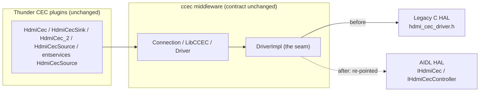
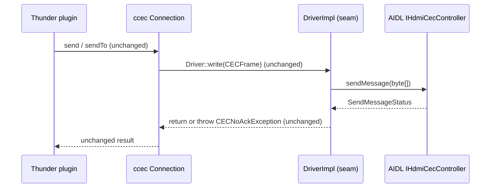
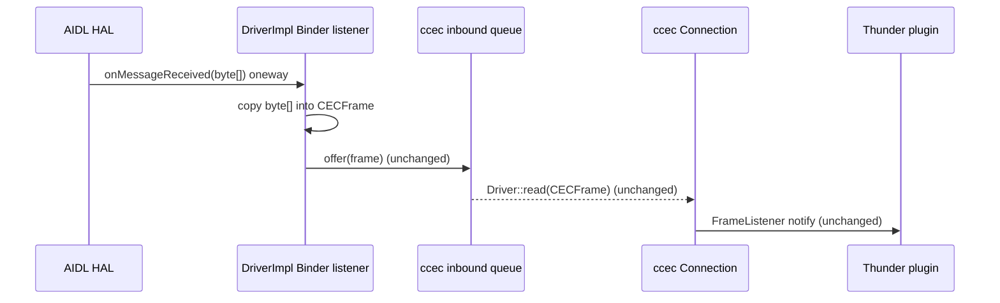

# HDMI CEC — Legacy C HAL to AIDL HAL Migration Mapping

## Overview

This page is the construct-by-construct migration mapping from the **legacy procedural C** HDMI-CEC HAL to the new **`@VintfStability` AIDL** HDMI-CEC HAL, together with the evidence that existing **Thunder (WPEFramework) plugin API behaviour is preserved** across that change.

The legacy contract is the ten-function C header at [`rdk-halif-hdmi_cec/include/hdmi_cec_driver.h`], whose public surface spans [`hdmi_cec_driver.h:L75-L423`]. The target contract is the AIDL package `com.rdk.hal.hdmicec`, declared at [`IHdmiCec.aidl:L41`] and described in the companion design document, [HDMI CEC](hdmi_cec.md).

Neither contract is consumed directly by a Thunder plugin. Every CEC plugin talks to the `ccec` middleware library, and `ccec` reaches the HAL through exactly **one** adapter — [`hdmicec/ccec/src/DriverImpl.cpp`] — whose single `#include` of the legacy header at [`DriverImpl.cpp:L54`] is the only production reference to the legacy C API anywhere in this workspace. That adapter is referred to throughout this page as **the seam**.

!!! info "The behaviour-preservation principle"
    The migration re-points **only the internals of `DriverImpl`**. The plugin-facing `ccec` contract — the abstract `Driver` [`Driver.hpp:L45-L77`], the `LibCCEC` lifecycle singleton [`LibCCEC.hpp:L42-L51`] and the client-facing `Connection` [`Connection.hpp:L57-L85`] — keeps its exact signatures, return values and exception semantics. Because the plugins are written against that contract and never against the HAL, their JSON-RPC / COM-RPC surface is unaffected. Every row of the mapping below is therefore judged on one question: *does the seam still honour the `ccec` contract after the swap?*

### Scope

Three construct classes are mapped, one per sub-table:

|Construct class|Coverage|
|-|-|
|**Methods**|All ten legacy functions [`hdmi_cec_driver.h:L146-L423`] — eight as dedicated rows, plus `HdmiCecSetRxCallback()` [`hdmi_cec_driver.h:L330`] and `HdmiCecSetTxCallback()` [`hdmi_cec_driver.h:L358`] folded into the callback rows, which is what they are: registration mechanisms|
|**Callbacks**|Both legacy typedefs — `HdmiCecRxCallback_t` [`hdmi_cec_driver.h:L106`] and `HdmiCecTxCallback_t` [`hdmi_cec_driver.h:L117`]|
|**Data structures**|The 15-value `HDMI_CEC_STATUS` enum [`hdmi_cec_driver.h:L75-L93`], the opaque `int` handle [`hdmi_cec_driver.h:L146`], the raw message buffer [`hdmi_cec_driver.h:L287-L302`], the single-versus-array logical-address representation [`hdmi_cec_driver.h:L196,L228,L255`], and the additive `Property` [`Property.aidl:L23`] and `State` [`State.aidl:L30`] enums|

Out of scope: any source-code change. This page *describes* the edit each row requires at the seam; it does not perform it. Where the AIDL HAL has no successor for a legacy construct the cell reads `None` and the recommended alternative is named — the gap is documented, not resolved.

### Citation convention and short-name resolution

Every technical statement on this page carries a `path:line` citation. Citations use short file names for legibility; resolve them with this table.

|Short name used in citations|Canonical repository-root-relative path|
|-|-|
|`hdmi_cec_driver.h`|`rdk-halif-hdmi_cec/include/hdmi_cec_driver.h`|
|`hdmi-cec_halSpec.md`|`rdk-halif-hdmi_cec/docs/pages/hdmi-cec_halSpec.md`|
|`IHdmiCec.aidl`, `IHdmiCecController.aidl`, `IHdmiCecEventListener.aidl`, `Property.aidl`, `SendMessageStatus.aidl`, `State.aidl`|`rdk-halif-aidl/hdmicec/current/com/rdk/hal/hdmicec/`|
|`hdmi_cec.md`|`rdk-halif-aidl/hdmicec/current/docs/hdmi_cec.md` (this directory)|
|`DriverImpl.cpp`|`hdmicec/ccec/src/DriverImpl.cpp`|
|`Driver.hpp`, `LibCCEC.hpp`, `Connection.hpp`|`hdmicec/ccec/include/ccec/`|
|`HdmiCecSourceImplementation.cpp`|`entservices-hdmicecsource/plugin/HdmiCecSourceImplementation.cpp`|
|`HdmiCecSinkImplementation.cpp`|`entservices-hdmicecsink/plugin/HdmiCecSinkImplementation.cpp`|

!!! warning "Name-collision hazard: two different `hdmicec` directories"
    The workspace-root `hdmicec/` directory is the **`ccec` middleware repository** — it holds the seam `hdmicec/ccec/src/DriverImpl.cpp`, the preserved public contract `hdmicec/ccec/include/ccec/*.hpp` and the legacy test mock `hdmicec/mocks/hdmicec/hdmi_cec_driver_mock.h`. It is a **completely different** directory from `rdk-halif-aidl/hdmicec/`, which is this AIDL component. The two are unrelated despite the identical leaf name. Always expand a short name to its full repository-root-relative path using the table above before acting on a citation.

---

## Architecture Context

Four layers sit between a JSON-RPC caller and the CEC bus, and only the third one changes:

1. **Thunder CEC plugins** — the JSON-RPC / COM-RPC surface. They include `ccec/Connection.hpp`, `ccec/LibCCEC.hpp`, `ccec/MessageEncoder.hpp` and friends, and nothing else from the CEC stack.
2. **`ccec` public contract** — `LibCCEC` for lifecycle [`LibCCEC.hpp:L42-L51`], `Connection` for messaging [`Connection.hpp:L57-L85`], and the abstract `Driver` the adapter implements [`Driver.hpp:L45-L77`].
3. **`DriverImpl` — the seam** — the concrete `Driver`. Ten call sites bind it to the legacy C HAL: [`DriverImpl.cpp:L119,L124,L125,L146,L212,L251,L296,L308,L325,L337`]. **These ten call sites, and only these, are re-pointed.**
4. **The HAL** — today the legacy C library; after migration the AIDL service `IHdmiCec` [`IHdmiCec.aidl:L41`] and the controller it hands out, `IHdmiCecController` [`IHdmiCecController.aidl:L37`].

The migration therefore has an unusually narrow blast radius: one file, ten call sites, two added Binder listener methods. Layers 1 and 2 are untouched.



The single most consequential structural difference is *where the HAL boundary sits*. The legacy HAL was a linked shared library, `libRCECHal.so` [`hdmi-cec_halSpec.md:L140`], called in-process through function pointers and an opaque `int` handle. The AIDL HAL is an out-of-process Binder service reached through object references. Registration, lifetime and error reporting all change shape as a result, and those three shape changes account for most of the risk recorded below.

---

## Migration Mapping Table

The table is presented in three parts — methods, callbacks and data structures — each using the identical five-column schema. Read the columns as: what the plugins depend on today, the legacy construct behind it, the AIDL construct that replaces it, the change required at the seam, and the residual risk to plugin behaviour.

### Method Mapping

| Existing plugin dependency | Old HAL concept | New AIDL HAL equivalent | Migration action | Risk |
|---|---|---|---|---|
| `LibCCEC::init()` drives `Driver::open()` at plugin startup [`LibCCEC.hpp:L47`], called by every CEC plugin — [`HdmiCecSourceImplementation.cpp:L956`], [`HdmiCecSinkImplementation.cpp:L3035`] | `HdmiCecOpen(int *handle)` returns `HDMI_CEC_STATUS` [`hdmi_cec_driver.h:L146`] | `IHdmiCec.open(IHdmiCecEventListener)` returns `IHdmiCecController` [`IHdmiCec.aidl:L114`] | In `DriverImpl::open()` bind the `IHdmiCec` service and call `open(listener)`; store the controller reference instead of the int handle [`DriverImpl.cpp:L119`] | **Medium** — receive registration folds into `open()`; source-side address discovery leaves the HAL for middleware [`hdmi_cec_driver.h:L124-L127`]; `EX_ILLEGAL_STATE` replaces `HDMI_CEC_IO_ALREADY_OPEN` [`IHdmiCec.aidl:L93`] |
| `LibCCEC::term()` drives `Driver::close()` at teardown [`LibCCEC.hpp:L48`], called by every CEC plugin — [`HdmiCecSourceImplementation.cpp:L1156`], [`HdmiCecSinkImplementation.cpp:L3168`] | `HdmiCecClose(int handle)` [`hdmi_cec_driver.h:L168`] | `IHdmiCec.close(IHdmiCecController)` returns boolean [`IHdmiCec.aidl:L137`] | In `DriverImpl::close()` call `close(controller)` and release the reference [`DriverImpl.cpp:L146`] | **Low** — both clear registered addresses ([`hdmi_cec_driver.h:L152`] and [`IHdmiCec.aidl:L122`]); a boolean result replaces the status enum |
| `Connection::send()` and `sendTo()` reach `Driver::write()` [`Connection.hpp:L69-L72`] — the primary plugin transmit path, e.g. [`HdmiCecSourceImplementation.cpp:L774`], [`HdmiCecSinkImplementation.cpp:L2784`] | `HdmiCecTx(handle, buf, len, int *result)`, synchronous [`hdmi_cec_driver.h:L395`] | `IHdmiCecController.sendMessage(byte[])` returns `SendMessageStatus` [`IHdmiCecController.aidl:L125`] | In `DriverImpl::write()` call `sendMessage` and translate the result onto the ccec result codes (`Driver::SENT_AND_ACKD` [`Driver.hpp:L50`], `SENT_FAILED` [`Driver.hpp:L51`], `SENT_BUT_NOT_ACKD` [`Driver.hpp:L52`]), preserving both `CECNoAckException` paths [`DriverImpl.cpp:L251,L277,L283`] | **High** — the result set differs and requires the cross-walk below; the maximum message size is 16 bytes [`IHdmiCecController.aidl:L95`] |
| `Connection::sendAsync()` and `sendToAsync()` reach `Driver::writeAsync()` [`Connection.hpp:L73,L77`]; live in production at [`HdmiCecSourceImplementation.cpp:L1443`] | `HdmiCecTxAsync(handle, buf, len)`, deprecated [`hdmi_cec_driver.h:L423`, deprecation note L398] | **None** — no async send exists; the diagnostic `IHdmiCecEventListener.onMessageSent` reports outcomes after the fact [`IHdmiCecEventListener.aidl:L102`] | In `DriverImpl::writeAsync()` route to the synchronous `sendMessage` on the existing ccec sender thread so callers stay non-blocking [`DriverImpl.cpp:L212`] | **Medium** — AIDL is synchronous-send only [`hdmi_cec.md:L35`]; async must be emulated by ccec threading; the legacy path is already deprecated |
| `Driver::addLogicalAddress()` [`Driver.hpp:L64`], reached through `LibCCEC::addLogicalAddress()` [`LibCCEC.hpp:L51`] by the sink plugin at [`HdmiCecSinkImplementation.cpp:L2767,L3065`] | `HdmiCecAddLogicalAddress(handle, int)`, sink-only, single address [`hdmi_cec_driver.h:L196`, sink-only L174-L175] | `IHdmiCecController.addLogicalAddresses(int[])` returns boolean [`IHdmiCecController.aidl:L62`] | In `DriverImpl::addLogicalAddress()` wrap the single address in a one-element array [`DriverImpl.cpp:L337`] | **Medium** — single-to-array cardinality; range restricted to 0x0–0xE [`IHdmiCecController.aidl:L50`]; a batch "false if any already added" [`IHdmiCecController.aidl:L51`] replaces per-code status |
| `Driver::removeLogicalAddress()` [`Driver.hpp:L63`], exercised on the sink teardown and HPD paths | `HdmiCecRemoveLogicalAddress(handle, int)`, sink-only, resets the address to 0xF [`hdmi_cec_driver.h:L228`, reset semantics L203] | `IHdmiCecController.removeLogicalAddresses(int[])` returns boolean [`IHdmiCecController.aidl:L81`] | In `DriverImpl::removeLogicalAddress()` wrap the single address in an array [`DriverImpl.cpp:L325`] | **Low-Medium** — array cardinality; "false if any addresses are not added" [`IHdmiCecController.aidl:L70`]; verify the 0xF default-reset is preserved |
| `Driver::getLogicalAddress()` [`Driver.hpp:L66`] and `LibCCEC::getLogicalAddress()` [`LibCCEC.hpp:L49`], called by every CEC plugin — e.g. [`HdmiCecSourceImplementation.cpp:L1192`] | `HdmiCecGetLogicalAddress(handle, int *)`, returns 0x0F when none is set [`hdmi_cec_driver.h:L255`, sentinel L235] | `IHdmiCec.getLogicalAddresses()` returns `int[]` [`IHdmiCec.aidl:L82`] | In `DriverImpl::getLogicalAddress()` call `getLogicalAddresses()` on the service and select per device type [`DriverImpl.cpp:L296`] | **Medium** — single-per-device-type [`hdmi_cec_driver.h:L236`] versus array-of-all, with the broadcast address 0xF excluded [`IHdmiCec.aidl:L74-L75`] and a zero-length array when none are set [`IHdmiCec.aidl:L77`]; middleware must reconcile the selection and the "none" sentinel |
| `Driver::getPhysicalAddress()` [`Driver.hpp:L67`] and `LibCCEC::getPhysicalAddress()` [`LibCCEC.hpp:L50`], called by every CEC plugin — [`HdmiCecSourceImplementation.cpp:L1176`], [`HdmiCecSinkImplementation.cpp:L3201`] | `HdmiCecGetPhysicalAddress(handle, unsigned int *)` [`hdmi_cec_driver.h:L280`]; legacy `HdmiCecOpen()` itself discovered the physical address from the connection topology [`hdmi-cec_halSpec.md:L158`] and the HAL owned CEC 10 physical device discovery [`hdmi-cec_halSpec.md:L66`] | **None** — physical address, HPD and EDID are out of scope for the CEC HAL; source them from the HDMI Input / HDMI Output HAL instead [`hdmi_cec.md:L39`] | In `DriverImpl::getPhysicalAddress()` re-source the value from the HDMI Input / HDMI Output HAL or from a middleware cache, keeping the ccec signature unchanged [`DriverImpl.cpp:L308`] | **High** — no CEC-HAL equivalent; introduces a new cross-HAL dependency; if unresolved, every CEC plugin loses physical-address reporting |

Signature contrast for the highest-risk method row, transmit:

```c
/* Legacy C — hdmi_cec_driver.h:L395 */
HDMI_CEC_STATUS HdmiCecTx(int handle, const unsigned char *buf, int len, int *result);
```

```java
// AIDL — IHdmiCecController.aidl:L125
SendMessageStatus sendMessage(in byte[] message);
```

The legacy call reports two things — a call-level `HDMI_CEC_STATUS` return and a bus-level `int *result` out-parameter whose values are "valid only for directly addressed messages" [`hdmi_cec_driver.h:L374-L377`]. The AIDL call reports one: a `SendMessageStatus` return, with call-level failures raised as Binder exceptions instead [`IHdmiCec.aidl:L32-L37`]. The seam must fold two channels into one without losing the directed-versus-broadcast distinction; see the cross-walk and its warning below.

Signature contrast for address management:

```c
/* Legacy C — hdmi_cec_driver.h:L196 */
HDMI_CEC_STATUS HdmiCecAddLogicalAddress(int handle, int logicalAddresses);
```

```java
// AIDL — IHdmiCecController.aidl:L62
boolean addLogicalAddresses(in int[] logicalAddresses);
```

### Callback Mapping

| Existing plugin dependency | Old HAL concept | New AIDL HAL equivalent | Migration action | Risk |
|---|---|---|---|---|
| `DriverImpl::DriverReceiveCallback` feeds the inbound queue [`DriverImpl.cpp:L58,L70`], from which `Connection` dispatches to the plugins' `FrameListener` implementations registered via `Connection::addFrameListener` [`Connection.hpp:L66`] — e.g. [`HdmiCecSourceImplementation.cpp:L1027`], [`HdmiCecSinkImplementation.cpp:L2782`] | `HdmiCecRxCallback_t` registered via `HdmiCecSetRxCallback` [`hdmi_cec_driver.h:L106,L330`] | `IHdmiCecEventListener.onMessageReceived(byte[])` [`IHdmiCecEventListener.aidl:L57`] | Implement a Binder listener in `DriverImpl`, move the receive logic into `onMessageReceived`, and register the listener as the `open()` argument rather than through a separate `HdmiCecSetRxCallback` call [`DriverImpl.cpp:L58,L124`] | **Medium** — receive registration folds into `open()`; the `byte[]` copy preserves the old transient-buffer semantics (the C contract at [`hdmi_cec_driver.h:L99`] requires copying because `buf` is invalid once the callback returns, which ccec already satisfies at [`DriverImpl.cpp:L60-L61`]); `oneway` delivery [`IHdmiCecEventListener.aidl:L31`] means ordering is absorbed by the inbound queue |
| `DriverImpl::DriverTransmitCallback`, already vestigial because transmit is synchronous — it only logs on failure [`DriverImpl.cpp:L80,L83`] | `HdmiCecTxCallback_t` registered via `HdmiCecSetTxCallback`, deprecated [`hdmi_cec_driver.h:L117,L358`, deprecation notes L109,L333] | Diagnostic `IHdmiCecEventListener.onMessageSent(byte[], SendMessageStatus)` [`IHdmiCecEventListener.aidl:L102`, diagnostic intent L70,L75-L76] | Optionally surface transmit diagnostics through `onMessageSent`; retire the transmit callback because the synchronous `sendMessage` already returns the status; drop the `HdmiCecSetTxCallback` registration [`DriverImpl.cpp:L125`] | **Low** — already deprecated on the legacy side and log-only on the ccec side; the synchronous status return covers the functional need |

### Data Structure Mapping

| Existing plugin dependency | Old HAL concept | New AIDL HAL equivalent | Migration action | Risk |
|---|---|---|---|---|
| `DriverImpl` maps HAL status onto the ccec exceptions the plugins actually catch — `CECNoAckException` [`DriverImpl.cpp:L277,L283`], `IOException` [`DriverImpl.cpp:L272`], `InvalidStateException` [`DriverImpl.cpp:L160`], `AddressNotAvailableException` [`DriverImpl.cpp:L340`] | `enum HDMI_CEC_IO_ERROR`, typedef'd `HDMI_CEC_STATUS`, 15 values [`hdmi_cec_driver.h:L75-L93`]; the legacy contract returned every error synchronously as a return argument [`hdmi-cec_halSpec.md:L109`] | Binder built-in status plus service-specific exceptions [`IHdmiCec.aidl:L32-L37`], and `SendMessageStatus` for transmit outcomes [`SendMessageStatus.aidl:L44,L51,L56`] | Add a status cross-walk in `DriverImpl` that reproduces the existing ccec exception model exactly — see the Status-Code Cross-Walk below | **High** — 15 discrete codes collapse onto Binder exceptions, boolean returns and a three-value status; the mapping is not one-to-one and must be specified explicitly |
| Internal to `DriverImpl`; never exposed to the plugins [`DriverImpl.cpp:L119`] | Opaque `int handle` produced by `HdmiCecOpen` and passed to every other function [`hdmi_cec_driver.h:L146`] | An `IHdmiCecController` object reference returned by `open()` [`IHdmiCec.aidl:L114`] | Store the controller reference in place of the int handle and route every control-plane call through it | **Low** — an object model replaces the integer handle; lifetime is bound to the Binder reference, so a client crash implies an implicit `close()` [`IHdmiCec.aidl:L100-L101`], which is strictly safer than a leaked handle |
| The ccec `CECFrame`, produced and consumed by `MessageEncoder` / `MessageDecoder` on behalf of the plugins and passed across `Connection` [`Connection.hpp:L69-L77`] | `unsigned char *buf` plus `int len` — a raw frame of header block, opcode block and operands [`hdmi_cec_driver.h:L287-L302`]; receive-buffer allocation ceiling 20 bytes [`hdmi-cec_halSpec.md:L87`] | `byte[] message` [`IHdmiCecController.aidl:L125`, frame layout L91-L93] | Convert `CECFrame` to and from `byte[]` at the seam on both transmit and receive; the on-wire frame format itself is unchanged, both contracts excluding the EOM and ACK bits from the caller-visible buffer ([`hdmi_cec_driver.h:L304-L305`], [`IHdmiCecEventListener.aidl:L53`], [`IHdmiCecController.aidl:L107`]) | **Low-Medium** — the AIDL message is capped at 16 bytes [`IHdmiCecController.aidl:L95`] where the legacy allocation ceiling was 20 bytes [`hdmi-cec_halSpec.md:L87`]; the `unsigned char` versus signed Java `byte` difference is handled in the conversion |
| The ccec single-address logical-address API used by the sink plugin [`Driver.hpp:L63-L66`], [`LibCCEC.hpp:L49-L51`] | A single `int` logical address on add, remove and get [`hdmi_cec_driver.h:L196,L228,L255`] | `int[]` on add and remove [`IHdmiCecController.aidl:L62,L81`]; `getLogicalAddresses()` returns `int[]` [`IHdmiCec.aidl:L82`] | Adapt the cardinality by wrapping and unwrapping arrays inside `DriverImpl`, keeping the ccec single-address API exactly as the plugins see it | **Medium** — cardinality mismatch, plus all-or-nothing batch semantics [`IHdmiCecController.aidl:L51,L70`] where the legacy API returned a per-call status code |
| None today; this is a new capability with no legacy counterpart | **None** — no equivalent exists in the legacy C API | The `Property` enum — `HAL_CEC_VERSION` [`Property.aidl:L36`] plus the metric counters `METRIC_DIRECTED_MESSAGES_SENT` [`Property.aidl:L48`], `METRIC_BROADCAST_MESSAGES_SENT` [`Property.aidl:L60`], `METRIC_DIRECTED_MESSAGES_SENT_AND_ACKED` [`Property.aidl:L72`], `METRIC_BROADCAST_MESSAGE_SENT_AND_ACKED` [`Property.aidl:L85`] and `METRIC_ARBITRATION_FAILURES` [`Property.aidl:L97`] — read through `getProperty()` [`IHdmiCec.aidl:L69`]; and the `State` enum, `CLOSED` [`State.aidl:L35`] and `STARTED` [`State.aidl:L40`], read through `getState()` [`IHdmiCec.aidl:L57`] and observed through `onStateChanged` [`IHdmiCecEventListener.aidl:L67`] | Optionally surface the new metrics and state through ccec and onward to the plugins; this is purely additive and can be deferred without affecting the migration | **Low** — additive only; nothing existing depends on it, so there is no behaviour-preservation concern |

!!! note "Do not normalise the metric names"
    `Property.aidl:L60` is `METRIC_BROADCAST_MESSAGES_SENT` — plural *MESSAGES* — while `Property.aidl:L85` is `METRIC_BROADCAST_MESSAGE_SENT_AND_ACKED` — singular *MESSAGE*. The asymmetry is in the published interface, so quote each identifier exactly as it appears rather than tidying it.

Signature contrast for the status model:

```c
/* Legacy C — hdmi_cec_driver.h:L75-L77 (15 enumerators, L77-L91) */
typedef enum HDMI_CEC_IO_ERROR { HDMI_CEC_IO_SUCCESS = 0, /* … */ } HDMI_CEC_STATUS;
```

```java
// AIDL — SendMessageStatus.aidl:L30-L44
enum SendMessageStatus { ACK_STATE_0 = 0, /* ACK_STATE_1 = 1 (L51), BUSY = 2 (L56) */ }
```

---

## Status-Code Cross-Walk

This is the single highest-risk mapping on the page: fifteen integer codes [`hdmi_cec_driver.h:L77-L91`] collapse onto Binder exceptions [`IHdmiCec.aidl:L32-L37`], boolean returns and a three-value transmit status [`SendMessageStatus.aidl:L44,L51,L56`]. The right-hand column states the ccec behaviour that must survive the collapse — that is the acceptance criterion for the seam.

| Legacy `HDMI_CEC_STATUS` | AIDL equivalent | Preserved ccec behaviour |
|---|---|---|
| `HDMI_CEC_IO_SUCCESS` [`hdmi_cec_driver.h:L77`] | Binder OK status, `EX_NONE` [`IHdmiCec.aidl:L34`], or boolean `true` | Normal return |
| `HDMI_CEC_IO_SENT_AND_ACKD` [`hdmi_cec_driver.h:L78`] | `SendMessageStatus.ACK_STATE_0` for a **directed** message [`SendMessageStatus.aidl:L44`, semantics L40] | Normal return from `Driver::write`, i.e. `Driver::SENT_AND_ACKD` [`Driver.hpp:L50`] |
| `HDMI_CEC_IO_SENT_BUT_NOT_ACKD` [`hdmi_cec_driver.h:L79`] | `SendMessageStatus.ACK_STATE_1` for a **directed** message [`SendMessageStatus.aidl:L51`, semantics L47] | `CECNoAckException` thrown — directed path [`DriverImpl.cpp:L276-L278`], CTS 9-3-3 broadcast path [`DriverImpl.cpp:L279-L284`] |
| `HDMI_CEC_IO_SENT_FAILED` [`hdmi_cec_driver.h:L80`] | `SendMessageStatus.BUSY` — arbitration failed after two attempts [`SendMessageStatus.aidl:L56`, semantics L54] | Send-failure path raises `IOException` [`DriverImpl.cpp:L269,L272`]; equates to `Driver::SENT_FAILED` [`Driver.hpp:L51`] |
| `HDMI_CEC_IO_NOT_OPENED`, `HDMI_CEC_IO_INVALID_HANDLE` [`hdmi_cec_driver.h:L81,L88`] | Binder `EX_ILLEGAL_STATE` [`IHdmiCec.aidl:L32-L37,L105`] | `InvalidStateException` [`DriverImpl.cpp:L160`] |
| `HDMI_CEC_IO_INVALID_ARGUMENT`, `HDMI_CEC_IO_INVALID_OUTPUT` [`hdmi_cec_driver.h:L82,L87`] | Binder `EX_ILLEGAL_ARGUMENT` [`IHdmiCec.aidl:L35`] | Argument-validation error raises `IOException` [`DriverImpl.cpp:L267,L272`] |
| `HDMI_CEC_IO_OPERATION_NOT_SUPPORTED` [`hdmi_cec_driver.h:L89`] | Binder `EX_UNSUPPORTED_OPERATION` | Source-device add / remove-address rejection [`hdmi_cec_driver.h:L174-L175,L207,L220-L221`] |
| `HDMI_CEC_IO_LOGICALADDRESS_UNAVAILABLE`, `HDMI_CEC_IO_ALREADY_REMOVED`, `HDMI_CEC_IO_NOT_ADDED` [`hdmi_cec_driver.h:L83,L86,L90`] | `addLogicalAddresses` / `removeLogicalAddresses` return `false` [`IHdmiCecController.aidl:L51,L62,L70,L81`] | Address-management result handled inside ccec — `AddressNotAvailableException` when unavailable [`DriverImpl.cpp:L339-L340`] |
| `HDMI_CEC_IO_ALREADY_OPEN` [`hdmi_cec_driver.h:L85`] | Binder `EX_ILLEGAL_STATE` on reopen — "Only a single instance can be opened. Attempts to open again, by this or another process will fail with `binder::Status EX_ILLEGAL_STATE`" [`IHdmiCec.aidl:L93`] | `InvalidStateException` [`DriverImpl.cpp:L113`] |
| `HDMI_CEC_IO_GENERAL_ERROR` [`hdmi_cec_driver.h:L84`] | Binder `EX_SERVICE_SPECIFIC` or general error [`IHdmiCec.aidl:L35`] | `IOException` [`DriverImpl.cpp:L121,L342-L343`] |
| `HDMI_CEC_IO_MAX` [`hdmi_cec_driver.h:L91`] | Not mapped — enum range sentinel, never a real outcome | Not applicable |

Two structural notes on the collapse. First, the legacy API split its reporting between a return value and, for transmit only, an out-parameter; AIDL splits it between the return value and the Binder exception channel. Second, `HDMI_CEC_IO_ALREADY_OPEN` was already slated for removal on the legacy side — "This error code will deprecated in the next phase" [`hdmi_cec_driver.h:L135`] — so mapping it onto `EX_ILLEGAL_STATE` follows the direction the legacy contract was already travelling.

!!! warning "The ACK_STATE_* inversion — the single most error-prone part of this migration"
    The meaning of `ACK_STATE_0` and `ACK_STATE_1` **inverts** between directed and broadcast messages, per HDMI 1.4b Section CEC 6.1.2 "ACK (Acknowledge)" [`SendMessageStatus.aidl:L35-L36`]:

    - **Directed message** — `ACK_STATE_0` means "The message was sucessfully acknowledged by the directly addressed follower" [`SendMessageStatus.aidl:L40`] (the source spells it *sucessfully*; quoted as-is), and `ACK_STATE_1` means "The message was not acknowledged by the directly addressed follower" [`SendMessageStatus.aidl:L47`].
    - **Broadcast message** — `ACK_STATE_0` means "One or more devices rejected the message" [`SendMessageStatus.aidl:L41`], and `ACK_STATE_1` means "The message was sent and not rejected by any device" [`SendMessageStatus.aidl:L49`].

    The AIDL package corroborates the inversion independently: "An acknowledgement implies a NACK in accordance with the inverted sense described in CEC specification" [`Property.aidl:L76`].

    **This is concrete, not theoretical.** `DriverImpl::write()` already discriminates directed from broadcast by inspecting the destination nibble `frame.at(0) & 0x0F`. The directed branch is `((frame.at(0) & 0x0F) != 0x0F) && sendResult == HDMI_CEC_IO_SENT_BUT_NOT_ACKD` [`DriverImpl.cpp:L276`], throwing `CECNoAckException()` [`DriverImpl.cpp:L277`]. The broadcast branch carries a comment that literally cites "CEC CTS 9-3-3" and the `REPORT_PHYSICAL_ADDRESS` retry requirement [`DriverImpl.cpp:L279`]; its condition is `((frame.at(0) & 0x0F) == 0x0F) && (length > 1) && ((frame.at(1) & 0xFF) == REPORT_PHYSICAL_ADDRESS) && (sendResult == HDMI_CEC_IO_SENT_BUT_NOT_ACKD)` [`DriverImpl.cpp:L280`], throwing `CECNoAckException()` [`DriverImpl.cpp:L283`].

    A naive `ACK_STATE_1 ⇒ CECNoAckException` translation would **invert the broadcast branch** and silently break behaviour that both CEC plugins depend on: each of them broadcasts `ReportPhysicalAddress` — opcode 0x84 [`hdmicec/ccec/include/ccec/OpCode.hpp:L73`] — on the very path the CTS 9-3-3 branch guards, at [`HdmiCecSourceImplementation.cpp:L774`] and [`HdmiCecSinkImplementation.cpp:L2784`]. The seam must keep the directed-versus-broadcast discrimination and map `SendMessageStatus` **per direction**. Note that the legacy contract already restricted its `result` values to "valid only for directly addressed messages" [`hdmi_cec_driver.h:L374-L377`], so per-direction interpretation is a preserved requirement rather than a new one.

---

## Gaps and Risks

Seven items, ordered by severity. Each is recorded rather than resolved: this page documents what the migration must decide, and deliberately stops short of prescribing implementation.

### 1. Physical-address discontinuity — highest risk

**Context:** `HdmiCecGetPhysicalAddress` [`hdmi_cec_driver.h:L280`] has **no** successor in the AIDL CEC HAL. The AIDL design document places the capability outside the HAL entirely:

> **HPD/EDID/Physical Address:** Out of scope for HAL; MW acquires physical address (EDID for Source, `0.0.0.0` for Sink) and manages HPD via `HDMI Input` (For Sink) / `HDMI Output` (For Source) HALs.

— [`hdmi_cec.md:L39`]

**Diagnosis:** The discontinuity is wider than one function. Legacy `HdmiCecOpen()` itself "also discovers the physical address based on the connection topology" [`hdmi-cec_halSpec.md:L158`], and the legacy HAL owned "physical device discovery and announcements on the `CEC` network as defined in the `HDMI-CEC Specification` Section `CEC 10`" [`hdmi-cec_halSpec.md:L66`]. Both responsibilities now sit with the Controller Client and middleware [`hdmi_cec.md:L39,L54`]. Meanwhile the ccec contract still publishes `getPhysicalAddress` [`Driver.hpp:L67`], [`LibCCEC.hpp:L50`] and the seam still calls the legacy function [`DriverImpl.cpp:L308`], with every CEC plugin depending on it — [`HdmiCecSourceImplementation.cpp:L1176`], [`HdmiCecSinkImplementation.cpp:L3201`].

**Recommended alternative:** obtain the physical address from the [HDMI Input](../hdmiinput/hdmi_input.md) HAL for sink devices and the [HDMI Output](../hdmioutput/hdmi_output.md) HAL for source devices, or from a middleware cache populated at HPD assertion, and keep the ccec signature unchanged so no plugin sees the difference.

**Risk:** **High.** It is the only mapping that requires a dependency on a HAL outside CEC. Left unresolved, every CEC plugin loses physical-address reporting, which in turn breaks the `ReportPhysicalAddress` broadcast at [`HdmiCecSourceImplementation.cpp:L774`] and [`HdmiCecSinkImplementation.cpp:L2784`].

### 2. High-level-protocol relocation to middleware

**Context:** The AIDL HAL performs the CEC low-level protocol only — "electrical timing, arbitration, retries, ACK sampling" [`hdmi_cec.md:L5`] — with the CEC link layer and frame I/O in scope and middleware owning the high-level protocol [`hdmi_cec.md:L34`]. Requirement HAL.CEC.2 assigns "CEC 3 High Level Protocol" to the CEC Controller Client [`hdmi_cec.md:L47`], and HAL.CEC.9 assigns logical-address allocation to it as well [`hdmi_cec.md:L54`].

**Diagnosis:** The *direction* is preserved; only the specification citation moves. The legacy contract already placed higher-level protocol on the caller — "The `caller` must be responsible for `CEC` higher level protocol as defined in `HDMI-CEC Specification` Section `CEC 12`" [`hdmi-cec_halSpec.md:L64`] — where the AIDL requirement cites CEC 3 instead [`hdmi_cec.md:L47`]. Likewise the legacy "caller must pass fully formed `CEC` messages to the `HAL`" [`hdmi-cec_halSpec.md:L65`] survives as HAL.CEC.4 [`hdmi_cec.md:L49`].

**Risk:** **Low** for the plugins, because ccec and the plugins already own message semantics through `MessageEncoder` / `MessageDecoder`. The residue is the CEC 10 discovery duty noted in item 1.

### 3. Deprecated transmit paths

**Context:** `HdmiCecSetTxCallback` [`hdmi_cec_driver.h:L358`, deprecation note L333] with its typedef `HdmiCecTxCallback_t` [`hdmi_cec_driver.h:L117`, deprecation note L109], and `HdmiCecTxAsync` [`hdmi_cec_driver.h:L423`, deprecation note L398], are all marked deprecated in the legacy header. AIDL offers synchronous send only — "Synchronously send a CEC message" [`IHdmiCecController.aidl:L84`], with queueing explicitly left to middleware [`hdmi_cec.md:L35`].

**Diagnosis:** ccec's transmit callback is already vestigial: `DriverImpl::DriverTransmitCallback` only logs on failure and discards the result [`DriverImpl.cpp:L80,L83`], so retiring it costs nothing. The asynchronous *send* is not vestigial, however — `Connection::sendAsync` is used in production at [`HdmiCecSourceImplementation.cpp:L1443`] — so `DriverImpl::writeAsync` [`DriverImpl.cpp:L212`] must keep its non-blocking contract by dispatching the synchronous `sendMessage` on a ccec thread.

**Risk:** **Medium**, concentrated in the asynchronous send rather than the callback.

### 4. Address-management cardinality change

**Context:** Address management moves from single-address C calls [`hdmi_cec_driver.h:L196,L228,L255`] to array-based AIDL calls [`IHdmiCecController.aidl:L62,L81`].

**Diagnosis:** Three differences compound. The AIDL calls are batch and all-or-nothing — false if any address is already added [`IHdmiCecController.aidl:L51`], false if any address is not added [`IHdmiCecController.aidl:L70`] — where the legacy calls returned a specific status per address. The AIDL range is restricted to 0x0–0xE [`IHdmiCecController.aidl:L50`], whereas the legacy header validated against "less than 0x0 and greater than 0xF" [`hdmi_cec_driver.h:L187`]. And `getLogicalAddresses()` returns every address with 0xF filtered out [`IHdmiCec.aidl:L74-L75`] and a zero-length array when none are set [`IHdmiCec.aidl:L77`], where the legacy getter returned one address per device type [`hdmi_cec_driver.h:L236`] and the 0x0F sentinel when none was set [`hdmi_cec_driver.h:L235`].

**Solution shape:** wrap and unwrap arrays in `DriverImpl` [`DriverImpl.cpp:L325,L337`], and reconstruct the 0x0F sentinel from an empty array so `Driver::getLogicalAddress` [`Driver.hpp:L66`] keeps returning what the plugins expect.

**Risk:** **Medium.**

### 5. Status-model collapse

**Context:** Fifteen enumerators [`hdmi_cec_driver.h:L77-L91`] collapse onto Binder exceptions [`IHdmiCec.aidl:L32-L37`], booleans and a three-value `SendMessageStatus` [`SendMessageStatus.aidl:L44,L51,L56`]. The legacy premise was that "All the `APIs` must return error synchronously as a return argument" [`hdmi-cec_halSpec.md:L109`].

**Diagnosis:** The collapse is safe only if the seam reproduces the ccec exception model exactly, which is what the Status-Code Cross-Walk above specifies. The ACK-inversion trap in that section is part of this item and is its most dangerous element.

**Risk:** **High** — mitigated to Low by implementing the cross-walk as written.

### 6. `oneway` event delivery

**Context:** `IHdmiCecEventListener` is declared `oneway` [`IHdmiCecEventListener.aidl:L31`], so every callback is fire-and-forget with no return path to the HAL.

**Diagnosis:** This matches, rather than changes, the legacy expectation that "The caller is required to return the callback context as fast as possible" [`hdmi-cec_halSpec.md:L101`]. ccec already decouples delivery from processing by offering each frame to an inbound queue [`DriverImpl.cpp:L58,L70`], so ordering and back-pressure are absorbed exactly as they are today. Frame-content handling is also unchanged: the HAL must strip the EOM and ACK bits from the delivered buffer [`IHdmiCecEventListener.aidl:L53`], matching the legacy contract [`hdmi_cec_driver.h:L304-L305`].

**Risk:** **Low.** One caveat worth noting: a `oneway` call cannot report a listener-side failure, so the existing catch-all that logs and deletes the frame when the queue rejects it [`DriverImpl.cpp:L72-L76`] becomes the only place such a loss is visible.

### 7. Retry-responsibility relocation

**Context:** CEC 7.1 frame re-transmission moves **from the caller into the HAL**. The legacy specification is explicit that the caller owns it: "`Caller` is responsible to perform retry operations as per the `CEC` specification requirements. `Caller` will retry each transmission in line with a requirement as specified in Section `CEC 7.1` of the HMDI-CEC specification." [`hdmi-cec_halSpec.md:L71`]. The AIDL contract is equally explicit that the HAL owns it: "The HAL implementation MUST comply with HDMI Specification 1-4> Section <CEC 7.1> on Frame Re-transmissions." [`IHdmiCecController.aidl:L109`]. `SendMessageStatus` corroborates by reporting that "At least one retransmission was attempted." [`SendMessageStatus.aidl:L42,L48`] and that arbitration failed "after two attempts" [`SendMessageStatus.aidl:L54`]; the design document likewise lists retries among the HAL's low-level duties [`hdmi_cec.md:L5`].

**Diagnosis:** The CTS 9-3-3 comment at [`DriverImpl.cpp:L279`] requires a retry above the HAL, so layering that on top of HAL-internal retry risks **double-retrying** the `REPORT_PHYSICAL_ADDRESS` broadcast.

**Solution shape:** decide explicitly which layer owns CEC 7.1 retry and remove the duplicate; if the HAL owns it, the ccec-level retry becomes a CTS-compliance concern to re-validate rather than a mechanism to keep.

**Risk:** **Medium.**

---

## Behaviour-Preservation Validation

**The claim.** The migration re-points **only the internals of `DriverImpl`**. No plugin-facing signature, return value or exception changes, so no plugin's JSON-RPC / COM-RPC behaviour changes.

**Why the claim is credible.** Because the coupling to the legacy HAL is astonishingly narrow, the claim is checkable rather than aspirational — the whole argument rests on three verifiable facts and one invariant contract.

### The invariant ccec contract

Three headers define everything the plugins can see. All of them are untouched by the migration.

|Contract|Members that must not change|
|-|-|
|Abstract `Driver` [`Driver.hpp:L45-L77`]|The twelve pure virtuals — `open` L58, `close` L59, `read` L60, `write` L61, `writeAsync` L62, `removeLogicalAddress` L63, `addLogicalAddress` L64, `getLogicalAddress` L66, `getPhysicalAddress` L67, `isValidLogicalAddress` L68, `poll` L69, `printFrameDetails` L70 — plus the result enum `SENT_AND_ACKD` L50, `SENT_FAILED = 1` L51, `SENT_BUT_NOT_ACKD` L52, and the singleton accessor `getInstance` L47|
|`LibCCEC` lifecycle [`LibCCEC.hpp:L42-L51`]|`getInstance` L44, `init` L47, `term` L48, `getLogicalAddress` L49, `getPhysicalAddress` L50, `addLogicalAddress` L51|
|`Connection` API [`Connection.hpp:L57-L85`]|`open` L63, `close` L64, `addFrameListener` L66, `removeFrameListener` L67, the four `send` / `sendTo` overloads L69-L72, `sendToAsync` L73, `poll` L74, `ping` L75, `sendAsync` L77, `getSource` L79, `setSource` L83 — including their exception semantics|

Note when reading `Driver.hpp` that line 65 is a commented-out earlier form of the getter, `// virtual void getLogicalAddress(int devType, int *logicalAddress) = 0;`. The live pure virtual is [`Driver.hpp:L66`], and that is the one the seam implements at [`DriverImpl.cpp:L290`].

### Three empirically verified facts

**Fact 1 — the seam is a single file.** A repository-wide search for `hdmi_cec_driver.h` across every `.c`, `.cpp`, `.h` and `.hpp` file returns exactly **eleven** files, and only one of them is production code:

|Category|Count|Files|
|-|-|-|
|Production consumer|1|`hdmicec/ccec/src/DriverImpl.cpp` — the `#include` at [`DriverImpl.cpp:L54`]|
|The header itself|1|`rdk-halif-hdmi_cec/include/hdmi_cec_driver.h`|
|Test mock|1|`hdmicec/mocks/hdmicec/hdmi_cec_driver_mock.h`|
|VTS / harness|8|Under `rdk-halif-test-hdmi_cec/`: `skeletons/src/hdmi_cec_driver.c`, `src/test_l1_hdmi_cec_driver.c`, `src/test_l2_hdmi_cec_sink_driver.c`, `src/test_l2_hdmi_cec_source_driver.c`, `src/test_l3_hdmi_cec_driver.c`, `src/test_vcomponent.c`, `src/test_vd_hdmi_cec_driver.c`, `vcomponent/src/vcHdmiCec.c`|

Every non-production reference is a test mock or a VTS harness. **This narrowness is precisely what makes the behaviour-preservation argument credible:** there is no second consumer to keep in step, no header leaking legacy types into plugin translation units, and no build target that sees both HALs at once.

**Fact 2 — no plugin includes the HAL header.** The CEC plugins include only ccec headers — `ccec/Connection.hpp`, `ccec/LibCCEC.hpp` (via `ccec/CCEC.hpp`), `ccec/CECFrame.hpp`, `ccec/MessageEncoder.hpp`, `ccec/MessageDecoder.hpp`, `ccec/MessageProcessor.hpp`, `ccec/FrameListener.hpp`, `ccec/Messages.hpp` and `ccec/Assert.hpp`. In this migration workspace that is exactly **four plugin source files (C/C++)**: `entservices-hdmicecsource/plugin/HdmiCecSourceImplementation.cpp` and `.h`, and `entservices-hdmicecsink/plugin/HdmiCecSinkImplementation.cpp` and `.h`. None of the four includes `hdmi_cec_driver.h`.

!!! info "Plugin inventory — workspace checkout versus the wider RDK-V estate"
    Across the RDK-V estate, five Thunder CEC plugins consume the `ccec` contract: **`rdkservices/HdmiCec`**, **`rdkservices/HdmiCecSink`**, **`rdkservices/HdmiCec_2`**, **`rdkservices/HdmiCecSource`** and **`entservices-hdmicecsource/plugin`** (joined by **`entservices-hdmicecsink/plugin`**, the sink counterpart to the last of these).

    Only the two `entservices` plugins are checked out in this migration workspace — see the repository table in the workspace `README.md`, which lists `entservices-hdmicecsource/` as the "HdmiCecSource Thunder plugin" and `entservices-hdmicecsink/` as the "HdmiCecSink Thunder plugin". The `rdkservices` plugins are therefore named here without `path:line` citations, because those paths do not exist in this checkout; every citation on this page resolves against a file that is present. The distinction does not weaken the argument — the four `rdkservices` plugins consume the same `ccec` contract through the same `Connection` and `LibCCEC` entry points, so the invariance established for the two checked-out plugins applies to them identically.

**Fact 3 — the plugin call sites are all ccec-level.** Every plugin interaction with the CEC stack lands on the invariant contract, never on the HAL:

|ccec entry point|Verified plugin call sites|
|-|-|
|`LibCCEC::init` [`LibCCEC.hpp:L47`]|[`HdmiCecSourceImplementation.cpp:L956`], [`HdmiCecSinkImplementation.cpp:L3035`]|
|`LibCCEC::term` [`LibCCEC.hpp:L48`]|[`HdmiCecSourceImplementation.cpp:L1016,L1156`], [`HdmiCecSinkImplementation.cpp:L3168`]|
|`LibCCEC::getPhysicalAddress` [`LibCCEC.hpp:L50`]|[`HdmiCecSourceImplementation.cpp:L1176`], [`HdmiCecSinkImplementation.cpp:L3201`]|
|`LibCCEC::getLogicalAddress` [`LibCCEC.hpp:L49`]|[`HdmiCecSourceImplementation.cpp:L1192`]|
|`LibCCEC::addLogicalAddress` [`LibCCEC.hpp:L51`]|[`HdmiCecSinkImplementation.cpp:L2767,L3065`]|
|`Connection` construction and `addFrameListener` [`Connection.hpp:L60,L66`]|[`HdmiCecSourceImplementation.cpp:L1023,L1027`], [`HdmiCecSinkImplementation.cpp:L3052,L2782`]|
|`Connection::sendTo` [`Connection.hpp:L70,L72`]|[`HdmiCecSourceImplementation.cpp:L774,L1039,L1041`], [`HdmiCecSinkImplementation.cpp:L995,L1122,L2784`]|
|`Connection::sendAsync` [`Connection.hpp:L77`]|[`HdmiCecSourceImplementation.cpp:L1443`]|
|`Connection::poll` [`Connection.hpp:L74`]|[`HdmiCecSinkImplementation.cpp:L2979`]|

### Preserved invariants as positive evidence

Several properties the plugins rely on are not merely unbroken by the migration; they are restated by the AIDL contract or improved by it.

|Invariant|Legacy statement|AIDL statement|Verdict|
|-|-|-|-|
|Single instance|"This interface is required to support a single instantiation with a single process." [`hdmi-cec_halSpec.md:L83`]|"Only a single instance can be opened…" [`IHdmiCec.aidl:L93`]|Preserved|
|Close clears addresses|"Close will clear up registered logical addresses." [`hdmi_cec_driver.h:L152`]|"On closing the HDMI CEC interface, all added logical addresses are removed." [`IHdmiCec.aidl:L122`]|Preserved|
|Caller-visible frame format|Buffer excludes EOM and ACK bits on receive [`hdmi_cec_driver.h:L304-L305`]; HAL inserts them on transmit [`hdmi_cec_driver.h:L307-L308`]|HAL removes them on delivery [`IHdmiCecEventListener.aidl:L53`] and adds them on send [`IHdmiCecController.aidl:L107`]; restated as HAL.CEC.4 [`hdmi_cec.md:L49`]|Preserved|
|Caller owns the lifecycle|"The caller is expected to have complete control over the life cycle of the `HAL`." [`hdmi-cec_halSpec.md:L156`], de-initialised by `HdmiCecClose()` [`hdmi-cec_halSpec.md:L168`]|Client-driven `open()` / `close()` [`IHdmiCec.aidl:L114,L137`]|Preserved through `LibCCEC::init` / `term` [`LibCCEC.hpp:L47-L48`]|
|No blocking calls|"There are no blocking calls." [`hdmi-cec_halSpec.md:L105`]|Synchronous `sendMessage` blocks only until ACK or timeout [`IHdmiCecController.aidl:L86`], [`hdmi_cec.md:L35`]|Preserved in spirit; bounded by the same CEC timing budget [`hdmi-cec_halSpec.md:L71`]|
|Thread safety|"This interface is not required to be thread safe." [`hdmi-cec_halSpec.md:L79`], echoed by a `@warning` on all ten functions — spelled `This API is NOT thread safe` at [`hdmi_cec_driver.h:L141,L163,L192,L224,L249,L269,L326,L354`] and `This API is Not thread safe` at [`hdmi_cec_driver.h:L391,L419`]|Binder IPC is inherently thread-safe; ccec already serialises every call under `AutoLock` [`DriverImpl.cpp:L158`]|**Improved**, not regressed|
|Deterministic call sequence|"NOTE: The module would operate deterministically if the above call sequence is followed." [`hdmi-cec_halSpec.md:L170`]|State machine `CLOSED` → `STARTED` with `@pre` conditions on every call [`IHdmiCec.aidl:L110,L133`], [`IHdmiCecController.aidl:L58,L74,L118`]|Preserved and made explicit|

### Transmit path — unchanged above the seam



Only the two middle interactions change. The plugin still calls `Connection::send` or `sendTo` [`Connection.hpp:L69-L72`]; `Connection` still calls `Driver::write(const CECFrame&)` [`Driver.hpp:L61`]; and the seam still either returns normally or throws `CECNoAckException` [`DriverImpl.cpp:L277,L283`]. What changes inside the seam is that `HdmiCecTx` [`DriverImpl.cpp:L251`] becomes `sendMessage` [`IHdmiCecController.aidl:L125`] and the two-channel status becomes a single `SendMessageStatus`, interpreted per direction as the cross-walk requires.

### Receive path — unchanged above the seam



The listener replaces the registered C function pointer: `IHdmiCecEventListener.onMessageReceived(byte[])` [`IHdmiCecEventListener.aidl:L57`] takes over from `HdmiCecRxCallback_t` [`hdmi_cec_driver.h:L106`], and registration moves from `HdmiCecSetRxCallback` [`DriverImpl.cpp:L124`] into the `open()` argument [`IHdmiCec.aidl:L114`]. Everything downstream is untouched: the frame is copied [`DriverImpl.cpp:L60-L61`], offered to the inbound queue [`DriverImpl.cpp:L70`], drained through `Driver::read` [`Driver.hpp:L60`] and dispatched to the plugin's `FrameListener` registered via `Connection::addFrameListener` [`Connection.hpp:L66`].

### Conformance regime

Equivalence is demonstrated by the existing conformance suite once the seam is actually re-pointed. The suite is `rdk-halif-test-hdmi_cec`, the "Unit Testing Suite For HDMI CEC HAL" [`rdk-halif-test-hdmi_cec/README.md:L1`], whose levels are `L1` — Functional Tests [`rdk-halif-test-hdmi_cec/README.md:L18`], `L2` — Module functional Testing [`rdk-halif-test-hdmi_cec/README.md:L19`], and `L3` — Module testing with External Stimulus is required to validate and control device [`rdk-halif-test-hdmi_cec/README.md:L20`].

!!! note "The conformance suite is reference only for this document"
    Nothing in `rdk-halif-test-hdmi_cec` is modified, extended or executed by this documentation effort; the suite is cited solely to identify the mechanism that will measure equivalence after the future code change. Note also that eight of its files are among the eleven that reference the legacy header (Fact 1), so re-pointing the seam does not by itself migrate the harness — that is separate, subsequent work.

---

## References

### Source of truth for this mapping

|Artefact|Location and size|Role|
|-|-|-|
|**Legacy C HAL header**|`rdk-halif-hdmi_cec/include/hdmi_cec_driver.h` (432 lines)|Source of truth for every "Old HAL concept" cell|
|**Legacy HAL specification**|`rdk-halif-hdmi_cec/docs/pages/hdmi-cec_halSpec.md` (221 lines)|Legacy semantics, runtime and memory model|
|**AIDL service interface**|`rdk-halif-aidl/hdmicec/current/com/rdk/hal/hdmicec/IHdmiCec.aidl` (168 lines)|`open`, `close`, `getState`, `getProperty`, `getLogicalAddresses`, listener registration|
|**AIDL control interface**|`rdk-halif-aidl/hdmicec/current/com/rdk/hal/hdmicec/IHdmiCecController.aidl` (127 lines)|`addLogicalAddresses`, `removeLogicalAddresses`, `sendMessage`|
|**AIDL event interface**|`rdk-halif-aidl/hdmicec/current/com/rdk/hal/hdmicec/IHdmiCecEventListener.aidl` (103 lines)|`onMessageReceived`, `onStateChanged`, `onMessageSent`|
|**AIDL enums**|`…/com/rdk/hal/hdmicec/SendMessageStatus.aidl` (57 lines), `State.aidl` (41 lines), `Property.aidl` (98 lines)|Transmit status, lifecycle state, properties and metrics|
|**The migration seam**|`hdmicec/ccec/src/DriverImpl.cpp` (425 lines)|Source of truth for every "Migration action" cell|
|**Preserved ccec contract**|`hdmicec/ccec/include/ccec/Driver.hpp` (84 lines), `LibCCEC.hpp` (66 lines), `Connection.hpp` (123 lines)|Source of truth for every "Existing plugin dependency" cell|
|**Thunder plugin consumers**|`entservices-hdmicecsource/plugin/HdmiCecSourceImplementation.cpp` and `.h`, `entservices-hdmicecsink/plugin/HdmiCecSinkImplementation.cpp` and `.h`|The behaviour to preserve, as observed at the call sites|
|**Conformance suite**|`rdk-halif-test-hdmi_cec`|Post-migration equivalence measurement (reference only)|

### Related documentation

|Reference|Link|
|-|-|
|**HDMI CEC AIDL design document**|[hdmi_cec.md](hdmi_cec.md)|
|**AIDL interface-version migration guide**|[migration-guide.md](../standards/migration-guide.md)|
|**AIDL and Binder introduction**|[AIDL and Binder](../introduction/aidl_and_binder.md)|
|**HDMI Input HAL** (physical address for sink devices)|[HDMI Input](../hdmiinput/hdmi_input.md)|
|**HDMI Output HAL** (physical address for source devices)|[HDMI Output](../hdmioutput/hdmi_output.md)|

!!! info "External references"
    - **Android "AIDL for HALs"** — [source.android.com/docs/core/architecture/aidl/aidl-hals](https://source.android.com/docs/core/architecture/aidl/aidl-hals). Sanctions the direction of this migration and requires *stable* AIDL for framework-to-hardware HALs, which is why every type in this package carries `@VintfStability`: [`IHdmiCec.aidl:L40`], [`IHdmiCecController.aidl:L36`], [`IHdmiCecEventListener.aidl:L30`], [`SendMessageStatus.aidl:L28`], [`State.aidl:L28`], [`Property.aidl:L21`]. It is also the origin of the built-in Binder error statuses this page maps `HDMI_CEC_STATUS` onto in place of a custom status enum [`IHdmiCec.aidl:L32-L37`].
    - **High Definition Multimedia Interface Specification 1.4b** — [available from hdmi.org](https://www.hdmi.org/spec/hdmi1_4b). Already referenced by the design document [`hdmi_cec.md:L15`] and cited directly by the AIDL transmit status for the ACK semantics that drive this page's most important warning [`SendMessageStatus.aidl:L35-L36`].

### A note on two documented upstream defects

These are recorded so that readers do not mistake them for mapping errors. Neither is corrected by this page, because both live in files outside its scope.

- The `HdmiCecTxAsync` description at [`hdmi_cec_driver.h:L403`] says the result "will be reported via HdmiCecRxCallback_t()" — naming the **receive** callback. It is the **transmit** callback, `HdmiCecTxCallback_t` [`hdmi_cec_driver.h:L117`], that reports it, as the legacy specification makes clear: "For asynchronous transmit, use the function: `HdmiCecTxAsync()`. The caller must register a callback via `HdmiCecSetTxCallback()` in order to receive the status or acknowledgement." [`hdmi-cec_halSpec.md:L166`]. A documentation defect in the legacy header, and one more reason the deprecated asynchronous path is not worth carrying forward unchanged.
- The design document's Interface Definitions table attributes `open`, `close` and address management to `IHdmiCecController.aidl` [`hdmi_cec.md:L65`], but `open()` [`IHdmiCec.aidl:L114`], `close()` [`IHdmiCec.aidl:L137`] and `getLogicalAddresses()` [`IHdmiCec.aidl:L82`] are members of `IHdmiCec`, and the AIDL address methods are plural. The same table describes `SendMessageStatus` as "(e.g., SUCCESS, NACK, BUS_BUSY, TIMEOUT, ERROR)" [`hdmi_cec.md:L68`], where the actual enumerators are `ACK_STATE_0` [`SendMessageStatus.aidl:L44`], `ACK_STATE_1` [`SendMessageStatus.aidl:L51`] and `BUSY` [`SendMessageStatus.aidl:L56`]. Every mapping on this page is taken from the `.aidl` files directly for that reason.
