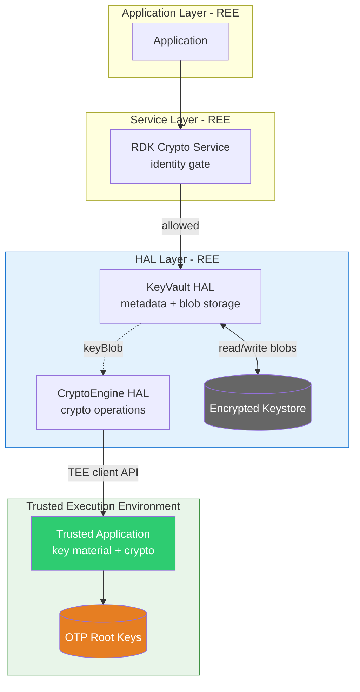
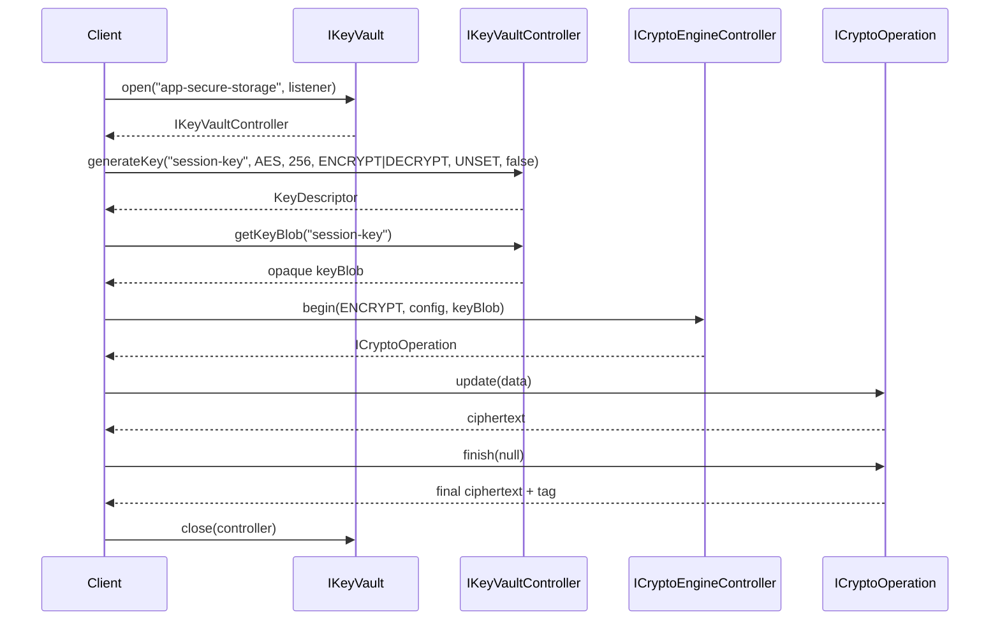
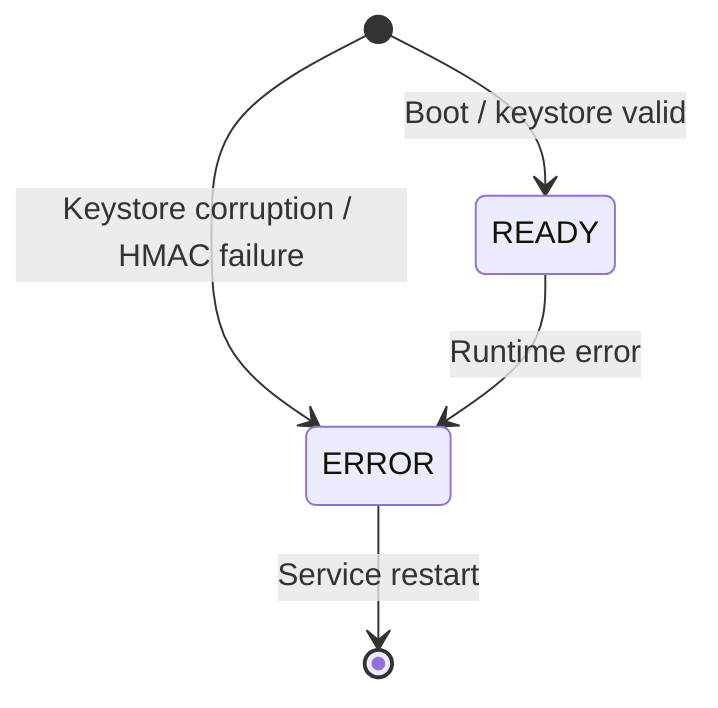

# KeyVault HAL

The KeyVault HAL provides secure key storage and lifecycle management. It abstracts platform-specific secure storage (TEE, HSM) behind a uniform AIDL interface, offering named vault instances with independent key material, access rules, and persistence policies.

A KeyVault is purely a key store — it holds keys as encrypted-at-rest blobs and manages their metadata; it performs no crypto itself. To use a key, a caller fetches its opaque blob with `getKeyBlob()` and passes it to the CryptoEngine HAL, which unwraps it inside the TEE for the operation.

Together with the CryptoEngine HAL, the KeyVault forms a **Cryptographic Key Management System (CKMS)** in the sense of NIST SP 800-130: the KeyVault is the key-management plane (storage, lifecycle, policy) and the CryptoEngine is the key-use plane (the operations). Key management is the system; the cryptographic operations are one part of it.

Excluded: cryptographic operations themselves — these are the responsibility of the CryptoEngine HAL.

## References

!!! info "References"
    |||
    |-|-|
    |**Interface Definition**|[keyvault/current](https://github.com/rdkcentral/rdk-halif-aidl/tree/main/keyvault/current)|
    |**Interface Version**|`current`|
    |**HAL Interface Type**|[AIDL and Binder](../../introduction/aidl_and_binder.md)|
    |**HAL Feature Profile**|[hfp-keyvault.yaml](../hfp-keyvault.yaml)|

## Related Pages

!!! tip "Related Pages"
    - [Per-App Vaults — Secure Vault Usage](./per_app_vault_secure_usage.md) — the end-to-end per-app security model: identity gating, key derivation, and the app developer workflow
    - [CryptoEngine HAL](../../cryptoengine/current/docs/cryptoengine.md) — crypto operations; attached to a vault via `attachCryptoEngine()`
    - [HAL Interface Overview](../../key_concepts/hal/hal_interfaces.md)
    - [HAL Feature Profile](../../key_concepts/hal/hal_feature_profiles.md)

---

## Functional Overview

The KeyVault HAL has three layers:

| Interface | Role |
|-----------|------|
| `IKeyVault` | Top-level manager. Enumerates vaults, opens sessions, creates/destroys runtime vaults. |
| `IKeyVaultController` | Per-session controller. Key lifecycle (generate, import, export, delete, rotate), crypto engine attachment (for derive/wrap), `getKeyBlob()` to drive a CryptoEngine on a stored key, and vault introspection. |
| `IKeyVaultEventListener` | Asynchronous callback interface for vault state changes, key expiry, and key invalidation. |

---

## Implementation Requirements

| # | Requirement | Comments |
|---|-------------|---------|
| HAL.KV.1 | The service shall register with Binder Service Manager using the service name `KeyVault`. | Defined as `IKeyVault.serviceName`. |
| HAL.KV.2 | Platform-provisioned vaults shall be available immediately after service startup. | Defined in HFP `vaults` section. |
| HAL.KV.3 | Key material for TEE-backed vaults shall never leave the secure environment in plaintext. | Export returns `EX_SECURITY` for non-extractable keys. |
| HAL.KV.4 | Key material at rest shall be encrypted using OTP-derived root keys. | Per-vault encryption with HMAC-authenticated keystores. |
| HAL.KV.5 | On deep sleep, the HAL is closed. On resume, the HAL is reopened and vaults re-initialise. | Callers check `getVaultState()` after `open()`. |
| HAL.KV.6 | `flush()` shall persist all pending changes and re-sign the keystore HMAC. | Write failure returns `EX_SERVICE_SPECIFIC`. |
| HAL.KV.7 | Application-created vaults shall be subject to HFP limits (`allowApplicationVaults`, `maxApplicationVaults`). | `createVault()` returns `EX_UNSUPPORTED_OPERATION` if not permitted. |
| HAL.KV.8 | Platform-provisioned vaults shall not be destroyable. | `destroyVault()` returns `EX_ILLEGAL_ARGUMENT`. |
| HAL.KV.9 | The vault shall advertise its supported algorithms, key types, digests, and sizes via `getCapabilities()`, and reject any unsupported key-creation request. | `generateKey`/`generateKeyPair`/`importKey` return `EX_UNSUPPORTED_OPERATION`. Not all SoCs support all features. |

---

## Interface Definitions

| AIDL File | Description |
|-----------|-------------|
| `IKeyVault.aidl` | Top-level manager: vault enumeration, session open/close, runtime vault create/destroy |
| `IKeyVaultController.aidl` | Per-session controller: key lifecycle, crypto engine attachment, vault introspection |
| `IKeyVaultEventListener.aidl` | Oneway callback interface: state changes, key expiry, key invalidation, key rotation |
| `VaultCapabilities.aidl` | Parcelable: vault name, security level, supported algorithms/key types/digests/sizes, key limits, persistence, storage capacity |
| `DerivedKeySpec.aidl` | Parcelable: output key spec for deriveIntoVault (alias, algorithm, type, size, usages) |
| `KeyDescriptor.aidl` | Parcelable: key alias, algorithm, type, size, usages, extractability, digest, version, timestamps |
| `VaultState.aidl` | Enum: READY, ERROR |

---

## Initialization

1. The platform starts the KeyVault HAL service process.
2. The service reads the HAL Feature Profile to discover platform-provisioned vaults.
3. For each provisioned vault, the service initialises the keystore partition and validates the HMAC.
4. The service registers `IKeyVault` with Binder Service Manager under the name `KeyVault`.
5. Clients obtain the `IKeyVault` proxy via Service Manager lookup.
6. Clients call `getVaultNames()` to discover available vaults.
7. Clients call `open(vaultName, listener)` to obtain an `IKeyVaultController` session.

---

## Product Customization

Platform vendors customize vaults via the HAL Feature Profile ([hfp-keyvault.yaml](./hfp-keyvault.yaml)):

- **Application vault policy** — whether apps can create runtime vaults, and how many
- **Platform-provisioned vaults** — each with:
    - Name and description
    - Security level (`SOFTWARE` or `TEE`)
    - Maximum key count
    - Supported key sizes
    - Deep sleep persistence behaviour
    - Storage capacity
    - Key extractability policy

Example provisioned vaults:

| Vault | Security | Persists Sleep | Extractable | Use Case |
|-------|----------|---------------|-------------|----------|
| `platform-identity` | TEE | Yes | No | Device certificates and signing keys |
| `app-secure-storage` | TEE | Yes | No | Per-application encrypted key-value storage |
| `drm-provisioning` | TEE | Yes | No | DRM key provisioning and device credentials |
| `app-session` | TEE | No | No | App secure-messaging session keys (re-derived after sleep) |
| `general-purpose` | SOFTWARE | Yes | Yes | Shared vault for platform services |

---

## System Context

The KeyVault HAL runs in the REE as a normal Linux service. It stores each key as an opaque, OTP-wrapped blob at rest and manages key metadata; it performs no crypto itself. Cryptographic operations are delegated to the CryptoEngine HAL, the only component that talks to the Trusted Application (TA) in the TEE, so plaintext key material exists only inside the TA.

The HAL is **caller-agnostic** — it does not enforce per-app access control. Which application may open which vault is decided above the HAL by the RDK Crypto Service, on the caller's verified identity, before the request reaches the HAL.

Feature support is platform-dependent. A vault advertises what it supports through `getCapabilities()` (`VaultCapabilities`); any request for an unsupported algorithm, key type, or operation is rejected with `EX_UNSUPPORTED_OPERATION`.

* **Application / RDK Crypto Service** — the caller; the service gates access by verified identity.
* **KeyVault HAL** — stores keys as OTP-wrapped blobs and manages metadata; performs no crypto.
* **CryptoEngine HAL** — performs all crypto; the sole REE↔TA gateway.
* **TEE / TA + OTP** — derives per-vault keys from the OTP root and runs operations; plaintext keys never leave.

---

## Resource Management

| Operation | Behaviour |
|-----------|-----------|
| `IKeyVault.open(name, listener)` | Opens a session to a named vault. Returns `IKeyVaultController`. |
| `IKeyVault.close(controller)` | Aborts active operations, releases the session. Key material remains persisted. |
| `IKeyVaultController.attachCryptoEngine(engine)` | Binds a crypto engine to this vault session. Only one engine per session. |
| `IKeyVaultController.detachCryptoEngine()` | Unbinds the engine. Aborts in-flight operations using vault keys. |
| `IKeyVault.createVault(name, level, maxKeys)` | Creates a runtime vault (subject to HFP limits). |
| `IKeyVault.destroyVault(name)` | Destroys a runtime vault and securely erases all its keys. |

- Multiple sessions can be open to the same vault concurrently.
- If a client process dies, Binder death notification triggers cleanup of its sessions.

---

## Operation and Data Flow

### Key generation and use

### Key import and export

- `importKey(alias, algorithm, keyType, keyData, usages, digest, extractable)` — encrypts raw key material at rest using vault root-derived key
- `importWrappedKey(alias, algorithm, keyType, wrappedKeyData, wrappingKeyAlias, unwrapParams, usages, extractable)` — imports a key that is unwrapped only inside the secure environment, so plaintext never enters the REE. The secure path for provisioning an externally-generated key.
- `exportKey(alias)` — returns raw key material only if `extractable == true`
- `exportWrappedKey(alias, wrappingKeyAlias, wrapParams)` — wraps the key inside the TA under a vault wrapping key for secure migration, including non-extractable keys
- `deleteKey(alias)` — securely erases key material and re-persists the keystore

---

## Event Handling

Events are delivered via `IKeyVaultEventListener` (oneway/async):

| Event | Trigger |
|-------|---------|
| `onVaultStateChanged(state)` | Vault seal/unseal transitions (deep sleep/resume), error conditions, initial readiness. |
| `onKeyExpired(alias)` | Key TTL reached. Key material has been purged. |
| `onKeyInvalidated(alias)` | Key deleted or otherwise invalidated. |
| `onKeyRotated(alias, newVersion)` | Key rotated to a new version. |

Listeners are registered either at `open()` time or via `registerEventListener()` / `unregisterEventListener()`.

---

## State Machine / Lifecycle

### Vault state

- `READY` — keys are accessible. Normal operating state.
- `ERROR` — keystore corruption detected (e.g. HMAC validation failure).

On deep sleep the HAL is closed; on resume it is reopened and vaults re-initialise. Callers should check `getVaultState()` after `open()` before attempting key operations.

---

## Platform Capabilities

Queried at runtime via `IKeyVaultController.getCapabilities()`:

| Field | Description |
|-------|-------------|
| `vaultName` | Human-readable vault name |
| `halVersion` | HAL version string |
| `securityLevel` | `SOFTWARE` or `TEE` |
| `maxKeys` | Maximum key count for this vault |
| `algorithms` | Algorithms this vault can generate/import/store |
| `keyTypes` | Key types this vault can store (SECRET, PUBLIC, PRIVATE) |
| `digests` | Digests this vault can bind to a key |
| `keySizes` | Supported key sizes in bits |
| `persistsAcrossSleep` | Whether keys survive deep sleep |
| `allowExtractableKeys` | Whether the vault permits creating/importing extractable keys |
| `storageCapacityBytes` | Total keystore partition size |
| `storageUsedBytes` | Current usage |

Support is platform-dependent — not every SoC supports every algorithm, key type, or size. Callers should consult these fields before key creation; an unsupported request is rejected with `EX_UNSUPPORTED_OPERATION`. (Crypto-operation support is advertised separately by the CryptoEngine via `EngineCapabilities`.)

---

## Error Handling

| Exception | Meaning |
|-----------|---------|
| `EX_ILLEGAL_ARGUMENT` | Unknown vault name, duplicate alias, empty key data, attempt to destroy platform vault. |
| `EX_ILLEGAL_STATE` | Max sessions reached, engine already/not attached. |
| `EX_UNSUPPORTED_OPERATION` | Algorithm/key type/size/digest not supported by this vault, or application vault creation not permitted by HFP. |
| `EX_SECURITY` | Attempt to export a non-extractable key. |
| `EX_SERVICE_SPECIFIC` | Key limit reached, keystore write failure, internal error. |

On any exception, output parameters contain undefined memory and must not be used.
