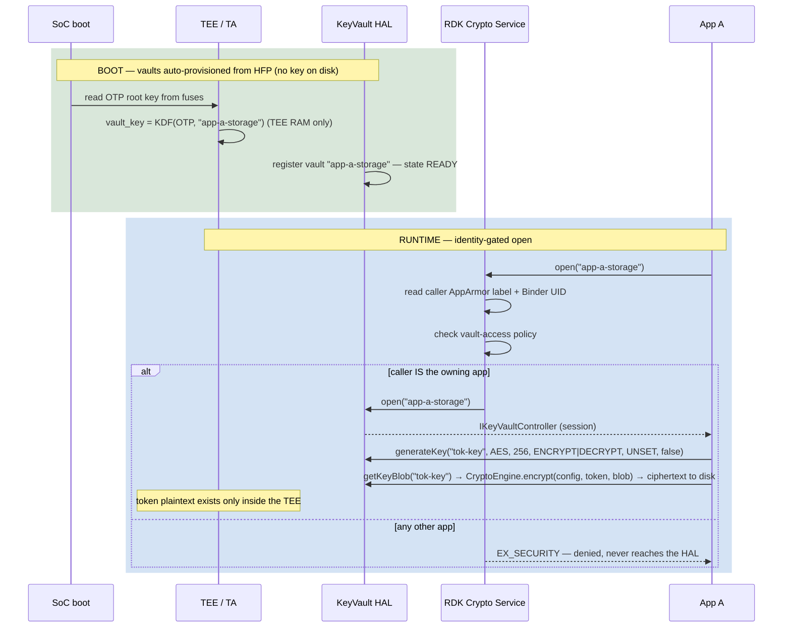
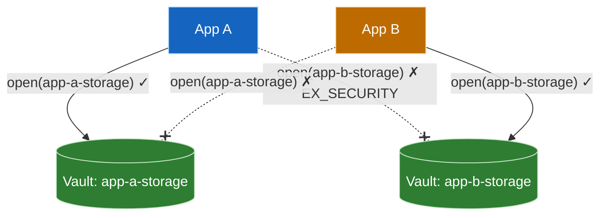
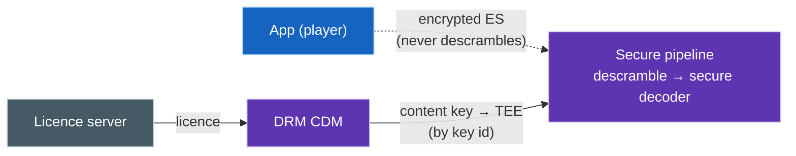
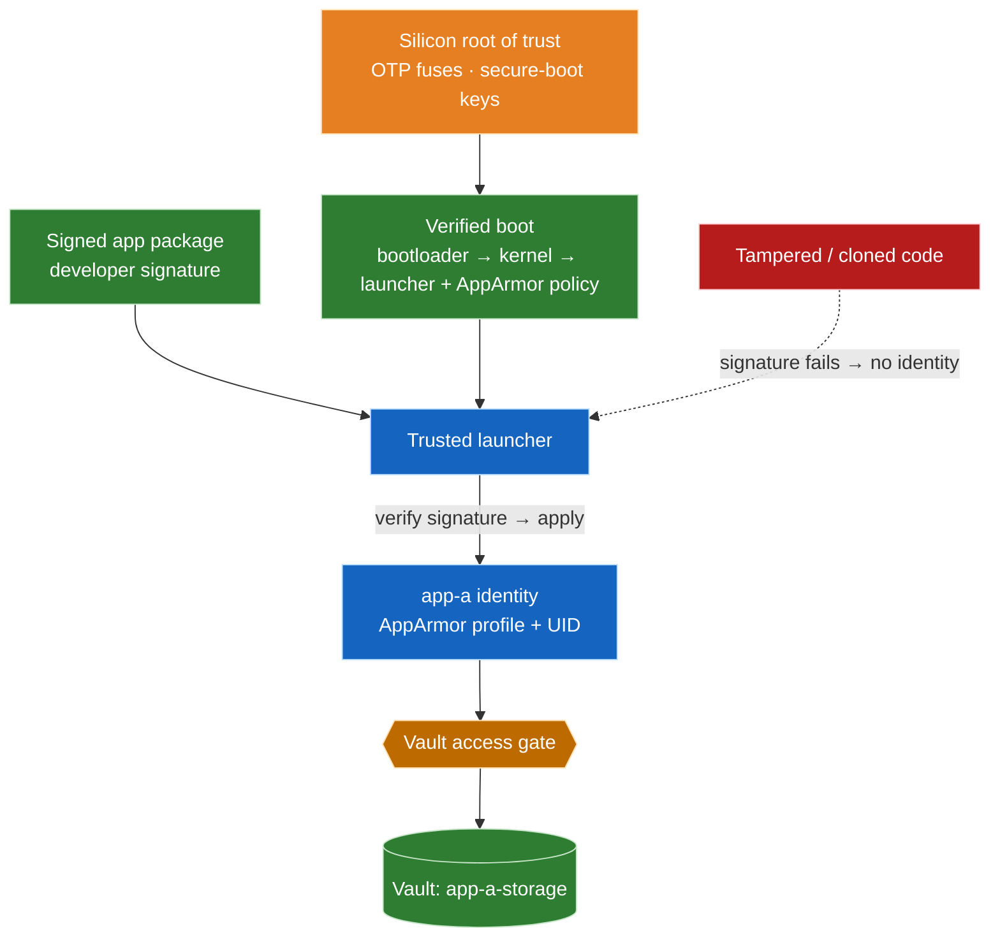
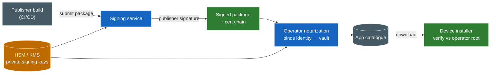
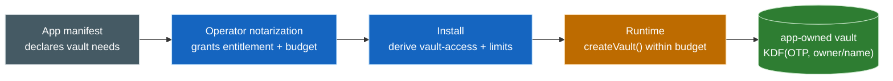
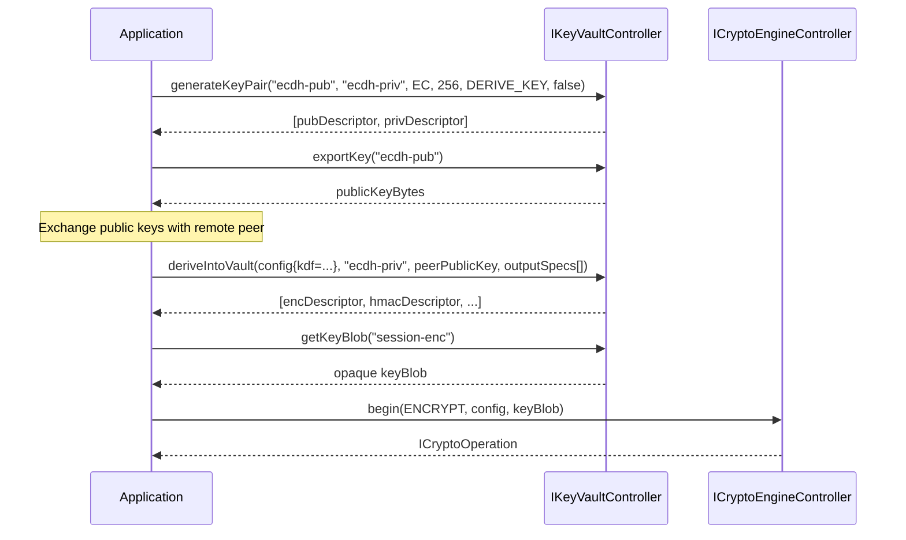
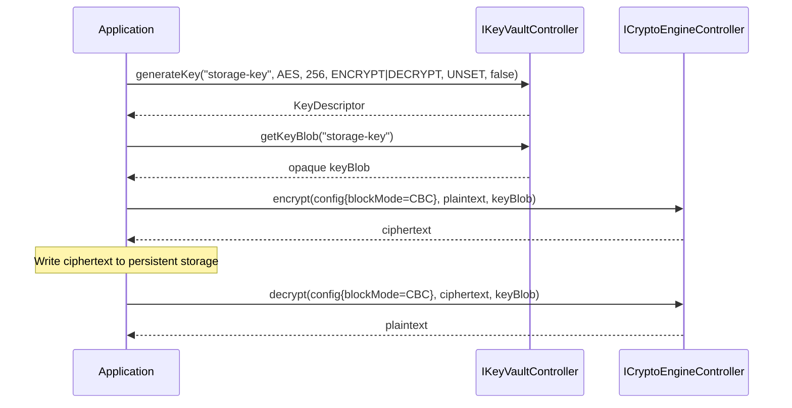
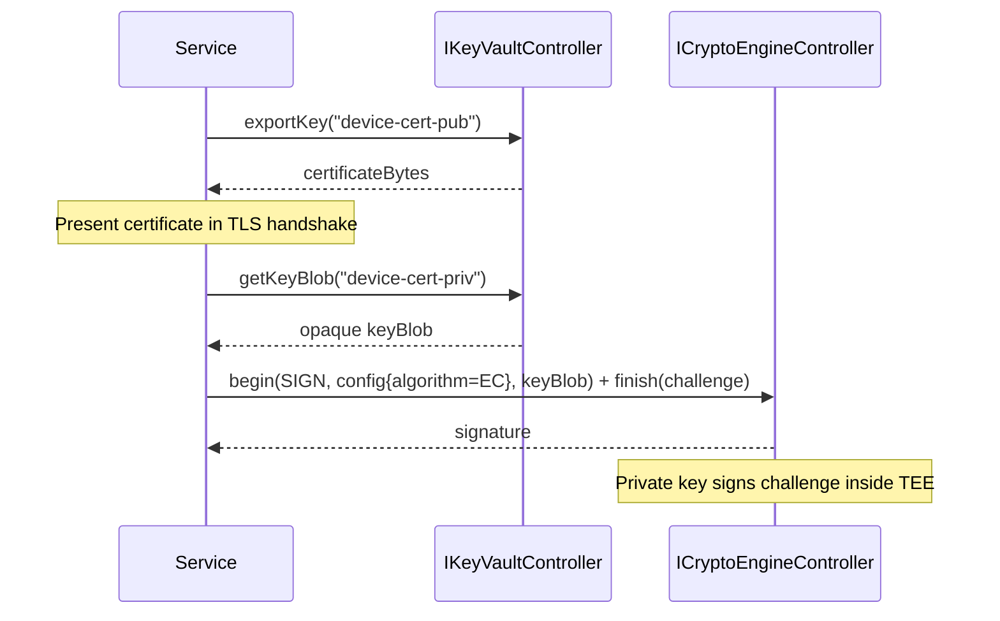
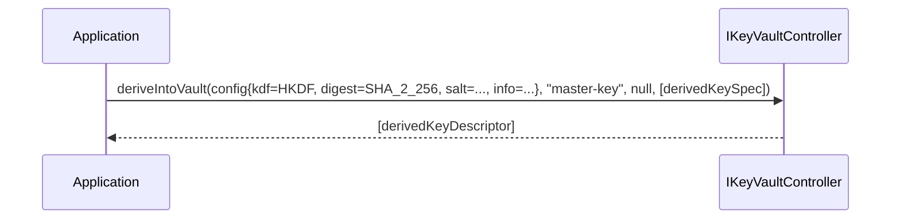

# Per-App Vaults — Secure Vault Usage

This page describes the **end-to-end security model** behind per-application
vaults: how an application reaches *only its own* vault, why key material never
leaves the TEE, and how an application's identity is established and trusted. It
complements the [KeyVault HAL](./keyvault.md) interface specification — that page
defines the API; this page explains how the API is used safely in a multi-app
product.

> **Terms**
>
> - **CKMS** — *Cryptographic Key Management System*: the KeyVault HAL (storage,
>   lifecycle, policy) plus the CryptoEngine HAL (operations), in the sense of
>   the **NIST SP 800-130** framework — design guidance, **not** a compliance
>   standard; cite **FIPS 140-3 / KMIP / PKCS#11** for normative requirements.
> - **RDK Crypto Service** — the REE service that brokers vault access. It gates
>   *which application may open which vault* on the caller's **verified identity**
>   and forwards permitted requests to the HALs.
> - **KeyVault** — the **storage** plane: holds keys, metadata, lifecycle.
> - **CryptoEngine** — the **operations** plane: encrypt / decrypt / sign / HMAC,
>   performed inside the TEE.
> - **Vault** — a named, per-app key store; its encryption key is derived from
>   the device OTP root inside the TEE.
> - **HFP** — *HAL Feature Profile*: the per-module YAML that declares a HAL's
>   capabilities (e.g. [hfp-keyvault.yaml](../hfp-keyvault.yaml) lists the
>   provisioned vaults).

**Overview.** At boot the platform provisions **one vault per app**, each with its
own TEE-derived key. An app opens **only its own** vault, gated on its **verified
identity**. Keys never leave the TEE; per-app isolation follows from the design.

## References

!!! info "References"
    |||
    |-|-|
    |**Interface Definition**|[keyvault/current](https://github.com/rdkcentral/rdk-halif-aidl/tree/main/keyvault/current)|
    |**Interface Version**|`current`|
    |**HAL Feature Profile**|[hfp-keyvault.yaml](../hfp-keyvault.yaml)|

## Related Pages

!!! tip "Related Pages"
    - [KeyVault HAL](./keyvault.md) — interface specification, layers, and data flow
    - [CryptoEngine HAL](../../cryptoengine/current/docs/cryptoengine.md) — crypto operations; attached to a vault via `attachCryptoEngine()`

---

## 1. Architecture overview



---

## 2. Boot-provisioned vaults

A platform-provisioned vault is declared once in the KeyVault **HFP** and brought
up automatically at service start — no runtime creation, no app action:

```yaml
# hfp-keyvault.yaml
vaults:
  - name: app-a-storage    # one vault per app
    securityLevel: TEE
    persistsAcrossSleep: true
    extractable: false
  - name: app-b-storage
    securityLevel: TEE
    ...
```

At boot the TA derives each vault's key deterministically:

```text
vault_key = KDF(OTP_ROOT_KEY, vault_name)   # re-derived every boot, TEE RAM only
```

- **No key on disk** — nothing to steal from flash.
- **No key in the REE** — the RDK Crypto Service and KeyVault never see it.
- **Device-bound** — a different device has a different OTP, so a copied/mirrored
  blob is inert elsewhere.

Provisioning is declarative: the HFP lists the vaults; the TA derives and holds
each key.

---

## 3. Access control: two independent gates



| Gate | Protects | Who holds the secret |
|---|---|---|
| **Data-at-rest key** — `KDF(OTP, vault_name)` | the blobs on flash: device-binding + per-vault isolation | nobody in the REE; re-derived in the TEE each boot |
| **Caller-access gate** — AppArmor label + Binder UID | *which app* may open *which vault* | the RDK Crypto Service policy, kernel-enforced |

```yaml
# /etc/rdk/crypto-service/vault-access.yaml
vault-access:
  - profile: app-a          # AppArmor profile of App A
    vaults: [app-a-storage]
  - profile: app-b
    vaults: [app-b-storage]
  # default: no access
```

The two gates are **deliberately independent**: access is by *verified identity*,
not by *possession of a key*. An app never holds a vault key, so a compromised or
misconfigured app still can't reach another vault even though every blob derives
from the same OTP root.

---

## 4. Token storage

1. **Open** its vault — `open("app-a-storage")`. The RDK Crypto Service verifies
   identity and returns a controller; any other app gets `EX_SECURITY`.
2. **Get a key** — `generateKey("tok-key", AES, 256, ENCRYPT|DECRYPT, UNSET, false)`.
   The key is created in the TEE and is non-extractable — it never leaves it.
3. **Get its blob** — `getKeyBlob("tok-key")` returns the key in its opaque,
   device-bound, TEE-encrypted form (safe to hold; it is not the key).
4. **Encrypt the token** — `CryptoEngine.encrypt(config, token, keyBlob)`; write the
   ciphertext to the app's storage. The TA unwraps the blob and encrypts inside the
   TEE, so the plaintext token and key exist only there during the operation. Read
   back with `decrypt(config, ciphertext, keyBlob)`.
5. **(Stronger) bind it** — for tokens that must survive theft, keep a
   non-extractable **signing** key in the vault and present a sender-constrained
   credential (mTLS / DPoP) instead of a bearer token, so even a copied token is
   useless without the key.

A copied or **mirrored** ciphertext is worthless: different device → different
`KDF(OTP, …)`; other app → denied at the gate; the key is non-extractable.

---

## 5. Content protection vs control-plane crypto

Two security planes meet at a media app, and **only one uses the vault.**

**Content (DRM) does not go through the vault.** Content keys are handled by the
**DRM CDM** (via the platform's content-decryption path, e.g. OpenCDM): the licence
exchange provisions the content key **directly into the TEE, keyed by key id**, and
the platform **descrambles in the secure pipeline** (secure buffers / secure video
path). The app holds no content key and runs no descramble — the KeyVault and
CryptoEngine are **not in the content path**. DRM is a separate implementation
(the DRM HAL + secure media pipeline).



**Control-plane crypto is what the vault is for.** An app authenticates to its
backend and secures messages with **device-bound keys**, and that key material
lives in the vault.

- **Full case — control-plane session security (App A).** The platform holds
  device-bound keys, performs an **authenticated key exchange** (e.g. authenticated
  Diffie-Hellman), derives **HMAC / AES session keys**, and signs/MACs messages —
  all under keys that never leave the TEE. `deriveIntoVault()` produces the session
  keys directly inside the vault.
- **Minimal case — device attestation (App B).** The app fetches its device
  key's blob (`getKeyBlob`) and asks the CryptoEngine to **`computeHmac`** (or
  sign) a server-supplied challenge under it, then sends the result to its backend
  to prove the device is genuine: one key, one op. Same shape, fewer moving parts.

Both keep the device key in the TEE and return only the signature or the derived
session-key descriptors — never raw key material.


**The split.** Content keys are protected by the DRM CDM and the secure media path
— the vault never sees them. The vault protects the **long-lived device-identity
and control-plane keys** — session-key seeds, certificate-signing keys, app tokens
— generated or imported (`importWrappedKey`) into the TEE, non-extractable, used by
alias. DRM owns the content; the vault owns the device's identity and its secure
channel.

## 6. App identity and verification

**The RDK Crypto Service never trusts what the app says.** A downloadable app can
put any name or app-ID it likes in the request payload — that string is **ignored.**
The service asks the **kernel** who the caller is, over the Binder channel the app
does not control:

- `getCallingUid()` / `getCallingPid()` — Binder delivers the **kernel-set UID**
  of the caller, out-of-band; the app cannot forge it.
- **AppArmor label** of the caller (Binder peer context / `/proc/<pid>/attr/…`) —
  the kernel-reported confinement, which the app also cannot set for itself.

Identity is **kernel-attested, not self-reported.** Claiming to be `app-a`
in a message buys nothing — the service reads the caller's real UID + label from
the kernel and matches *that* against `vault-access.yaml`.

The genuine App A obtains its UID/label from a **trusted launcher**, which derives
it from the app's **verified signature** — an app does not assign its own identity.
A confined process cannot put itself into the `app-a` AppArmor profile; AppArmor
forbids transitioning to an arbitrary profile. Identity is **granted, not claimed.**
A download that claims a published app-ID but carries a **different signature** is a
*different identity* — the name is decoration; the signature is the identity.

How the `app-a` identity is granted:

1. The app ships as a **signed package** (developer / operator signature).
2. **Verified boot** brings up bootloader → kernel → **launcher + AppArmor
   policy**, each signature-checked, anchored in the **same silicon root of trust
   (OTP fuses)** the vault keys derive from.
3. At launch the **launcher verifies the package signature**, then applies the
   `app-a` profile + UID. Tampered code fails the signature and **never receives
   the identity.**



Two clone attempts, two outcomes:

| Clone attempt | Outcome |
|---|---|
| **Install the clone as a *different* app** | gets a *different* profile/UID → vault `open()` denied. Isolation holds by construction. |
| **Replace App A's code in place** | would inherit the identity — **stopped only by code signing + verified boot.** Modified code fails the signature, so the launcher won't grant the identity. Remove either and the clone wins. |

> **Apps are downloadable from a catalogue.** In practice apps are pulled from an
> app catalogue/store and installed at runtime — they are *not* pre-baked into the
> image. This does **not** weaken the model; it is *why* identity must be
> signature-derived. The catalogue is only a distribution point — trust comes from
> the **signature**, verified on-device against trusted keys at install:
>
> - A new app from the catalogue gets **its own** identity (and its own vault, or
>   none). It can never be mapped to another app's vault, because the mapping is
>   keyed to *signing identity* — not the catalogue listing, the package name, or
>   anything the app declares.
> - A **sideloaded** or untrusted-source app must still pass signature
>   verification; if it isn't signed by a trusted key, the installer gives it a
>   default sandbox identity with **no privileged vault**.
> - The catalogue and its **signing infrastructure are part of the trusted
>   computing base** — protecting those signing keys matters as much as the
>   device OTP. A compromised signing key lets an attacker mint a "genuine" app.

**Transitive trust.** The vault trusts the identity it is told; its security rests
on the chain below — signed apps + verified boot + a trusted launcher. AppArmor +
UID answer *"which app is this"*; **code signing** answers *"is this the genuine
App A."*

**Strongest binding:** key the vault to the app's **code identity** (signing
certificate / measured hash) attested into the TEE, not a name the launcher
asserts — then `vault-access.yaml` maps the *signing identity*, and cloning needs
the developer's private key. Forging that is infeasible.

**Runtime compromise.** A *genuine* app **exploited at runtime** holds the real
identity, so it can open its own vault — the vault cannot tell genuine code from a
hijacked process. Mitigate with least-privilege behind the gate and
**sender-constrained tokens**, so what leaks cannot be replayed.

### How an app is signed (server side)

Signing happens **on a server — never on a developer's machine or in the app.**
The private signing key lives in an **HSM / cloud KMS**; signing is an
authenticated, audited step in the build / catalogue pipeline. Two signatures, two
purposes:

| Signature | Asserts | Key holder |
|---|---|---|
| **Publisher signature** | provenance — *"this is the publisher's code, unmodified"* | the publisher's signing key (HSM) |
| **Operator notarization** | authorization — *"approved for this platform; maps to `app-a` → `app-a-storage`"* | the operator / catalogue signing key (HSM) |

The **operator's** signature is the one that binds an app to its **identity and
vault** — a publisher cannot self-assign vault access; only the operator's signing
authority can. The device trusts the **operator root** (anchored in the verified
boot chain) and validates root → intermediate → signing cert.



**The signing keys are the crown jewel** — the whole identity chain, and therefore
every vault, rests on them:

- **HSM-resident, non-exportable** keys; the build system calls a signing
  *service*, never holds the key.
- **Offline root CA**, online intermediates, **short-lived** signing certs.
- **Separation of duties + audit** — who can trigger a signing is gated by review.
- **Revocation / rotation** — a leaked cert is revoked; short validity bounds the
  damage.

A compromised signing key lets an attacker mint a "genuine" app — so **this** is
where the security budget belongs, not in app-side token gymnastics.

## 7. Packaging keys

Two keys are distinct, and only one touches packaging — and it is **not shipped in
the app**:

| Key | Needed at packaging? | Where it lives |
|---|---|---|
| **Signing key** (developer / operator private key) | **Yes — to sign the package** | in the signing infrastructure, **never in the app**. The package carries only the **signature + public certificate**. |
| **The app's working keys** (encryption, token-wrapping) | **No** | minted **on-device** in the app's vault — `KDF(OTP, vault_name)`, non-extractable, device-bound. |

So an app packages **zero secrets** to use its vault. It authenticates by *being
signed* (identity); its keys are *generated on the device* at runtime. There is no
shared key to bake in.

**Secrets are provisioned at runtime, never packaged.** A key baked into the
package would be identical on every device and recoverable from the binary with
`strings`. A pre-existing or server-shared secret is delivered at runtime
**wrapped into the vault** via `importWrappedKey` (the KeyVault secure-import
method): the blob is unwrapped only inside the TEE, bound to the device, and never
exists as packaged plaintext.

**Net:** packaging needs a *signature* (public-key identity), not a *secret*. The
private signing key stays with the developer; the app's own keys are born on the
device.

## 8. Dynamic (application-created) vaults

Alongside the boot-provisioned vaults of §2, an app whose needs the operator did
not pre-declare uses the **dynamic** path: it **creates its own vaults at
runtime**, within bounds it was granted. Same isolation, different timing.

| Mode | When | Declared where | For |
|---|---|---|---|
| **Platform-provisioned** | boot | HFP (`hfp-keyvault.yaml`) | fixed per-app vaults known up front |
| **Application-created** | runtime | the app's **notarized manifest** | new apps, variable needs |

### The developer workflow

1. **Declare in the manifest.** The app states its vault needs — how many vaults,
   key types/sizes, persistence, TEE vs software. This ships *inside the signed
   package*.
2. **Operator notarization grants them.** During signing (§6), operator review
   turns the manifest into the app's **entitlement** — its `vault-access` entry
   and its `createVault` budget. A developer cannot grant itself more; the
   operator's signature bounds it.
3. **Install derives the policy.** The installer reads the *notarized* manifest
   and writes the app's access + limits — **no firmware or HFP change** for a new
   app.
4. **Create at runtime.** The app calls `createVault(name, level, maxKeys)` for
   what it needs, then `generateKey` / `importWrappedKey` as usual;
   `destroyVault(name)` when done.



### Guardrails — so "dynamic" stays safe

- **Bounded by the HFP.** `allowApplicationVaults` and `maxApplicationVaults` cap
  what apps may create; `createVault` returns `EX_UNSUPPORTED_OPERATION` past the
  limit. A compromised app can't exhaust the secure store.
- **Owner-scoped names (anti-squatting).** An app-created vault is namespaced to
  the **creating identity** (e.g. `app-a/<name>`), so one app cannot pre-create or
  claim a name another app expects. Vault names are not a flat free-for-all.
- **Same guarantees as static.** A dynamic vault is still `KDF(OTP, vault_name)`,
  identity-gated on `open()`, keys non-extractable. *Dynamic* means *when it is
  created*, not *weaker*.
- **Delegation is explicit.** If an app family shares keys (a runtime and its
  sub-apps), the owner grants delegated access in policy — never implicitly.

**In sum:** dynamic vault needs are handled by **declare → notarize → derive →
create**, driven by the signed manifest and bounded by the HFP. Onboarding a new
app requires no firmware change.

### Sideloading during development

Apps are **sideloadable** for development, without notarizing through the catalogue
on every build. Sideloading is a first-class dev workflow under the same identity
rules:

- **A sideloaded app is still signed — with a developer key.** A **dev-mode**
  device trusts developer/test certificates (the developer registers their key);
  it does **not** trust them as production. A sideloaded build therefore gets a
  **developer identity**, never a production app's.
- **Developer identity → developer vaults only.** Dev/sideloaded apps map to
  **test vaults** (TEE-backed, isolated, test data) — **no production vault, no
  real DRM/content keys, no real tokens.** `createVault` works within a dev budget
  exactly as in production: same API, isolated scope.
- **Sideloading can't impersonate a shipped app.** A sideloaded build of App A
  signed with a dev key is a *different signature* → a *different identity* → it
  cannot open `app-a-storage`. *Name ≠ identity* (§6) holds for sideloads too.
- **Promotion to production = notarization.** Shipping the *same code* means
  submitting it for operator notarization (the §8 workflow), which rebinds it from
  the dev identity to its production identity + vault. Dev → prod is a
  trust-root change, not a code change.
- **Retail is locked.** On a retail device, developer mode is **off** — fused and
  protected by verified boot — so an attacker cannot flip it to sideload a
  privileged app. Sideloading is disabled or confined to the dev sandbox.

So sideloading gives developers full, dynamic use of the vault model on **dev-mode
hardware** — without ever exposing production vaults, DRM keys, or another app's
identity.

## 9. WebCrypto support: extractable keys and the two usage paths

An app vault supports the **WebCrypto** (`crypto.subtle`) model directly — the
KeyVault key lifecycle maps onto it almost one-for-one, and the `extractable`
flag means the same thing in both:

| WebCrypto (`crypto.subtle`) | App vault |
|---|---|
| `generateKey({extractable})` | `generateKey(alias, …, digest, extractable)` |
| `importKey(raw, …, extractable)` | `importKey(alias, …, digest, extractable)` |
| `exportKey(key)` (only if extractable) | `exportKey(alias)` (refused unless extractable) |
| operate on a `CryptoKey` handle | operate via the key's **`keyBlob`** (handle) |
| extractable raw key in JS memory | the **exported** raw key on the CryptoEngine `keyData` path |

This gives an app **two usage paths**, chosen by the `extractable` flag:

1. **Non-extractable (default, strongest).** The key stays in the vault. Use it by
   fetching `getKeyBlob(alias)` and passing the opaque blob to a CryptoEngine
   operation — the TA unwraps and operates, so the plaintext key never leaves the
   TEE. This is a WebCrypto **non-extractable `CryptoKey`**: fully usable, never
   exportable.
2. **Extractable (only when the app genuinely needs the raw bytes).** `exportKey`
   yields the material and the app operates on it via the CryptoEngine's
   `CryptoConfig.keyData` path — no vault, no TEE binding. This *is* the plain
   WebCrypto model for an extractable `CryptoKey` (or a purely software/ephemeral
   key the app generates itself).

The `extractable` flag is the hinge between the two; `VaultCapabilities`
`allowExtractableKeys` tells an app whether a given vault permits the extractable
path at all (a per-vault policy gate — a high-security vault sets it false).

**Example — a downloadable HTML/JS app using WebCrypto.** Its
`crypto.subtle.generateKey({name:"AES-GCM", extractable:false})` maps to a vault
key used **only** via its `keyBlob` (device-bound, never leaves the box); the same
call with `extractable:true` maps to a vault key the app may `exportKey` and then
use as an ordinary raw `CryptoKey`. Either way the per-app vault and the identity
gate (§3, §6) keep it isolated from every other app — WebCrypto semantics on top,
device-bound key protection underneath.

## 10. Use cases (API call recipes)

Concrete call sequences against the KeyVault + CryptoEngine API. All use the
A2 flow: `getKeyBlob(alias)` yields the opaque blob, which the CryptoEngine
unwraps for the operation.

### Authenticated key exchange

**If you need to** establish session keys with a remote server via (EC) Diffie-Hellman:

1. Open a TEE-backed vault.
2. `generateKeyPair()` — private key stays in the vault, public key bytes returned.
3. Send the public key to the remote peer, receive theirs.
4. `deriveIntoVault()` — derive session keys (encryption, HMAC, wrapping) into the vault.
5. `getKeyBlob()` for a session key and operate on the CryptoEngine.



### Encrypted persistent storage

**If you need to** store sensitive data (tokens, credentials, app state) encrypted on disk:



The key is non-extractable and device-bound — the data cannot be decrypted on another device.

### Device identity and mTLS

**If you need to** authenticate the device to a backend using mutual TLS — the private key signs the challenge inside the TEE and never enters REE memory:



### Key derivation (HKDF / PBKDF2)

**If you need to** derive a new key from an existing secret — the derived key is stored directly in the vault, raw material never exposed:



## 11. Design properties

| Concern | How the model provides it |
|---|---|
| Brokering | the RDK Crypto Service is the broker — `open()` + the access gate |
| Access control | one declarative `vault-access.yaml`, kernel-enforced via AppArmor label + UID |
| Encryption keys | TEE-derived, non-extractable, device-bound |
| Provisioning | `KDF(OTP, vault_name)` at boot — no key distribution |

Per-app isolation follows from the design: **distinct vault name → distinct key →
identity gate.** One vault per app, provisioned at boot from a config list, opened
by verified identity, keys that never leave the TEE.
